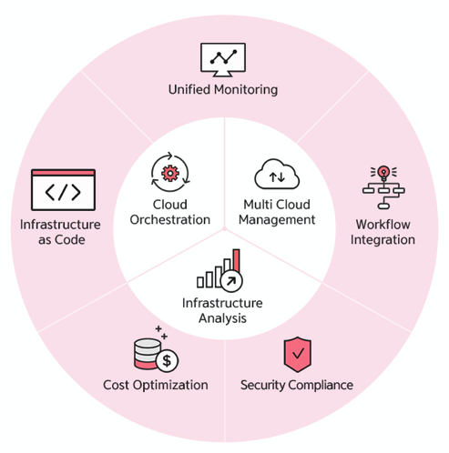
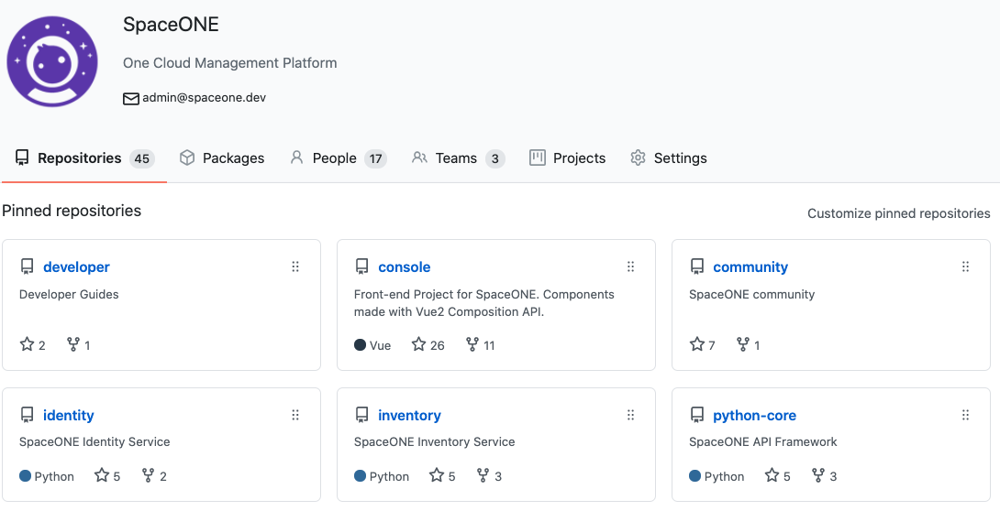
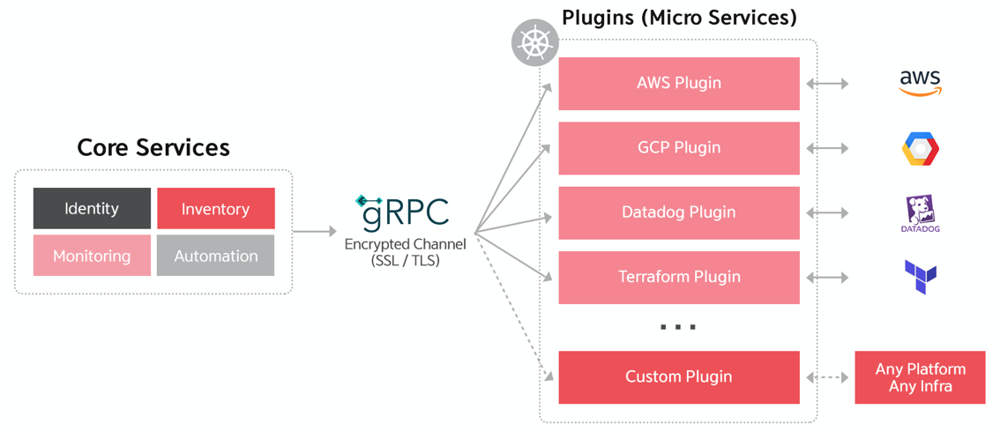
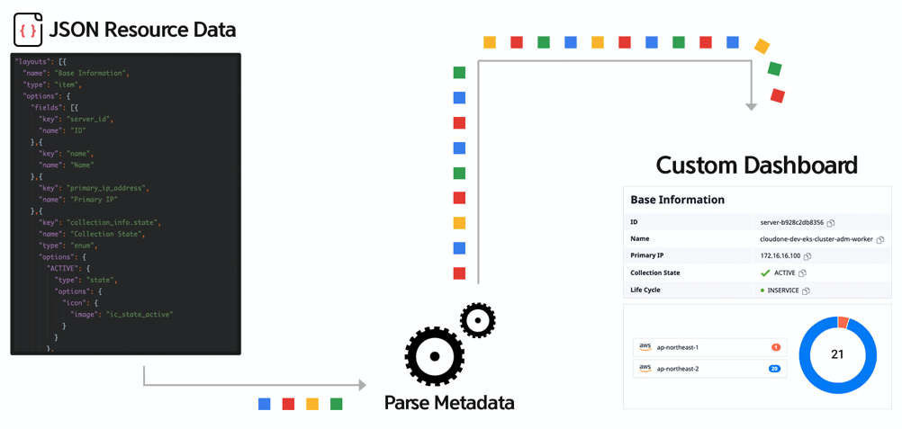
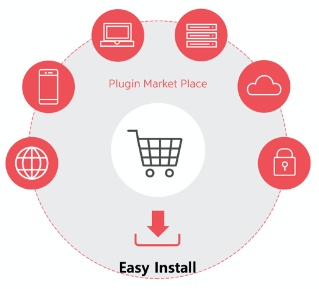

# Introduction to SpaceONE

## SpaceONE

スペースワンは、Multi-Cloudを統合管理できるようにするCloud管理プラットフォームです。   
管理と運営を便利にするために、以下のような機能を提供します。

### Main Feature

#### 1. Multi Cloud Management

* 「IaaS」インフラの統合: 多様なCloudに散らばったインフラ情報を自動探索·整列
* **Resource Search :** Quick search that reflected on relevance over resources
* **Resource Monitoring :** Instant connection for resources status that connected to infrastructure

#### 2. Cloud Orchestration

* **Infrastructure as Code :** Code-based infrastructure configuration management
* **Remote Command :** Batch command execution over multiple remote servers 
* **Application Catalog :** Supports easy installation on applications such as Database and Middleware

#### **3. Infra. Analysis**

* **Security Compliance :** Auto-detection and analysis on Cloud security vulnerabilities
* **Cost Optimization :** Detection over unused resources and analyzing overinvested infrastructure
* **Capacity Planning :** Infrastructure usage statistics and expansion plan establishment

### SpaceONE Universe

Our feature is getting expanded to all areas to build a universe \(called SpaceONE universe\) to fulfill requirements for cloud operation/management based on the inventory data, automation, and analysis, etc for Multi Clouds. 

## Key differentiators

Core technology of SpaceONE.

### Open Platform

In order to provide effective and flexible support over various clouds, we aim for open source strategy based cloud developer community.

### Plugin Architecture

Proto Buffer-based optimized gRPC Framework as own engine, enables effective processing of thousands of various cloud schemas based on MSA \(Micro Service Architecture\).

### 

### Dynamic Rendering

Provide an user customized view with selected items by creating a Custom-Dashboard based on Json Metadata.

### 

### Plugin Eco System

A Plugin marketplace for various users such as MSP, 3rd party, and customers to provide a freedom for developments and installation according to their own needs.

   

