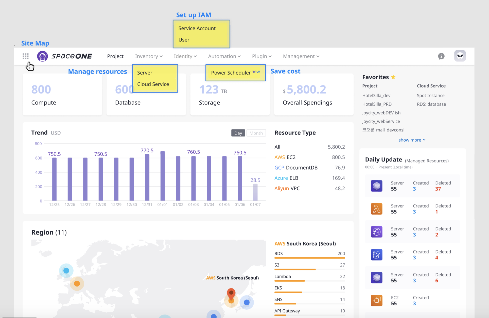
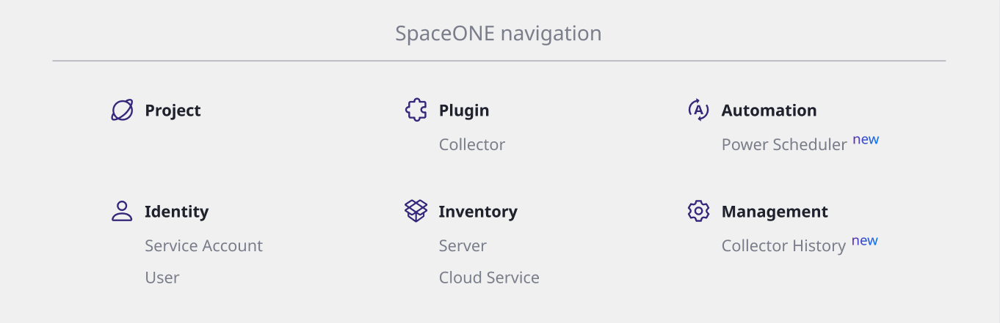

# Welcome aboard to SpaceONE

**SpaceONE,** our mission is accelerate the **Multi-Cloud** Native Technology for sustainable Ecosystem;   
Cloud management platform that enables integrating all **Multi-Clouds** regardless of the platforms which boosts and maximizes your operational efficiency in management.

### \*\*\*\*

### **Contents**

* **Getting started with the Role you assigned -** _SpaceONE has different roles by the authority._
  * \*\*\*\*[**General User**](general-user.md)\*\*\*\*
  * \*\*\*\*[**Power Scheduler Quick Start**](power-scheduler-quick-start.md)\*\*\*\*
  * \*\*\*\*[**Billing Quick Start**](billing-quick-start.md)\*\*\*\*
  * \*\*\*\*[**Metric Collector Quick Start**](metric-collector-quick-start.md) ****
* **Set up IAM**
  * \*\*\*\*[**Service Account**](identity/service-account/) ****
* **Project-based management system -** _Create project groups/projects and assign all users that make you managing cloud resources and accounts._
  * \*\*\*\*[**Project Group**](project/project-group-management.md)\*\*\*\*
  * \*\*\*\*[**Project**](project/project-management.md) ****
* **Recommend strong feature**
  * \*\*\*\*[**Server**](https://spaceone-dev.gitbook.io/user-guide/inventory/untitled)\*\*\*\*
  * \*\*\*\*[**Cloud Service**](https://spaceone-dev.gitbook.io/user-guide/inventory/cloudservice-beta)\*\*\*\*
  * \*\*\*\*[**Collector**](https://spaceone-dev.gitbook.io/user-guide/plugin/collector)\*\*\*\*

Please, visit us via

* **SpaceONE**  Github: [https://github.com/spaceone-dev](https://github.com/spaceone-dev) 
* **SpaceONE**  Docker: [https://hub.docker.com/repositories/spaceone](https://hub.docker.com/repositories/spaceone) 
* E-mail: support@spaceone.dev

