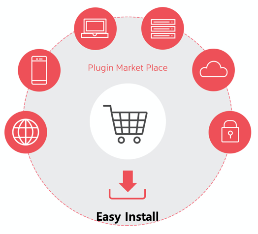

# Key Differentiators

## Open Platform

다양한 클라우드에 대한 지원을 효과적이고 유연하게 하기 위해, 오픈소스 기반 Cloud 개발자 Community 를 지향 합니다.    

## Plugin Architecture

Proto Buffer 기반의 최적화된 gRPC Framework을 자체 엔진으로 내장하여, 수천가지의 다양한 클라우드 Schema를 MSA\(Micro Service Architecture\) 기반으로 효과적인 처리가 가능합니다. 

## Dynamic Rendering

Json Metadata를 기반으로 Custom Dashboard를 구현하여, 사용자 맞춤형으로 조회하고 싶은 항목을 선택할 수 있습니다. 

### 

## Plugin Eco System

MSP, 3rd Party, 고객사등 다양한 사용자들이 필요에 따른 기능들을 자유롭게 개발하여 편리하게 install 할 수 있는 Plugin marketplace를 제공 합니다.

