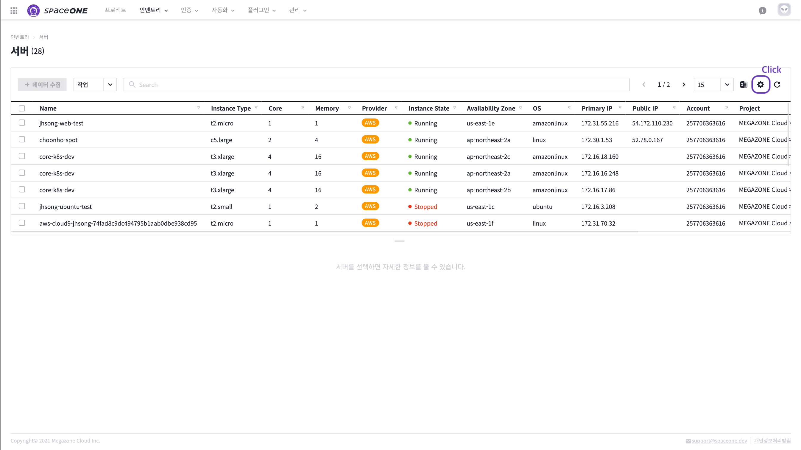

# Custom Table

## 개요

자원 목록 테이블에 표시하고 싶은 필드를 개인화할 수 있습니다. 

이를 설정하면, 이후에 해당 테이블의 자원을 표시할 때에는, 설정된 필드를 기준으로 보여집니다.

### 필드 설정하기

필드를 변경하고자 하는 테이블의 우측 상단의 설정 버튼을 클릭합니다. 


현재 필드 개인화가 지원되는 테이블 아래와 같습니다.

* Inventory &gt; Server - Main Table
* Inventory &gt; Cloud Service Detail - Main Table 
* Identity &gt; Service Account - Main Table


