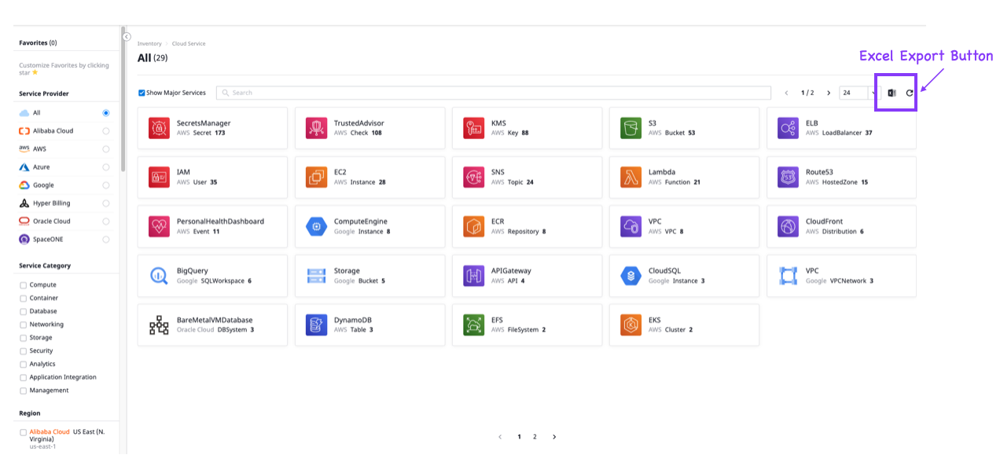
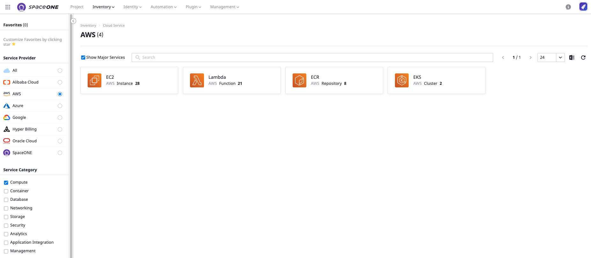
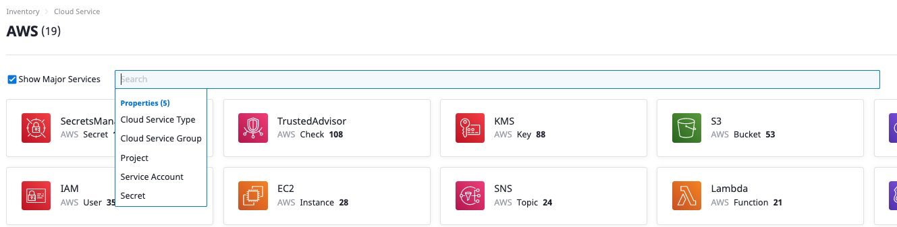

# Excel Export

## 개요

Excel export 기능을 이용해 손쉽게 SpaceONE내부의 데이터를 추출할 수 있습니다.

원하는 데이터를 추출하기 위한 필터를 설정한 후, export를 누르면 바로 excel로 해당 데이터를 받을 수 있습니다.

## 데이터 추출하기 

위의 사진의 Excel 모양 버튼을 클릭하면, 원하는 데이터를 엑셀로 받을 수 있습니다. 원하는 데이터를 가공하기 위해 여러 필터를 설정할 수 있습니다.

클라우드 서비스 페이지에서는 왼쪽 사이드 바의 필터를 이용해 각 프로바이더 별, 각 서비스 특성 별, 리전 별로 데이터를 볼 수 있고 해당 데이터를 추출할 수 있습니다.

더 나아가, 검색창에서도 원하는 필터를 선택할 수 있습니다.

예를 들어 이 검색 필터를 이용해 원하는 프로젝트를 검색하면, 위와 같이 프로젝트 별로 가지고 있는 클라우드 서비스를 한 눈에 볼 수 있습니다.

