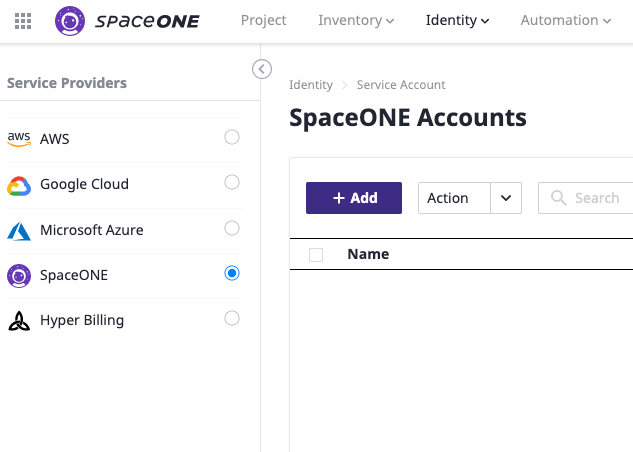
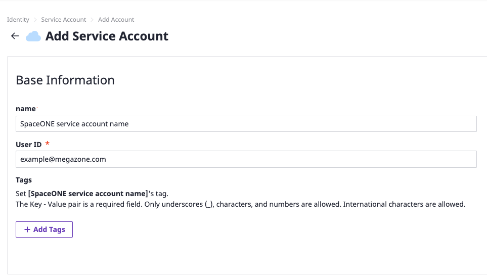
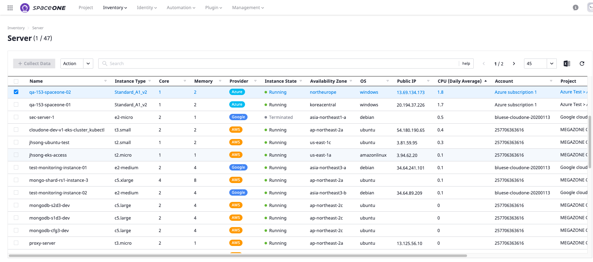
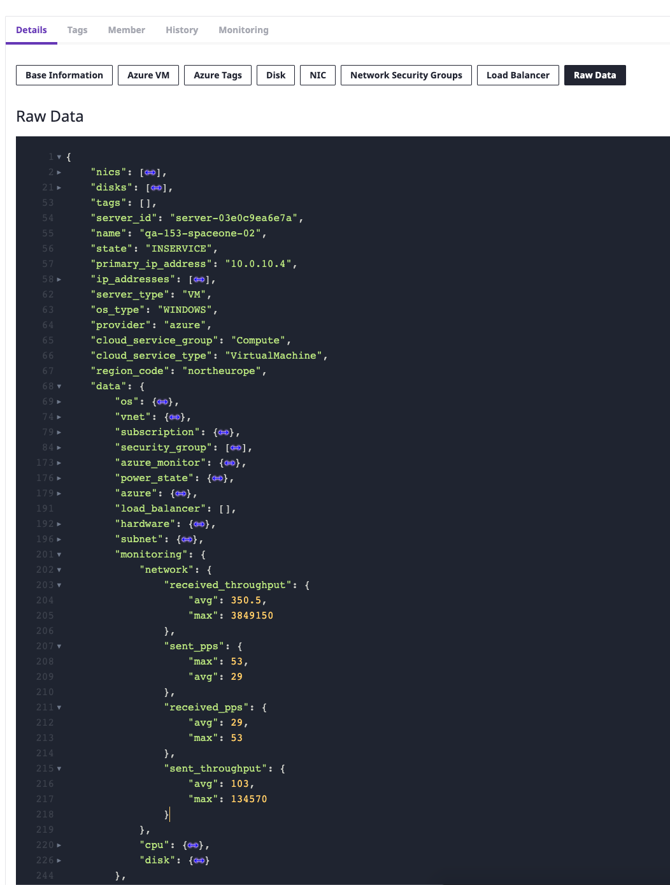

# Metric Collector Quick Start

## How to Set up

Collect monitoring configured metric data after completing following steps:

* [Prerequisites](power-scheduler-quick-start.md#prerequisites)
* [Get API Key for SpaceONE Service Account](metric-collector-quick-start.md#get-api-key-for-spaceone-service-account)
* [Register Billing Service Account](billing-quick-start.md#register-billing-service-account-ex-hyper-billing)
* [Billing Information](billing-quick-start.md#billing-information)

## Prerequisites

Monitoring Metric Collector requires SpaceOne Service Account to collect various vendor includes AWS, Google Cloud, Azure, etc. 

## Get API Key for SpaceONE Service Account 

Before adding  Service Account \(SpaceONE\), you needs API Key for SpaceONE. 


**We currently provide API-Key via administrator only.   
Please, contact your domain administrator of SpaceONE If you don't have a API-Key for SpaceONE service account or send an e-mail for more support \(**_**support@spaceone.dev**_**\)**


## Register SpaceOne Service Account \(Ex. Metric Collector\)

To register SpaceONE service account, you can do in Identity &gt; Service Account.

Select **SpaceONE** Service Provider, then click **Add**  

Register SpaceONE Service Account like following steps,

1. Name Service account
2. Set User ID
3. Put Credentials \(API Key\)

Configure credentials which has obtained from domain administrator after set service account name and user ID. 

You will get a three following items as credential inputs

1. _API Key_
2. _API Key ID_
3. _Identity Endpoint_

All those fields are mandatory. 


Do NOT assign project for Monitoring Metric collector Service.

You can SKIP this step.


## Monitoring Metric Information

You can check information at Inventory &gt; Server list.  
  
**Recommend Monitoring-metric-collector schedule is a once in day.** 

Data will be updated as below once collector's job has finished to run.

