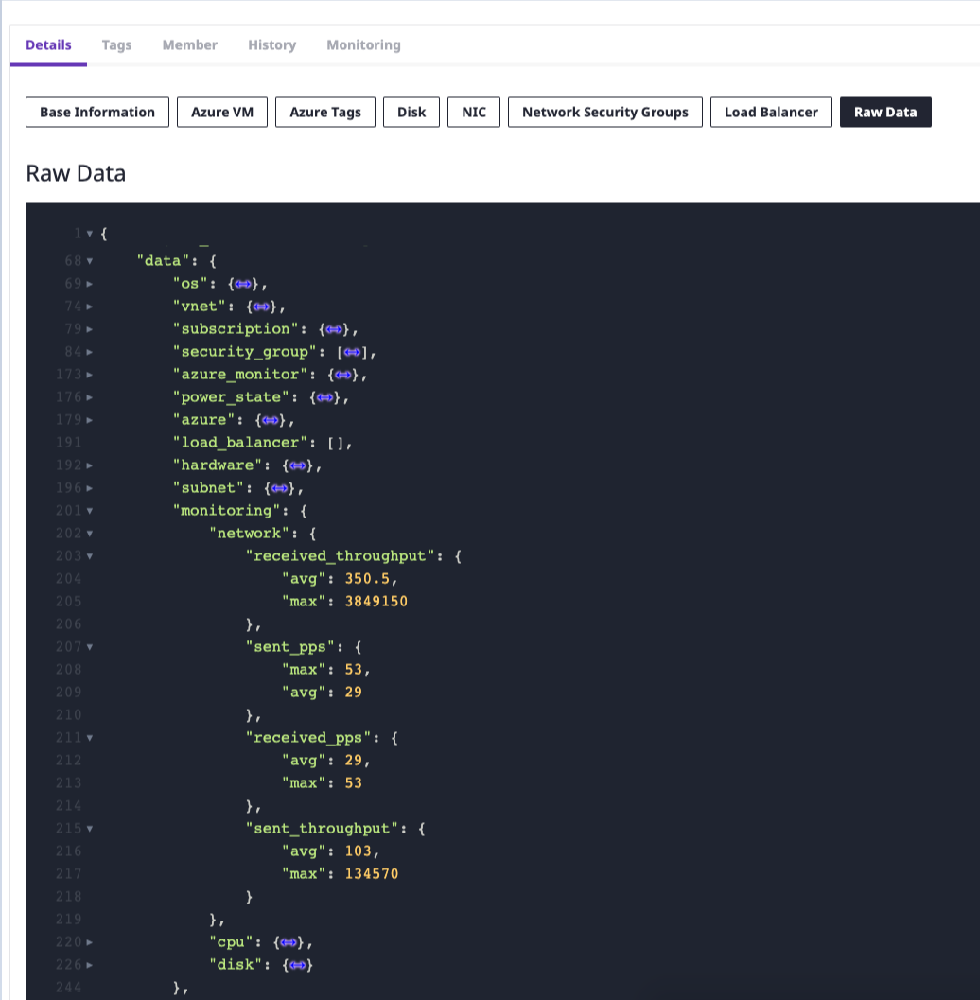

# Metric Collector Quick Start

## How to Set up

아래와 같은 절차를 통해 Monitoring metric 정보를 수집 할 수 있습니다. 

* [사전 준비](metric-collector-quick-start.md#undefined)
* [Service Account를 위한 API Key 얻기](metric-collector-quick-start.md#service-account-api-key)
* [SpaceOne Service Account 등록](metric-collector-quick-start.md#spaceone-service-account-ex-metric-collector)
* [Monitoring Metric 정보 확인 ](metric-collector-quick-start.md#monitoring-metric)

## 사전 준비

SpaceONE의 Metric Collector를 사용하기 위해서는 Provider에서 제공하는 SpaceONE Service Account를 필요로 합니다. 등록 절차는 아래를 참고해 주세요.



## Service Account를 위한 API Key 얻기

Service Account \(SpaceONE\)를 추가하기 전에, SpaceONE Service Provider용 API Key가 필요 합니다. 


API-Key는 시스템 관리자를 통해 제공되고 있습니다. SpaceONE Service Account 용도의 API-Key가 없을 경우 도메인 관리자에게 문의 하거나 support@spaceone.dev 로 이메일 문의가 필요 합니다. 


## SpaceOne Service Account 등록 \(Ex. Metric Collector\)

SpaceONE의 Service Account 등록은 **Identity** &gt; **Service Account** 에서 가능 합니다. 

Service Provider를 선택한 후, **+Add** 버튼을 클릭 하세요.  
 ****

아래의 절차를 통핸 SpaceONE Service Account를 등록할 수 있습니다.  

1. Service Account 이름
2. 사용자 ID 입력
3. Credential 입력 \(API Key 정보\)

Service Account 이름과 사용자 ID를 입력한 후에는 도메인 관리자로부터 얻은 Credential을 설정 합니다. 

Credential 입력 값은 아래와 같습니다. 

1. _API Key_
2. _API Key ID_
3. _Identity Endpoint_

모든 값은 필수 입력 항목입니다.  


Monitoring Metric collector Service에서는 Project를 할당하지 않아야 합니다. 

해당 절차는 skip 할 수 있습니다.


## Monitoring Metric 정보 확인

**Inventory** &gt; **Server** 에서 수집된 Monitoring Metric 정보를 확인할 수 있습니다. 

**참고:  Monitoring-metric-collector 의 수집은 하루에 1회를 권장 합니다.** 

Collector Job이 완료된 후에는 Monitoring metric 이 업데이트 됩니다. 

실제 수집된 데이터는 **Data -&gt; Monitoring**의 **"Raw Data"** 탭에서 확인 가능합니다. 

## Monitoring 수집 Metric 항목


기본 metric type은 version 1.5.3 이후로 지원 됩니다.   
**참고: Monitoring Metric 항목은 지속 업데이트 됩니다.**


#### Default Metric Stat

| Stat for Metric | Key | Description |
| :---: | :---: | :---: |
| MAX | max | Maximum value per day |
| AVERAGE | avg | Average value per day |

#### Collecting Metrics 

<table>
  <thead>
    <tr>
      <th style="text-align:center">Collecting Metric Type</th>
      <th style="text-align:left">Metric name / (Unit)</th>
    </tr>
  </thead>
  <tbody>
    <tr>
      <td style="text-align:center"><b>CPU</b>
      </td>
      <td style="text-align:left">
        

        <ul>
          <li>utilization (%)</li>
        </ul>
      </td>
    </tr>
    <tr>
      <td style="text-align:center"><b>Memory</b>
      </td>
      <td style="text-align:left">
        

        <ul>
          <li>usage (%)</li>
          <li>total (bytes)</li>
          <li>used (bytes)</li>
        </ul>
      </td>
    </tr>
    <tr>
      <td style="text-align:center"><b>Disk</b>
      </td>
      <td style="text-align:left">
        

        <ul>
          <li>write_iops (counts)</li>
          <li>write_throughput (bytes)</li>
          <li>read_iops (counts)</li>
          <li>read_throughput (bytes)</li>
        </ul>
      </td>
    </tr>
    <tr>
      <td style="text-align:center"><b>Network</b>
      </td>
      <td style="text-align:left">
        

        <ul>
          <li>received_throughput (bytes)</li>
          <li>received_pps (counts)</li>
          <li>sent_throughput (bytes)</li>
          <li>sent_pps (counts)</li>
        </ul>
      </td>
    </tr>
  </tbody>
</table>

