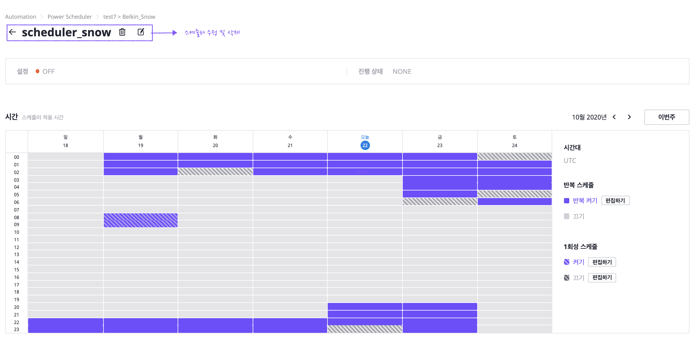

# Power Scheduler

## Overall

In Power Scheduler page, User can schedule power status of target cloud resources. 

Power Scheduler page offers listing scheduler information, add/update/delete scheduler.

## Prerequisites

User need to define security policy\(IAM\) before setup power scheduler. 

Before creating Power Scheduler modify your existing policy, For detailed process refer to link below.



## Power Scheduler Dashboard

**Scheduler list by Projects**

User can see Overall status of power scheduling 

**Search Bar**

User can search status of power scheduling by project name.

**Scheduling Dashboard** 

Items of power scheduler information for each projects are below.

<table>
  <thead>
    <tr>
      <th style="text-align:left">Item</th>
      <th style="text-align:left">Description</th>
    </tr>
  </thead>
  <tbody>
    <tr>
      <td style="text-align:left">Project Name</td>
      <td style="text-align:left">Name of projects which is linked to power scheduler</td>
    </tr>
    <tr>
      <td style="text-align:left">Number of Resource</td>
      <td style="text-align:left">
        <ul>
          <li>Number of resources : Number of resources that are controlled by power
            scheduler.</li>
          <li>Number of resources available : Total number of resources can be scheduled
            by power scheduler (Server, RDS, Auto Scaling Group).</li>
        </ul>
      </td>
    </tr>
    <tr>
      <td style="text-align:left">Schedule</td>
      <td style="text-align:left">List of running schedule(Up to 3 items)</td>
    </tr>
    <tr>
      <td style="text-align:left">Estimated Reduced Cost</td>
      <td style="text-align:left">Reduced cost by power scheduler in last 1 months(US dollar).</td>
    </tr>
    <tr>
      <td style="text-align:left">Scheduled Job</td>
      <td style="text-align:left">Length of each schedule</td>
    </tr>
  </tbody>
</table>

> **Scheduling Meat Map**
>
> The color of scheduling head map has 2 steps. The color shows how long is scheduled job. Each color means below

> Scheduled time is between 0 ~ 12 hours

> Scheduled time is between 12~24 hours

## Scheduler Management

### Scheduler Calendar

In scheduler Calendar, User can manage this functions

#### Scheduling Time

User can see scheduler timetable. x-axis is date, y-axis is time to be controlled. By clicking _**This weeks**_ jump to power scheduling plan for this weeks.

Move to next/previous weeks by  `< >` buttons right upper side of table.

Schedule has two mode.

| Scheduled mode | State | Description | color |
| :--- | :--- | :--- | :--- |
| Repeated Schedule |  | Repeated by every weeks. Within selected area, Resources are On, Otherwise\(Non selected\) resources became Off. |  |
| One time | ON | Event time for specific date. At the selected area, resources became on.  |  |
| One time | OFF | Event time for specific date. At the selected area, resources became off. |  |

#### Resource Group

**• Priority by Resource Group**

Scheduler is consist of several resource group. Each resource group has step defined by priority.

The lower number gets higher priority. The status change of higher priority finishes first. If the target status is _**ON**_, higher priority _**Resource Group**_ start first. 

Create/Deleting _**Resource Group**_ is done by clicking _**Edit button &gt; + Add Group**_.  

**Resource Groups In Same Priority**

There is sequence of changing status between resource groups in same priority.

Upper position resource group changes first, and Lower position goes second.

_**Details of Resource Group**_

Detailed status resource group is done by clicking _**Name of Resource Group.**_

| Item | Description |
| :--- | :--- |
| Name | Name of Resource Group |
| Resource Type | Type of Resource Group\(Instance, RDS, Autoscaling\) |
| Target List | List of Cloud Resources to be controlled |

### 

### Creating New Scheduler

By Clicking _**Creating New Scheduler**_ button, New scheduler editing screen appears. 

If there is no existed scheduler, Creation screen is auto generated.

To create schedule, fill out several items required.

#### Name

Name of Schedule. 

Combination of String, Number, '-' is valid. escape character is not available. 

#### Timestamp

Time to be 

스케줄이 적용되는 시간을 설정합니. calendar의 가로축은 날짜, 세로축은 스케줄러가 적용될 시간입니다.  `이번주` 버튼을 클릭하면 이번주의 스케줄 플랜을  입력합니다.  날짜와 시간을 클릭/ 드래그 하여 편리하게 타이머를 적용할 수 있습니다. 한번 더 클릭하면 타이머를 해제할 수 있습니다. 

스케줄에는 3가지의 scheduled mode가 있습니다.

<table>
  <thead>
    <tr>
      <th style="text-align:left">Scheduled mode</th>
      <th style="text-align:left">State</th>
      <th style="text-align:left">Description</th>
      <th style="text-align:left">icon</th>
    </tr>
  </thead>
  <tbody>
    <tr>
      <td style="text-align:left">&#xBC18;&#xBCF5; &#xC2A4;&#xCF00;&#xC904;</td>
      <td style="text-align:left"></td>
      <td style="text-align:left">&#xB9E4;&#xC8FC; &#xBC18;&#xBCF5;&#xB418;&#xB294; &#xD0C0;&#xC774;&#xBA38;&#xB85C;
        &#xC120;&#xD0DD;&#xB41C; &#xC601;&#xC5ED;&#xC740; resource&#xAC00; &#xCF1C;&#xC9C0;&#xBA70;,
        &#xD574;&#xC81C;&#xB41C; &#xC601;&#xC5ED;&#xC740; resource&#xAC00; &#xAEBC;&#xC9D1;&#xB2C8;&#xB2E4;.</td>
      <td
      style="text-align:left">
        

        

          
        

        </td>
    </tr>
    <tr>
      <td style="text-align:left">1&#xD68C;&#xC131; &#xC2A4;&#xCF00;</td>
      <td style="text-align:left">&#xCF1C;&#xAE30;</td>
      <td style="text-align:left">&#xD2B9;&#xC815; &#xB0A0;&#xC9DC;&#xC5D0; &#xC0DD;&#xC131;&#xB418;&#xB294;
        &#xC77C;&#xD68C;&#xC131; &#xD0C0;&#xC774;&#xBA38;&#xB85C;, &#xC120;&#xD0DD;&#xB41C;
        &#xC601;&#xC5ED;&#xC740; resource&#xAC00; &#xCF1C;&#xC9D1;&#xB2C8;&#xB2E4;.</td>
      <td
      style="text-align:left">
        
        </td>
    </tr>
    <tr>
      <td style="text-align:left"></td>
      <td style="text-align:left">&#xB044;</td>
      <td style="text-align:left">&#xD2B9;&#xC815; &#xB0A0;&#xC9DC;&#xC5D0; &#xC0DD;&#xC131;&#xB418;&#xB294;
        &#xC77C;&#xD68C;&#xC131; &#xD0C0;&#xC774;&#xBA38;&#xB85C;, &#xC120;&#xD0DD;&#xB41C;
        &#xC601;&#xC5ED;&#xC740; resource&#xAC00; &#xAEBC;&#xC9D1;&#xB2C8;&#xB2E4;.</td>
      <td
      style="text-align:left">
        

        

          
        

        </td>
    </tr>
  </tbody>
</table>

#### Resource Group

스케줄러를 적용할 리소스 그룹을 정의합니다.  `리소스 그룹 추가` 버튼을 누르면 `리소스 그룹 만들기` 페이지가 나타납니다. 

리소스 그룹 생성 시 설정해야 하는 정보는 다음과 같습니다.

<table>
  <thead>
    <tr>
      <th style="text-align:left">Item</th>
      <th style="text-align:left">Description</th>
    </tr>
  </thead>
  <tbody>
    <tr>
      <td style="text-align:left">&#xADF8;&#xB8F9; &#xAE30;&#xBCF8; &#xC815;&#xBCF4;</td>
      <td style="text-align:left">&#xADF8;&#xC774;&#xB984;&#xC744; &#xC785;&#xB825;&#xD569;&#xB2C8;&#xB2E4;.
        &#xCD5C;&#xB300; 128&#xC790; &#xAE4C;&#xC9C0; &#xC785;&#xB825; &#xAC00;&#xB2A5;&#xD558;&#xBA70;,
        &#xBA54;&#xC778;&#xD654;&#xBA74;&#xC758; &#xB9AC;&#xC18C;&#xC2A4; &#xADF8;&#xB8F9;
        &#xCE74;&#xB4DC;&#xC5D0;&#xB294; 16&#xC790; &#xAE4C;&#xC9C0; &#xD45C;&#xC2DC;&#xB429;&#xB2C8;&#xB2E4;.
        &#xBB38;&#xC790;&#xB85C; &#xC2DC;&#xC791;&#xD574;&#xC57C;&#xD558;&#xACE0;,
        &#xBB38;&#xC790;/&#xC22B;&#xC790;/ <code>- </code> &#xC744; &#xD3EC;&#xD568;&#xD55C;
        &#xBB38;&#xC790;&#xC5F4;&#xB85C; &#xC785;&#xB825;&#xD574;&#xC57C;&#xD569;&#xB2C8;&#xB2E4;.</td>
    </tr>
    <tr>
      <td style="text-align:left">&#xADF8;&#xB8F9; &#xAE30;&#xC900;</td>
      <td style="text-align:left">
        
&#xB9AC;&#xC18C;&#xC2A4; &#xD0C0;&#xC785;&#xC744; &#xC120;&#xD0DD;&#xD569;&#xB2C8;&#xB2E4;.
          &#xB9AC;&#xC18C;&#xC2A4; &#xD0C0;&#xC785;&#xC744; &#xC120;&#xD0DD;&#xD558;&#xBA74;
          &#xADF8;&#xC5D0; &#xB530;&#xB978; &#xB9AC;&#xC18C;&#xC2A4; &#xBAA9;&#xB85D;&#xC774;
          &#xC544;&#xB798;&#xC5D0; &#xD45C;&#xC2DC;&#xB429;&#xB2C8;&#xB2E4;.

        

          
        

      </td>
    </tr>
    <tr>
      <td style="text-align:left">&#xB9AC;&#xC18C;&#xC2A4; &#xBAA9;</td>
      <td style="text-align:left">&#xB9AC;&#xC18C;&#xC2A4; &#xBAA9;&#xB85D;&#xC5D0;&#xC11C; &#xBCF4;&#xC5EC;&#xC9C0;&#xB294;
        &#xB9AC;&#xC18C;&#xC2A4;&#xB4E4;&#xC774; scheduling &#xB429;&#xB2C8;&#xB2E4;.</td>
    </tr>
  </tbody>
</table>

설정한 정보를 확인한 후, 페이지 우측 하단의 `저장`버튼을 클릭해 저장합니다.  

### 스케줄 삭제

상단의 `휴지통` 버튼으로 스케줄러를 삭제할 수 있습니다. 

### 스케줄러 수정

<table>
  <thead>
    <tr>
      <th style="text-align:left">item</th>
      <th style="text-align:left">Description</th>
    </tr>
  </thead>
  <tbody>
    <tr>
      <td style="text-align:left">&#xC2A4;&#xCF00;&#xC904;&#xB7EC; &#xC774;&#xB984; &#xC218;</td>
      <td style="text-align:left">
        
&#xD398;&#xC774;&#xC9C0; &#xC0C1;&#xB2E8;&#xC5D0; &#xC704;&#xCE58;<code>&#xC2A4;&#xCF00;&#xC904;&#xB7EC; &#xD3B8;&#xC9D1;</code>&#xBC84;&#xD2BC;&#xC73C;&#xB85C;
          &#xC2A4;&#xCF00;&#xC904;&#xB7EC;&#xC758; &#xC774;&#xB984;&#xC744; &#xD3B8;&#xC9D1;&#xD560;
          &#xC218; &#xC788;&#xC2B5;&#xB2C8;&#xB2E4;.

        

        

          
        

      </td>
    </tr>
    <tr>
      <td style="text-align:left">&#xC2A4;&#xCF00;&#xC904;&#xB7EC; &#xC2DC;&#xAC04; &#xC218;</td>
      <td style="text-align:left">
        
calendar&#xC758; <code>&#xD3B8;&#xC9D1;&#xD558;&#xAE30;</code> &#xBC84;&#xD2BC;&#xC73C;&#xB85C;
          &#xC2A4;&#xCF00;&#xC904;&#xB7EC; &#xC9C0;&#xC815; &#xC2DC;&#xAC04;&#xB300;,
          &#xBC18;&#xBCF5; &#xC2A4;&#xCF00;&#xC904; &#xBC0F; 1&#xD68C;&#xC131; &#xC2A4;&#xCF00;&#xC904;&#xC744;
          &#xAC01;&#xAC01; &#xC218;&#xC815;&#xD569;&#xB2C8;&#xB2E4;.

        

        

          
        

        

      </td>
    </tr>
    <tr>
      <td style="text-align:left">&#xB9AC;&#xC18C;&#xC2A4; &#xADF8;&#xB8F9; &#xC218;</td>
      <td style="text-align:left">
        
&#xB9AC;&#xC18C;&#xC2A4; &#xADF8;&#xB8F9; &#xC704;<code>&#xD3B8;&#xC9D1;&#xD558;&#xAE30;</code> &#xBC84;&#xD2BC;&#xC73C;&#xB85C;
          &#xC2A4;&#xCF00;&#xC904;&#xB7EC; &#xC9C0;&#xC815; &#xC2DC;&#xAC04;&#xB300;&#xB97C;
          &#xC218;&#xC815;&#xD569;&#xB2C8;&#xB2E4;.

        

          
        

        

      </td>
    </tr>
  </tbody>
</table>

