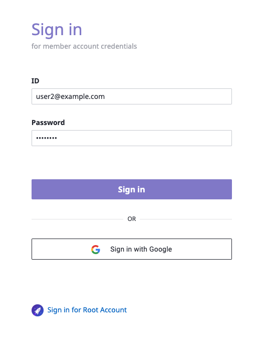
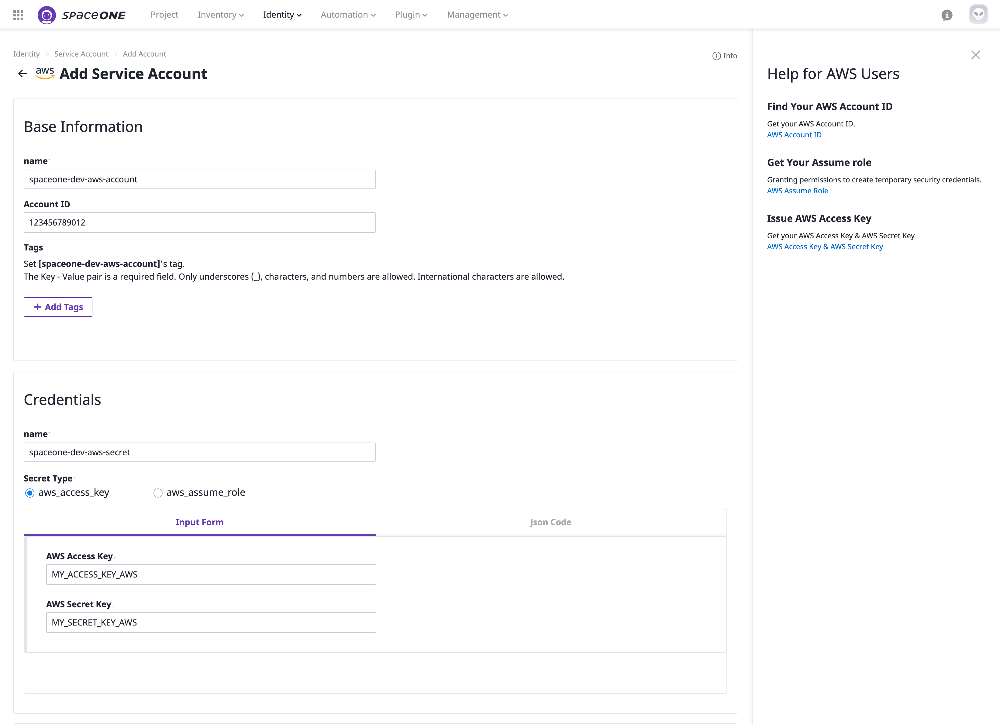

# Basic Setup

## Sign-in

**STEP 1:** 브라우저를 통해, SpaceONE 도메인에 접속 후 제공된 ID와 Password를 입력 합니다. 

## **나의 프로젝트 그룹과 프로젝트를 생성**


**일반 사용자**는 자신이 속한 프로젝트 그룹/프로젝트 만을 조작할 수 있는 권한을 갖습니다. 


**STEP 1:** 바 상단의  **`Project`** 메뉴로 이동 하여 아래와 같이  **`+ Create`** 버튼을 클릭 합니다. 

\*\*\*\*

**STEP 2:   `Group`** 의 이름을 입력한 후 **`Confirm`** 버튼을 아래와 같이 클릭 합니다. 

**STEP 3:** 지난 단계에서 생성한 프로젝트 그룹을 선택한 후 페이지 오른쪽 상단에 위치한 **`+ Create Project`** 버튼을 클릭 합니다. 프로젝트의 이름을 입력 한 후 **`Confirm`** 버튼을 클릭 합니다.\(ex. **SpaceONE-DEV**\)

**STEP 4:** 페이지 우측 상단의 **`+ Create Project`** 버튼을 클릭 후 앞에서 입력한 프로젝트명과 다른 이름을 입력 합니다.\(같은 프로젝트 그룹내의 중복 이름을 허용되지 않음\) 이후에 **`Confirm`** 버튼을 클릭 합니다. \(ex. **SpaceONE-PRO**\)

**STEP 5:**  SpaceONE 프로젝트 그룹 아래에 생성된 두개의 Sample 프로젝트 \(**SpaceONE-DEV, SpaceONE-PRO**\) 를   확인 합니다. 

## Register Service Account

Service accounts must be registered to run collectors which getting cloud resources from public clouds.

  
**STEP 1:** Drive to menu **`Identity > Service Account`** from the top bar and Click AWS from the provider panel on the left side menu.  
Click **`+ Add`** button to add AWS service account. 

**STEP 2:** Fill out the name of Service Account and Account ID on base information fields. Please, fill out your **AWS Access Key** and **AWS Secret Key** as well. 


Please, Click links at Help for AWS Users panel if you have any issue to get Account id, Assume role, and AWS access key. 


**STEP 3:** Please, select a project that you want to map with your service account. \(Optional\).   
We highly recommend mapping a project with Service Account for cloud resource management purposes.

All cloud resources under the Service Account that you registered above will be shown on the selected project and  I**nventory** menu.

## Collect Resources

**STEP 1:** Drive to menu **`Plugin > Collector`**  at the top menu bar. 

**STEP 2:**  Select collector and  Select collect data from drop down option on Action. 

**STEP 3:**  Click **`Confirm`** button on **Collect Data** pop-up window.

