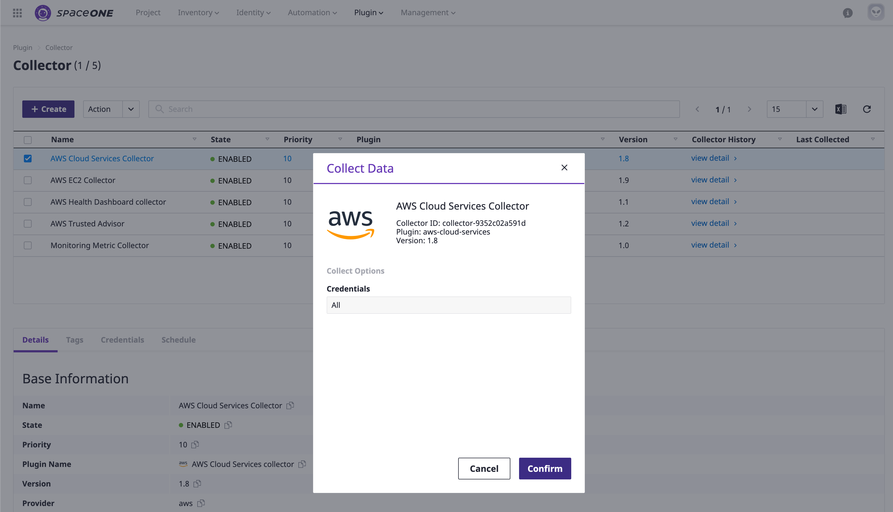

# Basic Setup

## Sign-in

**STEP 1:** 브라우저를 통해, SpaceONE 도메인에 접속 후 제공된 ID와 Password를 입력 합니다. 

## **나의 프로젝트 그룹과 프로젝트를 생성**


**일반 사용자**는 자신이 속한 프로젝트 그룹/프로젝트 만을 조작할 수 있는 권한을 갖습니다. 


**STEP 1:** 바 상단의  **`Project`** 메뉴로 이동 하여 아래와 같이  **`+ Create`** 버튼을 클릭 합니다. 

\*\*\*\*

**STEP 2:   `Group`** 의 이름을 입력한 후 **`Confirm`** 버튼을 아래와 같이 클릭 합니다. 

**STEP 3:** 지난 단계에서 생성한 프로젝트 그룹을 선택한 후 페이지 오른쪽 상단에 위치한 **`+ Create Project`** 버튼을 클릭 합니다. 프로젝트의 이름을 입력 한 후 **`Confirm`** 버튼을 클릭 합니다.\(ex. **SpaceONE-DEV**\)

**STEP 4:** 페이지 우측 상단의 **`+ Create Project`** 버튼을 클릭 후 앞에서 입력한 프로젝트명과 다른 이름을 입력 합니다.\(같은 프로젝트 그룹내의 중복 이름을 허용되지 않음\) 이후에 **`Confirm`** 버튼을 클릭 합니다. \(ex. **SpaceONE-PRO**\)

**STEP 5:**  SpaceONE 프로젝트 그룹 아래에 생성된 두개의 Sample 프로젝트 \(**SpaceONE-DEV, SpaceONE-PRO**\) 를   확인 합니다. 

## Service Account를 등록 

Collector를 통해 Public Cloud에 속한 클라우드 자원들의 정보를 가져오기 위해서는 Service Account가 반드시 등록되어 있어야 합니다. 

  
**STEP 1:**  상단 바에 있는 **`Identity > Service Account`** 로 가서 좌측 메뉴에 있는 AWS를 클릭 합니다. AWS Service Account를 추가 하기 위해 **`+ Add`** 버튼을 클릭 합니다.

**STEP 2:** 기본 입력 사항에 적혀있는 Service Account ****의 이름과 Account ID를 입력 합니다. 그 이후에 Credentials 항목에 속한 **AWS Access Key** 와 **AWS Secret Key** 또한 입력 합니다. 


Account id 혹은 Assume Role, Access Key 항목을 입력하는데 어려움이 있을 경우 Help의 링크를 클릭하여 상세내역을 확인 합니다. 


**STEP 3:** Service Account 를 연결 하고자 하는 프로젝트를 선택해 주세요.  
하나의 Cloud 자원 관리를 효율적으로 하기 위해 Service Account에 프로젝트를 반드시 연결 하는것을 권장 합니다. 

위의 Service Account에 등록한 모든 클라우드 자원들은 프로젝트와 inventory 메뉴에서 조회가 가능합니다. 

## 자원 수집

**STEP 1:** 메뉴바 상단의 **`Plugin > Collector`**  로 이동하세요.

**STEP 2:**  Collector를 선택 하고 Action 버튼 안의 Collect Data 버튼을 클릭 하세요.

**STEP 3:  Collect Data** 팝업 화면에서 **`Confirm`** 버튼을 클릭 하세요.

