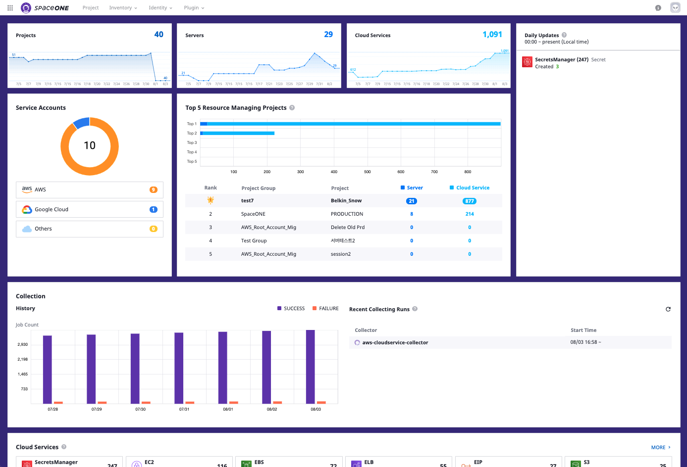
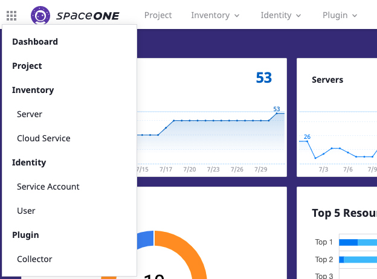
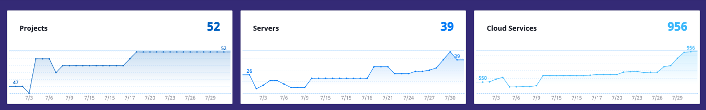
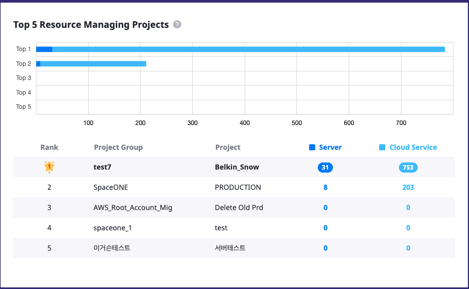
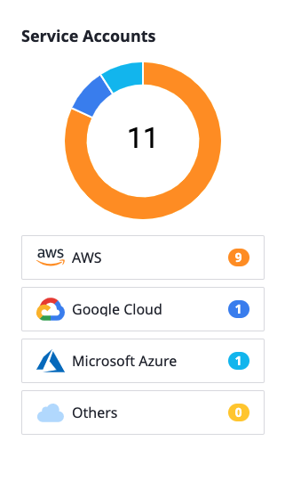
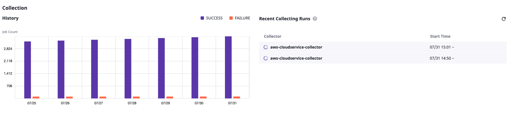
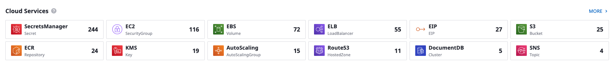
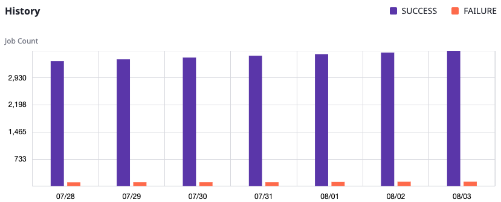
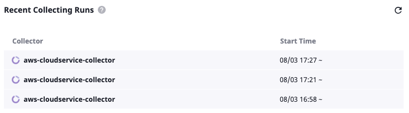
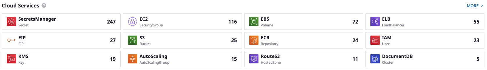

# Domain Dashboard

## 概要

DashboardはSpaceONEにアクセスする際に表示される初画面です。

DashBoardを通してDomainで利用している全サービスの現況が確認でき、各項目をクリックすれば、そのサービスに移動します。

画面上部のナビゲーションバーを利用して各ページへ移動できます。

## Summary

ドメインで利用している全体のProject, Server, Cloud Service個数がトータルで表示されます。

各々のSummaryをクリックする場合、そのサービスに移動します。

## Top 5 Resource Managing Projects

Server / Cloud Serviceを一番よく利用する上位5つのプロジェクトの現況が確認できます。各Project Group/Projectをクリックする場合、そのサービスに移動します。

ドメインに入力されたService Account数が確認できます。現在、AWS, Azure, GCPのKey Pairが入力できます。

Server / Cloud Serviceを一番よく利用する上位5つのプロジェクトの現況が確認できます。

##  Service Accounts

日別リソースの増加/減少情報を表示します。0~現在までの変更履歴を表現します。

各クラウドごとに登録されているService Accounts数を表示します。

## Daily Updates

00時から現在まで変更されたサーバとクラウドサービス数の現況が確認できます。

## Collection

1週間のリソース収集現況と現在進行中であるCollectorの状態が確認できます。

## Cloud Services

収集されたクラウドサービスのリソース数及び種類が確認できます。Moreをクリックすれば、要約情報ではなく、全クラウドサービスのリソース現況ページ\(Cloud Service Page\)へ移動します。

## Collection

Collector実行履歴及び現在実行中であるCollectorの状態が照会できます。

### History

一週間のCollector収集の成功/失敗履歴を表示します。

### 

### Recent Collecting Runs

現在実行中であるCollectorリストが確認できます。右側のRefreshボタンをクリックして状態のアップデートができます。

## Cloud Services 

収集されたCloud Resourceの内、12種の数値を表現します。_**MORE**_ をクリックすれば、全体リストが確認できます。 

