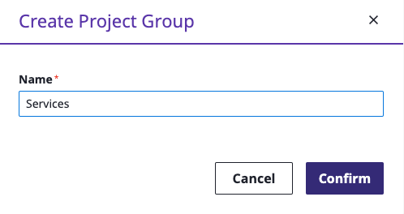
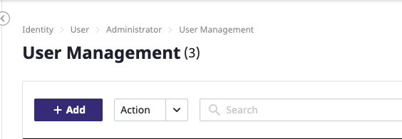
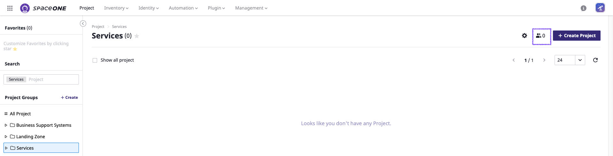
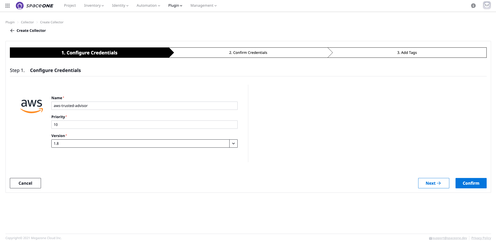
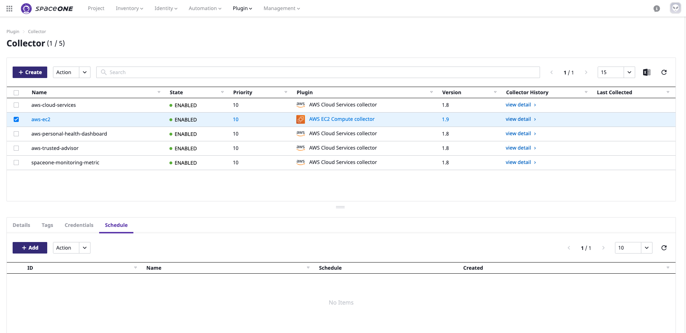

# Domain Admin

## Sign-in

**STEP 1:** Drive to domain of **SpaceONE** on browser ****and type given ID and Password as domain admin.  
**\(**E-mail received from the Root Account has stated detailed the connection methods; Single Sign On\(SSO\),  ID/PW, or Google Oauth2**\)**

## Create Project Group

All cloud resources **MUST** belong to a certain project for management purpose. You can grouping any projects with Project Group.   
Domain Admin creates the project group based on company's management policy.


**Note&gt;** General User **\(Project Admin\)** creates projects only under project group with permission to manage cloud resources.   


**STEP 1:** Drive to menu **`Project`** at top bar and click **`+ Create Group button`** at top right corner of panel.

**STEP 2:** Type project group name \(**sample case: Landing Zone**\) and Click Confirm.

**STEP 3:** Type project group name \(**sample case: Services**\) and Click Confirm.

**STEP 4:** Type project group name \(**sample case: Business Support Systems**\) and Click Confirm.

**STEP 5:** Check all 3 project groups has created a tree on left menu.

## Create User

Create general user and assign the project groups to created user. General users can access only to the project group which they are belonged to.

**STEP 1:** Drive to menu **`Identity > User`** at top bar. 

  
**STEP 2:** Click **`+ Add`** button to add a domain Admin user.

**STEP 3:** Fill out all required fields ****and click **`Confirm`** button once finish.

**STEP 4:** Drive to Project ****and Click member icons at right next to **`+ Create Project`** button.

**STEP 5:** Fill out all required fields ****and click **`Confirm`** button once finish.

\*\*\*\*

**STEP 3:** 

\*\*\*\*

## Collect Collectors

desc

### **Create AWS EC2 Collector**

**STEP 1:** 

**STEP 2:**

### **Create AWS Cloud Services Collector** 

**STEP 1:** 

\*\*\*\*

**STEP 2:** 

\*\*\*\*

### **Create AWS  Trusted Advisor Collector** 

**STEP 1:** 

**STEP 2:** 

\*\*\*\*

### **Create AWS Health Dashboard Collector** 

**STEP 1:** 

\*\*\*\*

**STEP 2:** 

\*\*\*\*

### **Create AWS Metric Collector** 

**STEP 1:**

**STEP 2:** 

desc

## Update Schedule

desc

**STEP 1:** 

**STEP 2:** 

 ****

\*\*\*\*

\*\*\*\*

