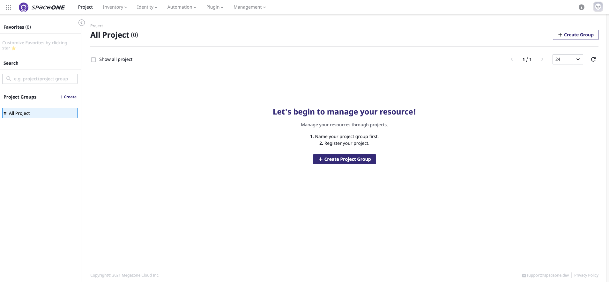
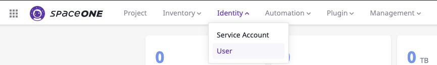
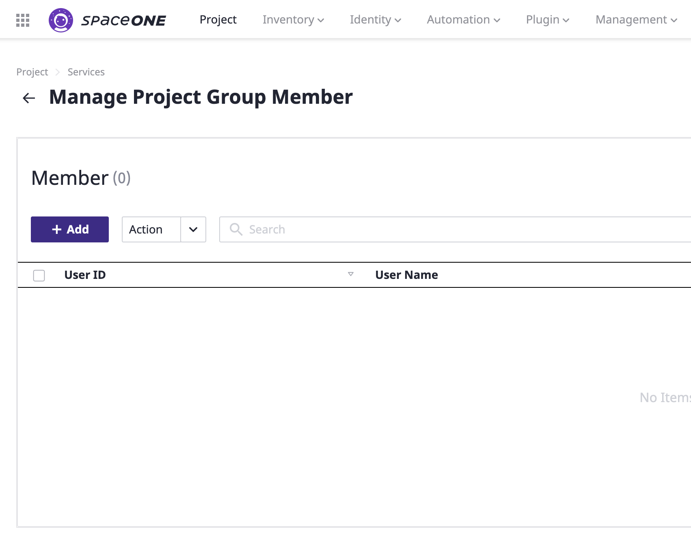
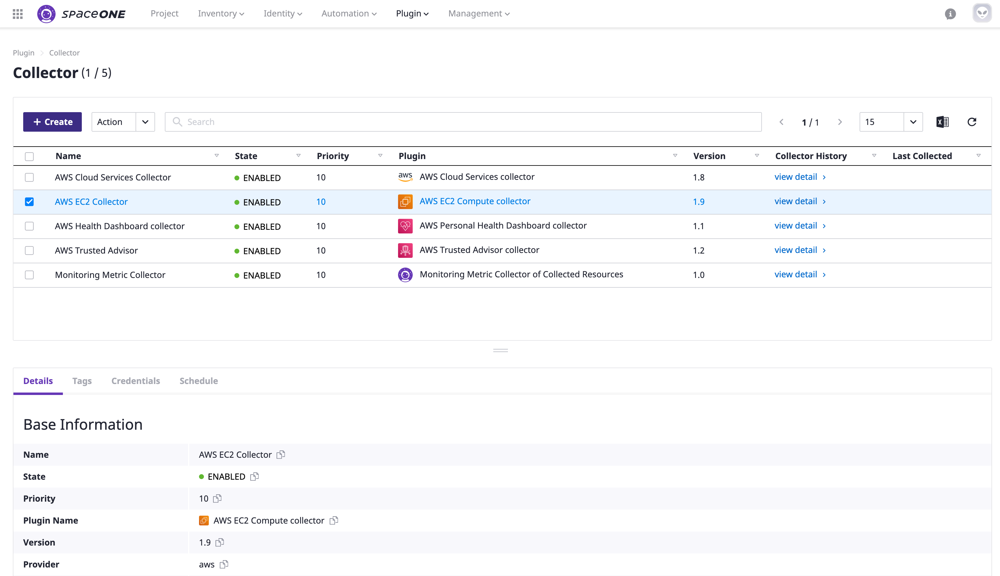

# Domain Admin

## Sign-in

**STEP 1:** Drive to domain of **SpaceONE** on browser ****and type given ID and Password as domain admin.  
**\(**E-mail received from the Root Account has stated detailed the connection methods; Single Sign On\(SSO\),  ID/PW, or Google Oauth2**\)**

## Create Project Group

All cloud resources **MUST** belong to a certain project for management purpose. You can grouping any projects with Project Group.   
Domain Admin creates the project group based on company's management policy.


**Note&gt;** General User **\(Project Admin\)** creates projects only under project group with permission to manage cloud resources.   


**STEP 1:** Drive to menu **`Project`** at top bar and click **`+ Create Group button`** at top right corner of panel.

**STEP 2:** Type project group name \(**sample case: Landing Zone**\) and Click Confirm.

**STEP 3:** Type project group name \(**sample case: Services**\) and Click Confirm.

**STEP 4:** Type project group name \(**sample case: Business Support Systems**\) and Click Confirm.

**STEP 5:** Check all 3 project groups has created a tree on left menu.

## Create User

Create general user and assign the project groups to created user. General users can access only to the project group which they are belonged to.

**STEP 1:** Drive to menu **`Identity > User`** at top bar. 

  
**STEP 2:** Click **`+ Add`** button to add a domain Admin user.

**STEP 3:** Fill out all required fields ****and click **`Confirm`** button once finish.

**STEP 4:** Drive to Project ****and Click **MEMBER** icons at right next to **`+ Create Project`** button.

**STEP 5:** Click **`+ Add`** button and Select members to add on the project group on the list at pop up window.

**STEP 6:** Click **`Confirm`** button when you finish to all members and set their role as project admin.

\*\*\*\*

**STEP 7:** Check all selected members has registered as project members.

## Cloud Resource Collectors

**Cloud Resource Collector** \(a.k.a **CRC**\) is a plugin that collects cloud resources across platforms such as AWS, Google Cloud, Azure, CRC is set by Domain Admin only.

**STEP 1:** Drive to Menu **`Plugin > Collector`**and Click **`+ Create`**button.

### **Create AWS EC2 Collector**

**STEP 1:** Select **aws-ec2** plugin and Click **`+ Create`** Button. ****

**STEP 2:** Please, fill out all required fields and select drop downs for each steps \(**Add Tags** is Optional\) and Click **`Confirm`** button to create a **AWS EC2 collector**.

### **Create AWS Cloud Services Collector** 

**STEP 1:** Select **aws-cloud-services** plugin and Click **`+ Create`** Button. ****

\*\*\*\*

  
**STEP 2:** Please, fill out all required fields and select drop downs for each steps \(**Add Tags** is Optional\) and Click **`Confirm`** button to create a **AWS Cloud Service Collecto**r.

\*\*\*\*

### **Create AWS  Trusted Advisor Collector** 

**STEP 1:** Select **aws-trusted-advisor** plugin and Click **`+ Create`** Button. ****

**STEP 2:** Please, fill out all required fields and select drop downs for each steps \(**Add Tags** is Optional\) and Click **`Confirm`** button to create a **AWS Trusted Advisor collecto**r.

\*\*\*\*

### **Create AWS Health Dashboard Collector** 

**STEP 1:** Select **aws-personal-health-dashboard** plugin and Click **`+ Create`** Button. ****

\*\*\*\*

**STEP 2:** Please, fill out all required fields and select drop downs for each steps \(**Add Tags** is Optional\) and Click **`Confirm`** button to create a **AWS Health Dashboard collector**.

\*\*\*\*

### **Create Monitoring Metric Collector** 

**STEP 1:** Select **monitoring-metric-collector** plugin and Click **`+ Create`** Button. ****

**STEP 2:** Please, fill out all required fields and select drop downs for each steps \(**Add Tags** is Optional\) and Click **`Confirm`** button.

**FINAL STEP:** Check all created collectors on the collector list.

## Set collection schedule

The schedule is to set the collection time so that the collectors run the jobs periodically to collect cloud resources.

**STEP 1:** Click **Schedule** tab on half bottom\(detail\) page on selected collector.

**STEP 2:**  Click **`+ Add`** button; Fill out Name and Time zone, and Select Schedule Frequency and then Click **`Confirm`** button once schedule setting is finished. 


1. Set '**Hourly schedule**' which runs everyday at selected hour 
2. Set '**Repeat Every \***' which runs every given intervals in seconds, minutes or hours.


  
**STEP3:** Check whether collection schedule is registered on collector.

\*\*\*\*

\*\*\*\*

