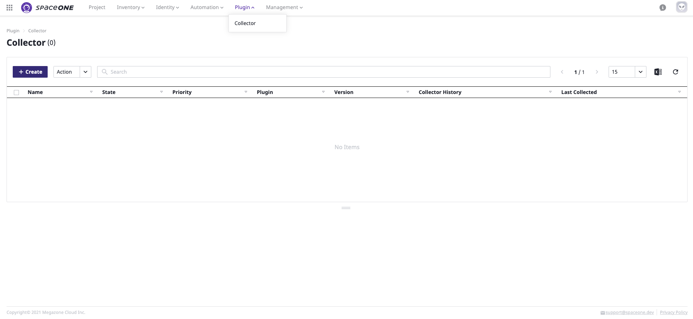

# Domain Admin

## Log-in

desc

**STEP 1:** 

## Create Project Group

desc

**STEP 1:** 

**STEP 2:** 

**STEP 3:** 

**STEP 4:** 

## Create User

desc

**STEP 1:** 

\*\*\*\*

**STEP 2: User를 Services 프로젝트 그룹에 매핑합다.**

**STEP 3: User Management 화면에서 Role과 Authorization Type이 매핑된 것을 확인할 수 있습니다.**

## Collect Collectors

desc

### **AWS EC2 Collector 생성**

**STEP 1: Market place 에서 aws-ec2 플러그인을 선택합니다.**

**STEP 2: AWS EC2 collector 를 생성합니다.**

### **AWS Cloud Services Collector 생성**

**STEP 1: Market-place 에서 `aws-cloud-services` 플러그인을 선택합니다.**

\*\*\*\*

**STEP 2: AWS Cloud Service Collector 를 생성합니다.** 

\*\*\*\*

### **AWS  Trusted Advisor Collector 생성**

**STEP 1: Market-place 에서 `aws-cloud-services` 플러그인을 선택합니다.**

**STEP 2:** 

\*\*\*\*

### **AWS Health Dashboard Collector 생성**

**STEP 1: Market-place 에서 `aws-cloud-services` 플러그인을 선택합니다.**

\*\*\*\*

**STEP 2:** 

\*\*\*\*

### **AWS Metric Collector 생성**

**STEP 1: Market-place 에서 `aws-cloud-services` 플러그인을 선택합니다.**

**STEP 2:** 

생성된 전체 collector 목록을 확인합니다.

## Update Schedule

desc

**STEP 1: Schedule을 설정하고 싶은 Collector를 선택한 뒤, 하단의 `Schedule` 탭 내 `Add` 버튼을 클릭합니다.** 

**STEP 2: 매 4시간 마다 수집하는 Collector를 생성합니다.**

 ****

\*\*\*\*

\*\*\*\*

