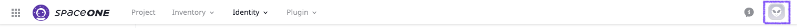
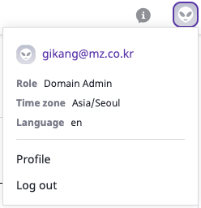
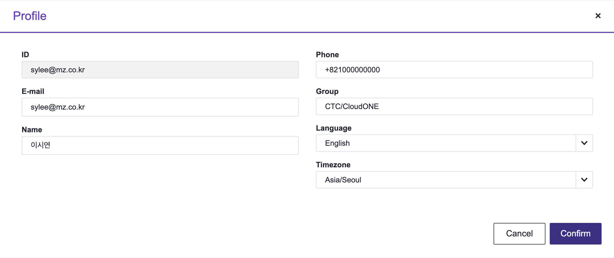

# Profile

## User Profile

ProfileはSpaceONEを利用するUserの情報を管理する機能です。

画面の右上をクリックして確認できます。

* Role : ユーザーの権限情報が確認できます。
* Time Zone : Consoleで利用される時間帯が確認できます。
* Language : Consoleの言語が指定できます。
* Profile : ユーザー情報が修正できます。
* Log Out : ログアウトしコンソールのログイン画面に移動します。
* **Profile**

Profileをクリックすれば、下記のようにユーザー情報ページが開かれます。

ID以外の全ての情報が修正できます。情報を変更した後、Confirmをクリックすれば、下記のようなAlertが右下に表示され、情報が修正されます。

