# General User

## Sign-in

**STEP 1:** Drive to the domain of **SpaceONE** on the browser ****and type the given ID and Password.

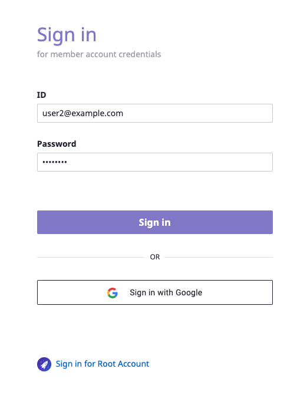

\*\*\*\*

## Create My Project Group and Project


**General User** has a permission to control only the project group/project which they belong to. 


**STEP 1:** Drive to menu **`Project`** at top bar and click **`+ Create`** button as below.

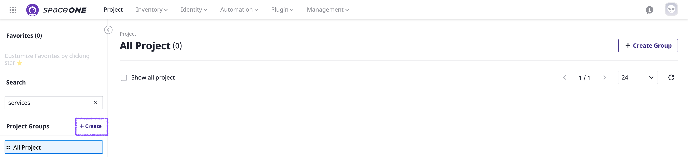

\*\*\*\*

**STEP 2:** Name **`Group`** at top bar and click **`+ Confirm`** button as below.

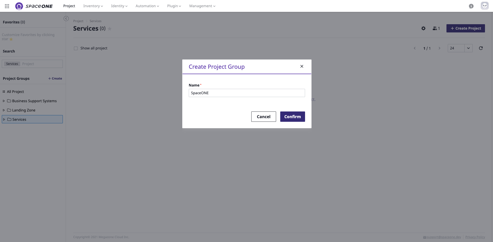

**STEP 3:** Select Project Group that you created in the previous step and click **`+ Create Project`** at the top right corner of the page. Name project and then click the**`Confirm`** button. \(sample case: **SpaceONE-DEV**\)

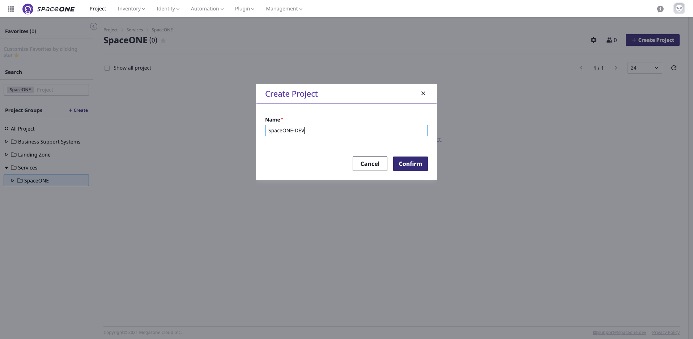

**STEP 4:**  Click **`+ Create Project`** at the top right corner of the page and then name project with a different name for your own use and then click **`Confirm`** button. \(sample case: **SpaceONE-PRO**\)

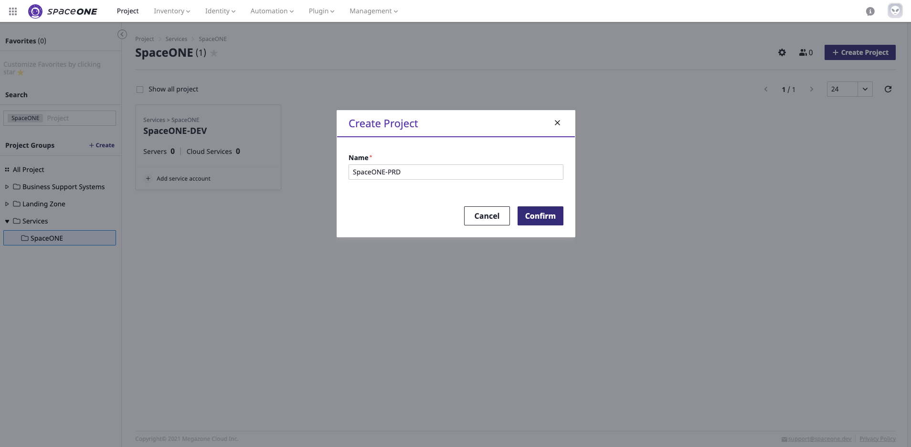

**STEP 5:**  Check 2 sample Projects \(**SpaceONE-DEV, SpaceONE-PRO**\) have created under **SpaceONE** project group. 

desc 

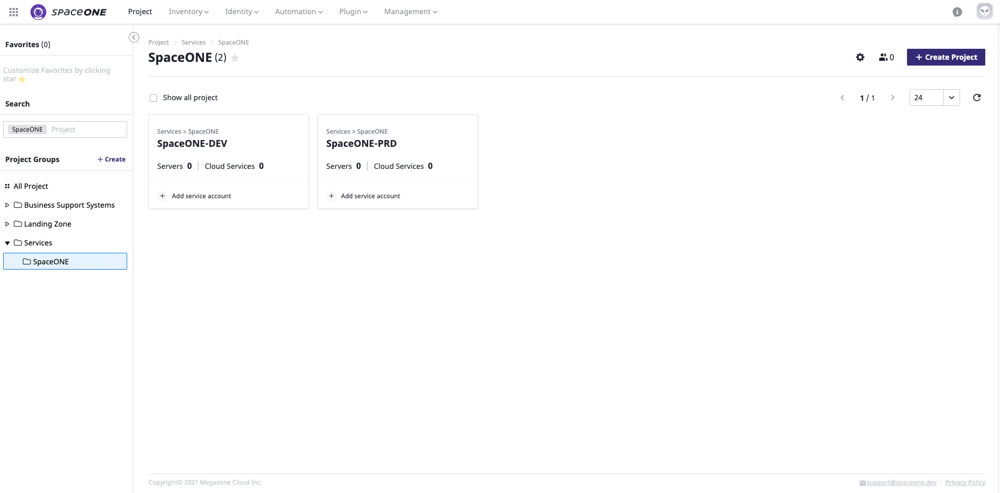

## Register Service Account

Service accounts must be registered to run collectors which getting cloud resources from public clouds.

  
**STEP 1:** Drive to menu **`Identity > Service Account`** from the top bar and Click AWS from the provider panel on the left side menu.  
Click **`+ Add`** button to add AWS service account. 

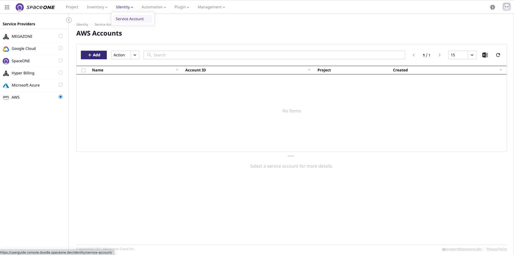

**STEP 2:** Fill out the name of Service Account and Account ID on base information fields. Please, fill out your **AWS Access Key** and **AWS Secret Key** as well. 


Please, Click links at Help for AWS Users panel if you have any issue to get Account id, Assume role, and AWS access key. 


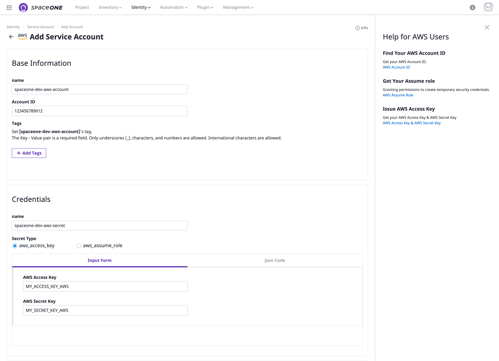

**STEP 3:** Please, select a project that you want to map with your service account. \(Optional\).   
We highly recommend mapping a project with Service Account for cloud resource management purposes.

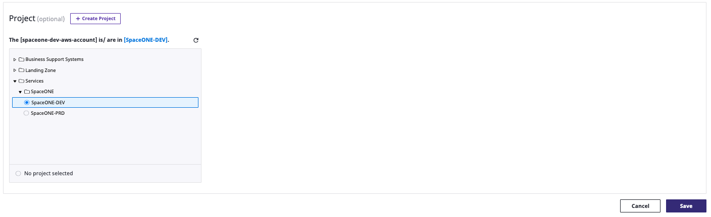

All cloud resources under the Service Account that you registered above will be shown on the selected project and  I**nventory** menu.

## Collect Resources

**STEP 1:** Drive to menu **`Plugin > Collector`**  at the top menu bar. 

**STEP 2:**  Select collector and  Select collect data from drop down option on Action. 

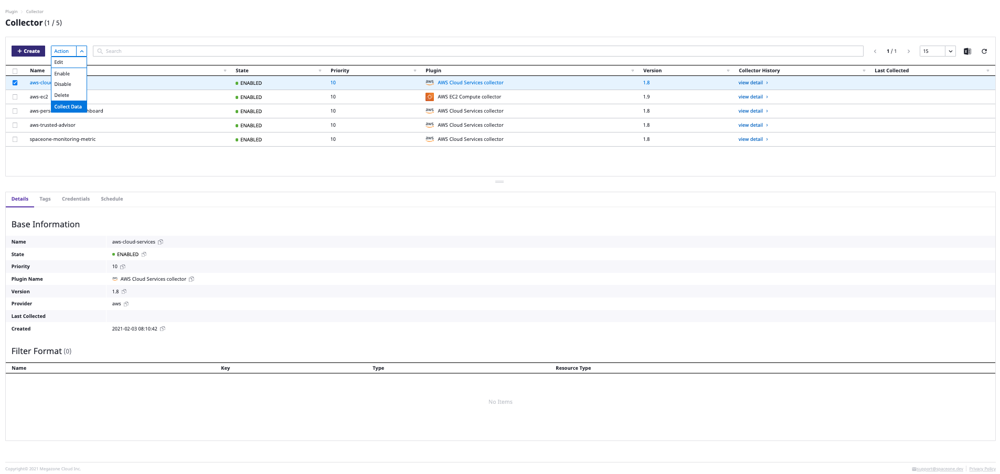

**STEP 3:**  Click **`Confirm`** button on **Collect Data** pop-up window.

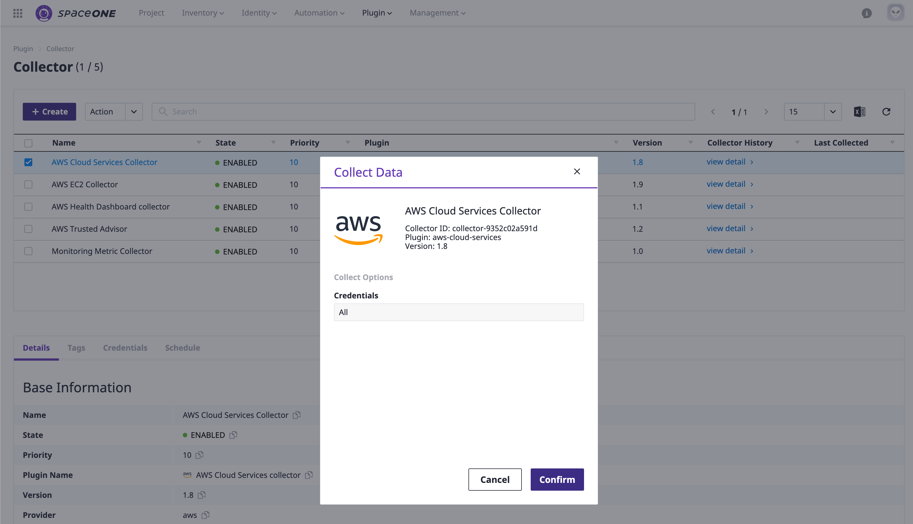

