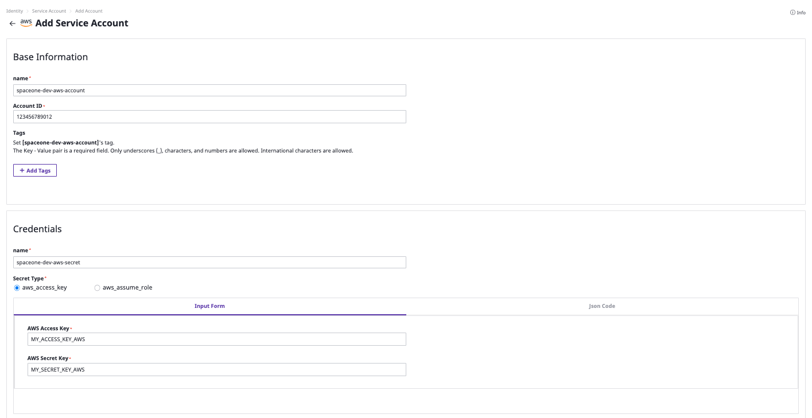

# General User

## Log-in

일반 사용는 자신이 소속된 프로젝트 그룹 하위에 프로젝트를 생성하고, 클라우드 계정을 등록하여 자원을 관리할 수 있습니다. 

**STEP 1: 일반 사용자로 로그인합니다.**

\*\*\*\*

## Create My Project Group and Project

**STEP 1: `SpaceONE` 프로젝트 그룹을 생성합니다.**

\*\*\*\*

**STEP 2: 생성한 `SpaceONE` 프로젝트 그룹 아래 `SpaceONE-DEV` 프로젝트를 생성합니다.** 

\*\*\*\*

**STEP 3: 생성한 `SpaceONE` 프로젝트 그룹 아래 `SpaceONE-PRD` 프로젝트를 생성합니다.** 

생성한 프로젝트를 한눈에 확인할 수 있습니다.

## Register Service Account

상단 navigation의 **`Identity`** - **`Service Account`** 를 클릭해 프로젝트 용 Service Account를 생성합니다. 

**STEP 1: 프로젝트용 Service Account를 생성합니다.**

**STEP 2: 해당 Service Account가 속할 프로젝트를 선택합니다. \(optional\)**

**`save`** 버튼을 눌러 저장합니다.

\*\*\*\*

\*\*\*\*

## Collect Resources

**STEP 1: 수집하고 싶은 collector를 선택한 후 상단 `Action` - `Collect Data` 를 선택해 리소스 수집을 시작합니다.**

\*\*\*\*

\*\*\*\*

