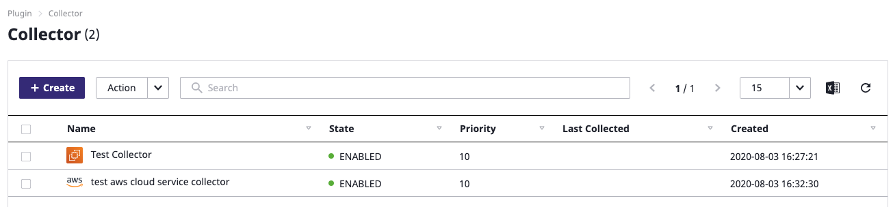

# A Compass To SpaceONE Universe Traveler

## How to Start  

You need little steps to follow to get start on 

* [**User Registr**](getting-started-2.md#adding-user)[**ation**](getting-started-2.md#adding-user)\*\*\*\*
* [**Create a Project**](getting-started-2.md#creating-project)\*\*\*\*
* [**Register Service Account**](getting-started-2.md#creating-service-account)\*\*\*\*
* [**Collect Cloud Resource** ](getting-started-2.md#discovering-cloud-resource)

## User Registration 

### Log-in as domain administrator

SpaceONE service assigns a domain per company, and you can access through this assigned domain.  
You will receive log-in ID and password since you applied services.

\(We guide applying process for spaceONE service on certain channels while CBT period\)

               Click 'Sign in root account credentials' button at the bottom to sign-in as domain administrator.

                               Sign in with given ID/Password from SpaceONE service administrator. 

### Add a new common user account

Let's add a user in the domain. You can sign into SpaceONE with created user account to proceed to next.

**Step 1:** Click Identity &gt; User on top of Global Navigation Bar

  
**Step 2:** Click ' + Create'  button to add user in your group.   
It's the first time to sign-in as  below, and therefore no user is on list.

**Step 3:** ID is required fields, and **must** entered in **e-mail** format. For other items, refer to the example below.

Click 'check user id' to check the duplicate name after entering the user name

**STEP 4:** Please, sign in with registered user above after sign out 

Please, refer to the IDENTITY&gt; USER page for more detailed user management functions.



### Sign in as a common user

Now, let's sign in as the added user and try SpaceONE service.   
  
**STEP1:** Click 'Sign in with Google' button and select account that was added previously.

You will see an empty dashboard if you sign in first time with added user. Because you don't have any data yet. :-\)

Now let's collect Cloud Resources through SpaceONE.   
Create a your first project with 'Get Started' button.

## Create Project   

Project 생성은 _Project Group_ 생성 후에 가능합니다. 

Project 페이지 좌측의 _Create_ 버튼을 클릭하여 Project Group을 생성합니다. 

아래와 같이 입력하여 Project Group을 생성합니다.

생성한 Project Group 을 선택한 후 _Create Project_ 버튼을 눌러 Project를 생성합니다. 

아래와 같이 Project 생성 창이 나오게 됩니다. 프로젝트 명을 입력하여 생성합니다. 

아래와 같이 Project 설정이 완료 되었습니다. 

더 자세한 Project 관리 기능을 알아보기 위해서는 IDENTITY &gt; Project 페이지를 참고 해주세요.

이제, Service Account를 설정 해보도록 합시다. 

## Service Account 생성하기 

Cloud Resource를 수집하기 위한 Credentials\(APIKey Pair\)를 입력 합니다. Getting Started Guide에서는 AWS를 기준으로 생성 합니다. 

Identity &gt; Service Account &gt; AWS 를 선택한 후 _Add_ 버튼을 클릭 합니다. 

Add Service Account 입력 폼에서 아래와 같이 AWS Service Account를 등록하기 위해 필요한 항목을 입력 합니다. 

붉은색 으로 표기된 항목은 필수 항목입니다. 나머지 항목은 옵션으로 입력하지 않아도 큰 문제가 되지 않습니다. 

 모든 항목을 입력한 후 Project 항목 에서는 사전에 생성한 Project를 지정 한 후 하단의 _Save_ 버튼을 클릭 합니다. 

AWS Service Account가 정상적으로 생성 되었다면, Collector를 생성하여 Cloud Resource를 수집 하는 것이 가능 합니다. Service Account에 대한 자세한 설명은 아래의 링크를 참고해주세요.  



## Cloud Resource 수집하기 

### Collector 생성하기

Plugin &gt; Collector 로 이동합니다. 최초 로그인시 설치된 Collector가 없으므로 비어있는 화면이 나오는 것이 정상 입니다. 

Create 버튼을 클릭하여 필요한 Collector를 선택 합니다. 

아래와 같이 _**Official MarketPlace**_에서 설치 가능한 Collector List를 확인할 수 있습니다. 이번에는 _**aws-ec2**_ Collector를 설치 해 보도록 하겠습니다. aws-ec2 collector의 _**Create**_ 버튼을 클릭 합니다. 

아래와 같이 Collector 생성 Wizard가 화면에 나타납니다. 

선택한 Collector의 이름과 버전을 선택할 수 있습니다. 다른 부분은 크게 변경할 필요 없고, 이름을 입력 하고 _**Confirm**_을 클릭하면 생성됩니다. 

같은 방법으로 AWS-Cloud-Service Collector도 생성 합니다. 아래와 같이 생성된 Collector가 조회 됩니다. 

### 

### Collector 실행하기 

이제 Cloud Resource를 수집해 봅시다. 

앞에서 생성한 Collector를 선택 후 _**Action &gt; Collect Data**_를 클릭 하면 아래와 같이 _**Collect Data**_ ****화면을 조회할 수 있습니다. Confirm을 클릭하여 수집을 실행 합시다. 

실행중인 Collector의 상황은 _**Domain Dashboard &gt; Collection**_ 화면에서 아래와 같이 확인 가능 합니다.  

수집은 대략 3분 이내에 완료가 됩니다. 수집이 정상적으로 완료된 경우 Inventory &gt; Server, Cloud Service에 수집된 리소스가 조회되는 것을 확인할 수 있습니다. 

Collector에 대한 자세한 설명은 Plugin &gt; Collector 페이지를 참조 해주세요.



## Next 

여기까지 해서 SpaceONE을 사용하기 위한 기본적인 설정 작업을 마쳤습니다.

다음은 위에서 설정한 각 기능들에 대해 세부적으로 살펴 보도록 하겠습니다.

  

