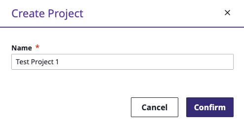
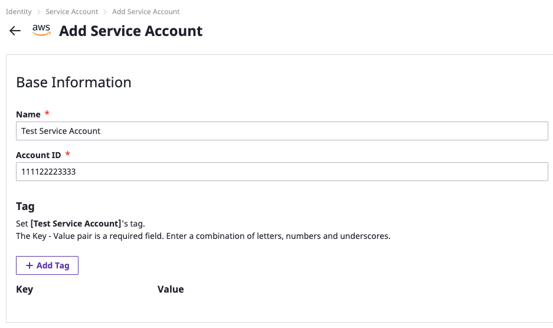

# A Compass To SpaceONE Universe Traveler

## How to Start  

You need little steps to follow to get start on 

* [**User Registr**](getting-started-2.md#adding-user)[**ation**](getting-started-2.md#adding-user)\*\*\*\*
* [**Create a Project**](getting-started-2.md#creating-project)\*\*\*\*
* [**Register Service Account**](getting-started-2.md#creating-service-account)\*\*\*\*
* [**Collect Cloud Resource** ](getting-started-2.md#discovering-cloud-resource)

## User Registration 

### Log-in as domain administrator

SpaceONE service assigns a domain per company, and you can access through this assigned domain.  
You will receive log-in ID and password since you applied services.

\(We guide applying process for spaceONE service on certain channels while CBT period\)

               Click 'Sign in root account credentials' button at the bottom to sign-in as domain administrator.

                               Sign in with given ID/Password from SpaceONE service administrator. 

### Add a new common user account

Let's add a user in the domain. You can sign into SpaceONE with created user account to proceed to next.

**Step 1:** Click Identity &gt; User on top of Global Navigation Bar

  
**Step 2:** Click ' + Create'  button to add user in your group.   
It's the first time to sign-in as  below, and therefore no user is on list.

**Step 3:** ID is required fields, and **must** entered in **e-mail** format. For other items, refer to the example below.

Click 'check user id' to check the duplicate name after entering the user name

**STEP 4:** Please, sign in with registered user above after sign out 

Please, refer to the IDENTITY&gt; USER page for more detailed user management functions.



### Sign in as a common user

Now, let's sign in as the added user and try SpaceONE service.   
  
**STEP 1:** Click 'Sign in with Google' button and select account that was added previously.

You will see an empty dashboard if you sign in first time with added user. Because you don't have any data yet. :-\)

Now let's collect Cloud Resources through SpaceONE.   
Create a your first project with 'Get Started' button.

## Creating a Project   

You can create a _project_ after creating a _Project Group_. 

**STEP 1:** Click '_Create_' button at right next to Project Group to create a project group.

**STEP 2:** Type as below to create a Project Group

**STEP 3:** Click '_Create Project'_ button to create a project __after select created Project Group.

Project creation window appears as below. Create a project by entering the project name.

Project setting is completed as shown below. 

Please refer to the IDENTITY&gt; Project page for more detailed project management functions. 

Now, let's set up a Service Account. 

## Creating a Service Account 

Enter Credentials\(APIKey Pair\) to collect Cloud Resource.   
The example service account registration in the Getting Started Guide is based on AWS.

**STEP 1:** Click '_+ Add_' button once selected Identity &gt; Service Account &gt; AWS. 

**STEP 2:** Enter all required fields to add an AWS Service Account in the Add Service Account input form as shown below.

Items marked in red are required fields. The rest of the items aren't mandatory. You can skip optional fields.

**STEP 3:** Select a project in the Project item, and then click the 'Save' button at the bottom, once you fill out all required fields. 

Now you can collect cloud resources by creating a Collector if AWS service account is successfully registered.   
  
Please refer to the link below for more information on Service Account.



## Collecting Cloud Resources 

### Creating Collector

Drive to Plugin &gt; Collector. It is normal for a blank screen to appear as there is no Collector installed when sign in for the first time

**STEP 1:** Select a Collector with clicking '+ Create' button.  

You can find Collector List that can be installed in _**Official MarketPlace**_ as shown below.  
We will proceed to install _**aws-ec2**_ Collector at this time. 

**STEP 2:** Click ****_**aws-ec2**_ collector's '+ create' button. 

The Collector Creation Wizard appears on the screen as shown below.

You can name collector and select its version. Other fields don't need to edit by any chance. It is created by entering the name and clicking Confirm.

**STEP 3:** Enter name and then click ****collector's 'confirm' button. 

You can also create an AWS-Cloud-Service Collector with same process as well.   
You can find collectors on the list once you created.

### 

### Execute Collector 

Now let's collect Cloud Resources.

**STEP 1:** Select the collector created earlier and click '**Action &gt; Collect Data'** to view the Collect Data screen as shown below. Click Confirm to start collecting.

You can find current status of the running Collector on the **Domain Dashboard&gt; Collection** screen as follows.

Collecting process takes approximately 3 minutes to complete. You can find the collected resources at Inventory&gt; Server, Cloud Service, if the collection is completed successfully. 

Please refer to the Plugin&gt; Collector page, for further details on Collector.



## Next 

So far, you have completed the basic setup to use SpaceONE. 

On next, we will look up each function in details.

  

