# A Compass To SpaceONE Universe Traveler

## 概要 

SpaceONEを利用するために、下記の順に従って設定してください。

* [**ユーザーの追加**](getting-started-2.md#adding-user)
* [**プロジェクト作成**](getting-started-2.md#creating-project)
* [**Service Account作成**](getting-started-2.md#creating-service-account)
* [**Cloud Resource収集** ](getting-started-2.md#discovering-cloud-resource)

## ユーザーの追加 

### ドメイン管理者としてログイン

SpaceONEサービスはお客様毎にドメインが割り当てられ、そのドメインで接続してご利用できます。

サービス申請後、管理者から割り当てられたサービスURLとAdmin ID/Passwordでサービスにアクセスします。

\(現在、CBT中なので、サービス申請は別途ご案内いたします。\)

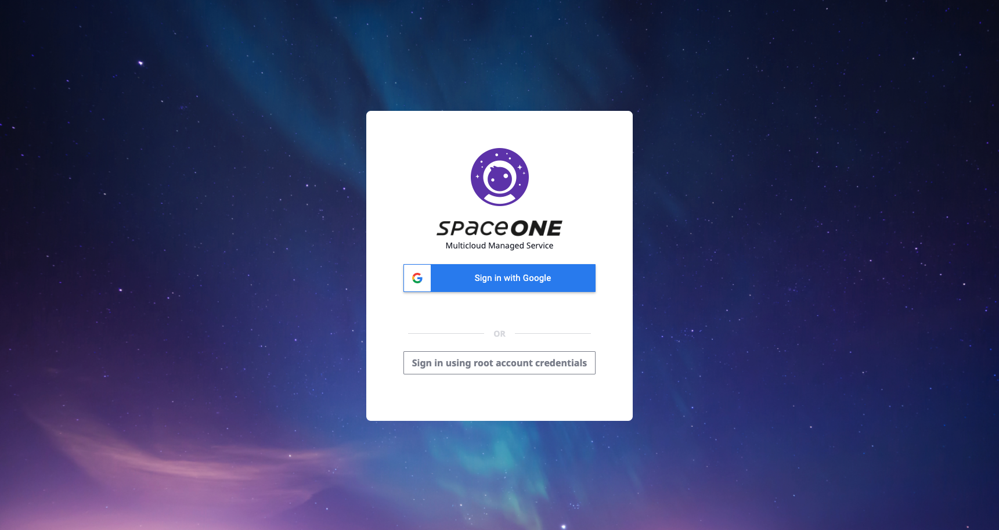

下記の通り、Sign In boxの下の_Sign-in using root account credentials_ ボタンをクリックして Domain Administrator 権限でログインします。

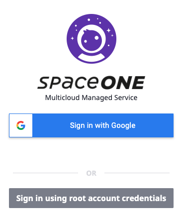

SpaceONEサービス管理者から付与されたID/Passwordでログインします。

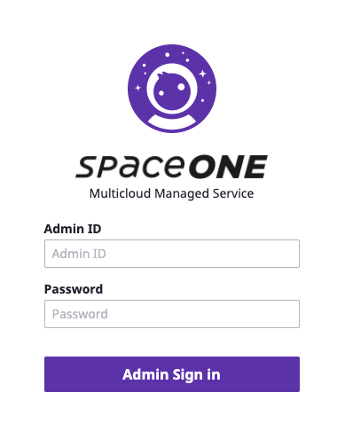

### 一般ユーザーの追加

一般ユーザーを追加してみましょう。追加した後には、追加されたユーザーでSpaceONEにログインしてユーザー別作業ができます。

上部の「Global Navation Bar」で「Identity &gt; User」をクリック

下記のイメージのように、初めてのログインなので、登録されたユーザーがありません。_Create_ ボタンをクリックしてユーザーを追加します。

IDの場合、必須事項で、メール形式で入力してください。他の項目の場合、下記の例をご参照ください。

ユーザ名を入力した後、_check user id_ をクリックして重複しているかチェックしてください。

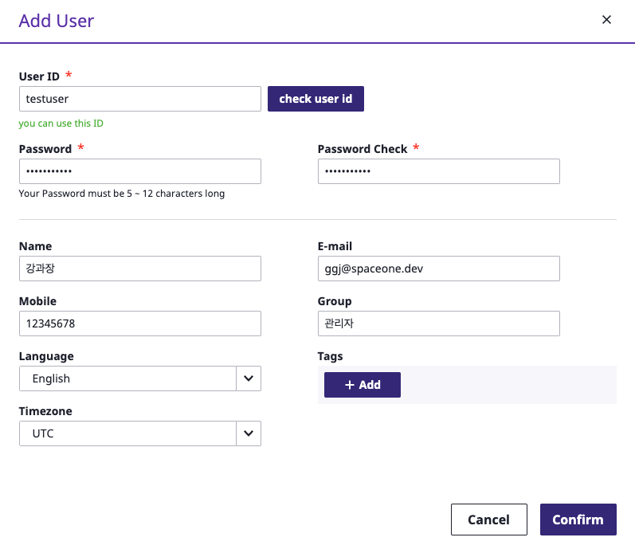

ユーザー登録が終わったらログオフして追加したユーザーでログインします。

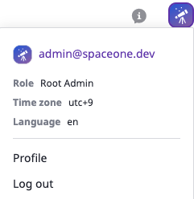

より詳しいユーザー管理機能はIDENTITY &gt; USER ページをご参照ください。



### 一般ユーザーでログイン

追加したユーザーでログインしてサービスを利用しましょう。_Sign in with Google_ ボタンをクリックしてログインします。

ログインすれば下記のイメージのように、まだデータが収集されてないので、Dashboardには何も表示されていません。

SpaceONEを通してCloud Resourceを収集してみます。まず、Get Started\_ ボタンをクリックしてProjectを作成します。

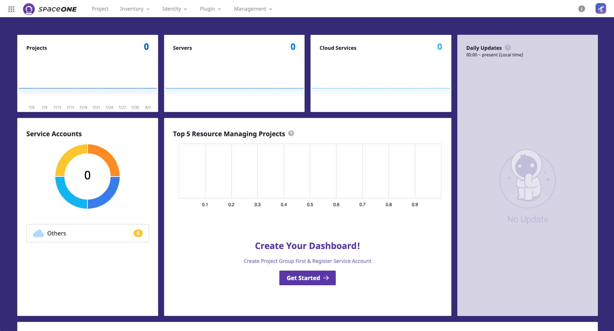

## プロジェクトの作成 

Project作成は_Project Group_ を作成した後できます。

Project ページの左側の_Create_ ボタンをクリックしてProject Groupを作成します。

下記のように入力してProject Groupを作成します。

作成したProject Group を選択した後、_Create Project_ ボタンをクリックしてProjectを作成します。

下記のようにProject名を入力して作成します。

下記のイメージのようにProjectの設定が完了されました。

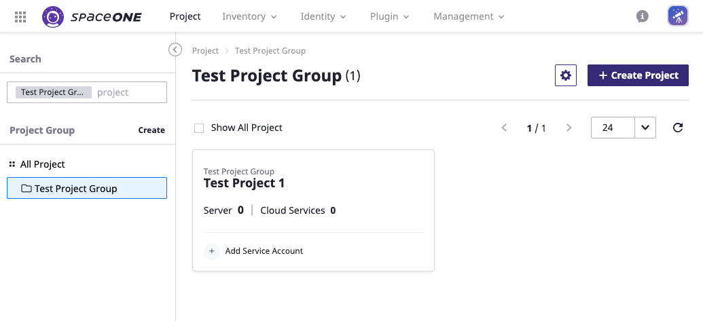

より詳しいProject管理機能については、IDENTITY &gt; Projectページをご参照ください。

次に、Service Accountを設定します。

## Service Account作成 

Cloud Resourceを収集するために、Credentials\(APIKey Pair\)を入力します。Getting Started GuideではAWSを基準で作成します。

Identity &gt; Service Account &gt; AWSを選択した後_Add_ ボタンをクリックします。

Add Service Account入力フォームに下記のようにAWS Service Accountを登録するための項目を入力します。

赤い「\*」で表示されているところは必須項目です。その他項目はオプションで、入力しなくても利用に問題ありません。

全ての項目を入力した後、 Project 項目に事前に作成した Projectを指定した後、下の _Save_ ボタンをクリックします。

AWS Service Accountが正しく作成されたら、 Collectorを作成して Cloud Resourceが収集できます。Service Accountの詳しい情報は下記のリンクをご参照ください。



## Cloud Resource 収集 

### Collector 作成

Plugin &gt; Collectorに移動し、初めてログインした場合、Collectorないので、情報は表示されません。

Createをクリックして必要な Collectorを選択します。

下記のように _**Official MarketPlace**_からインストールできるCollector Listが確認できます。ここでは_**aws-ec2**_ Collectorをインストールしてみます。aws-ec2 collectorの _**Create**_をクリックします。

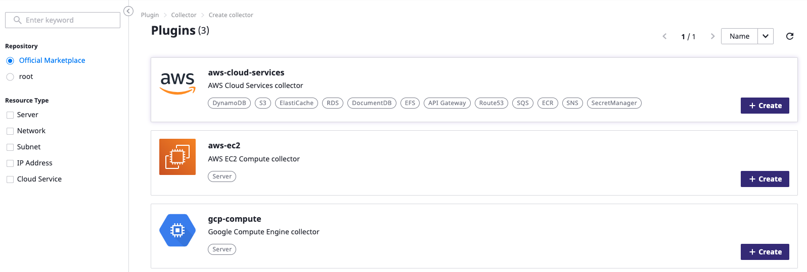

下記のようにCollector作成Wizardが表示されます。

選択したCollectorの名前とバージョンが選択できます。他のところは特に変更する必要がないので、名前を入力して_**Confirm**_をクリックして作成します。

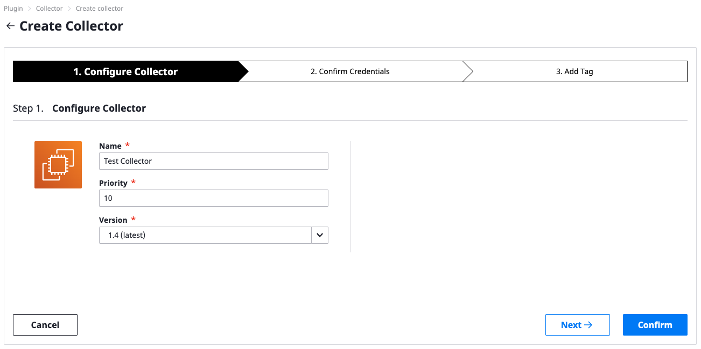

同じ方法でAWS-Cloud-Service Collectorも作成します。下記のように作成されたCollectorが照会できます。

### Collector実行

次に、Cloud Resourceを収集します。

以前作成したCollectorを選択した後、_**Action &gt; Collect Data**_をクリックすれば、下記のように_**Collect Data**_ 画面が照会できます。 Confirmをクリックして収集を実行します。

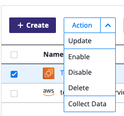

実行中のCollectorの状況は_**Domain Dashboard &gt; Collection**_ 画面で下記のように確認できます。

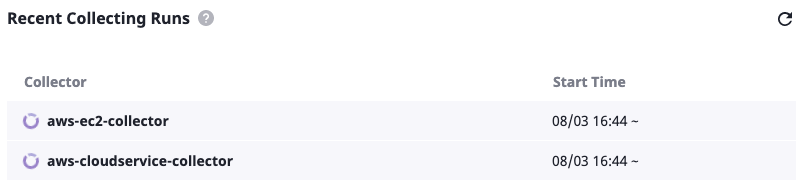

収集は約3分以内で完了されます。収集が正しく完了された場合、Inventory &gt; Server, Cloud Serviceから収集されたリソースが照会できます。

Collectorのより詳しい説明は Plugin &gt; Collector ページをご参照ください。



## Next

ここまではSpaceONEを利用するための基本的な設定です。

次は今まで設定してきた各機能を詳しく見てみます。

