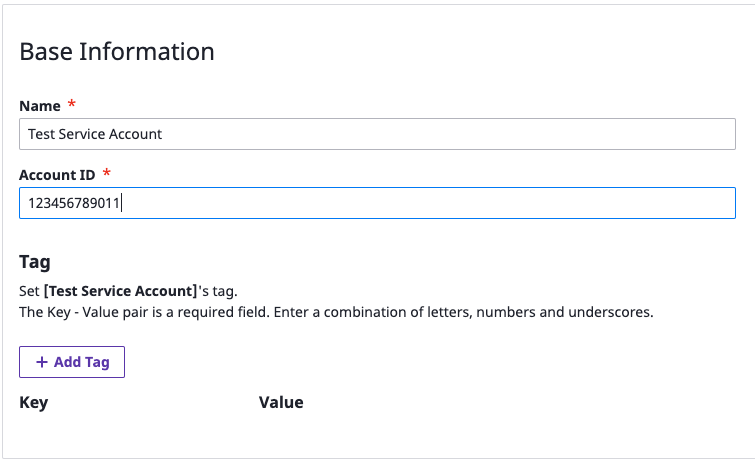
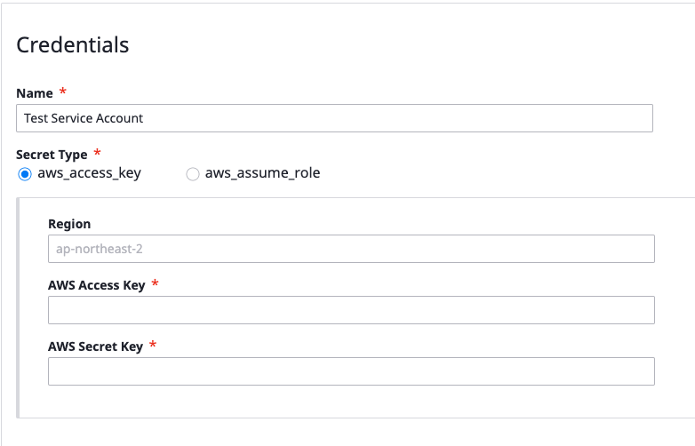
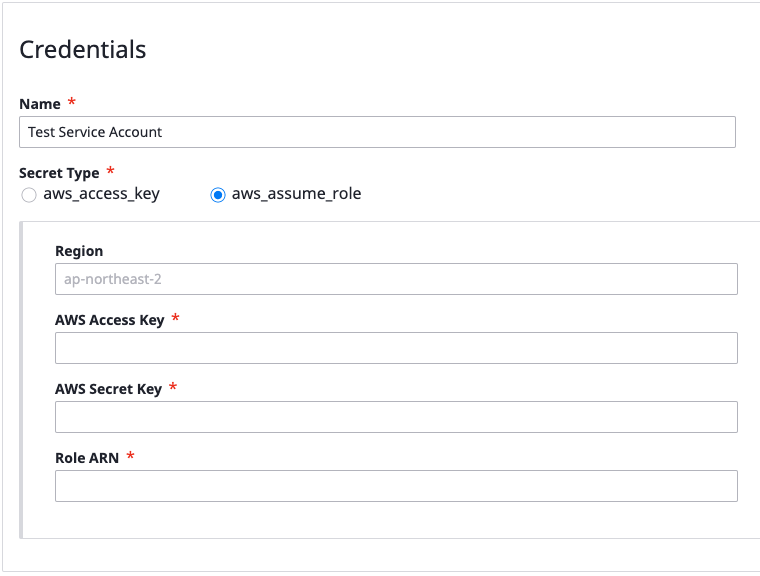
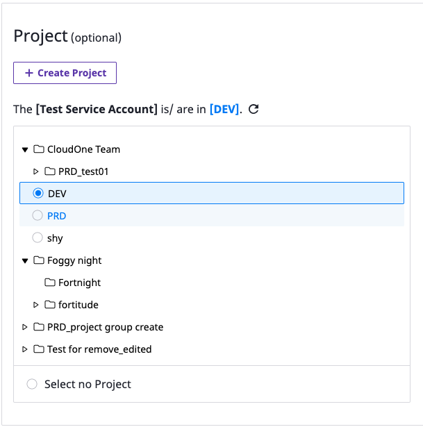
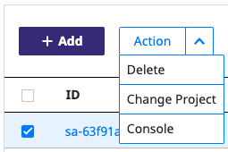
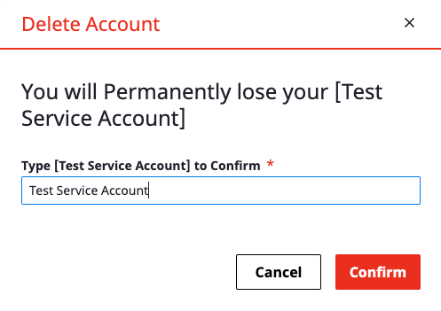
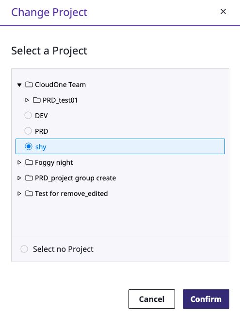
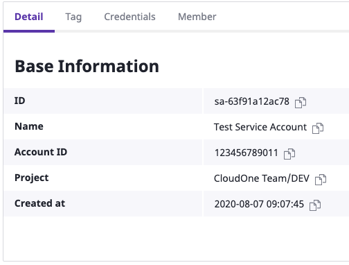
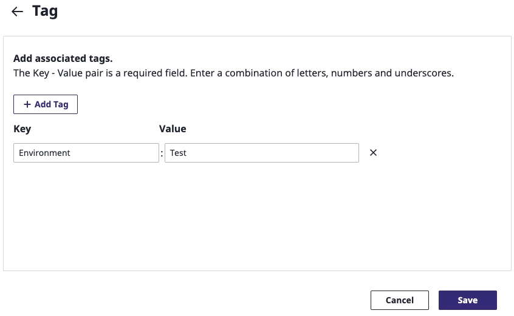

# Service Account

## Overall

Using service account page, Users can manage credentials easily for each  cloud providers. Multi cloud resources are collected based on this credentials

Listed jobs are available

* Adding _**Service Account**_
* Deletion of _**Service Account**_ /Changing _**project**_
* Link to AWS Console

SpaceONE supports providers belows. 

* AWS
* Google Cloud
* Microsoft Azure
* MEGAZONE
* SpaceONE

## Adding Service Account

Users can add _**Service Account**_ by select cloud provider and clicking _**+ Add**_ button

In the user guide, we will focus on AWS\`s IAM

_**Service Account**_ will be easily added by fill out items marked with \*.

### Base Information

* Name : Name of Service Account
* Account ID : Root Account ID.\(12-digits\)
* Tag : Additional _**Service Account**_\`s tag

### Credentials

Two types of Service Accounts are available. \(aws\_access\_key, aws\_assume\_role\)

Input parameters for each types. 

#### aws\_access\_key  

* Region\(Option\) : Target regions to be collected. Empty will be considered all regions \(Collectors will scan all regions resources\).
* AWS Access Key\(Required\) : Access Key from IAM. Read Only policy is strongly recommended.
* AWS Secret Key\(Required\) : Secret key from IAM.

#### aws\_assume\_role

* Region\(Option\) : Target regions to be collected. Empty will be considered all regions \(Collectors will scan all regions resources\).
* AWS Access Key\(Required\) : Access key from IAM to be assumed.
* AWS Secret Key\(Required\) : Secret key from IAM to be assumed.
* Role ARN\(Required\) : Role ARN of assume role from IAM.

### Selecting Project

Select the project to which the _**Service Account**_ will be placed. Collected resources from that _**Service Account**_ will be belongs to the projects automatically

* Project 생성이 필요할 경우 _**+ Create Project**_ 버튼을 클릭하여 필요한 Project Group/Project를 생성한 후 진행 합니다. Project 생성에 대한 자세한 링크는 아래 페이지를 참고하세요.



* 원하는 Project를 선택한 후 _**Save**_ 버튼을 클릭하여 Service Account의 생성 작업을 완료 합니다. 
* Project를 지정하지 않고 싶은 경우 _**Select no Project**_를 선택 합니다. Project는 나중에 다시 지정이 가능 합니다. 

## Service Account 삭제/Project 변경

Service Account를 삭제 하거나/기존에 지정했던 Project를 변경 합니다. 

대상 Service Account를 선택 후 _**Action**_ 메뉴를 클릭한 후 _**Delete**_ 혹은 _**Change Project**_를 선택 합니다. 

#### Service Account 삭제

아래와 같이 Service Account 삭제 화면에서 Service Account 이름을 입력한 후 _**Confirm**_ 을 클릭하여 삭제가 가능합니다.   

#### Project 변경

아래와 같이 Change Project 화면에서 변경하고자 하는 Project를 지정한 후 _**Confirm**_을 클릭하여 삭제가 가능합니다. 

## AWS Console로 링크 

대상 Service Account를 선택 후 _**Action**_ 메뉴를 클릭한 후 _**Console**_을 선택 합니다. 

AWS의 콘솔 링크로 이동 합니다. 사전에 AWS Console에 로그인이 되어 있거나, 로그인을 해야 해당 IAM Account로 이동할 수 있습니다. 

## 상세 조회 및 관리

상세 관리 탭을 통해  Service Account의 상세 정보 확인/Tag 관리/Credential 관리/Member 관리가 가능 합니다. 

#### Detail 

Service Account의 Meta 정보를 확인할 수 있습니다.

#### Tag

_**Edit**_ 버튼을 클릭해서 Service Account의 Tag를 추가/삭제할 수 있습니다. 

#### Credentials

Service Account 에서 Key 정보를 보관하고 있는 Credential 을 추가하거나 삭제할 수 있습니다.

####  

