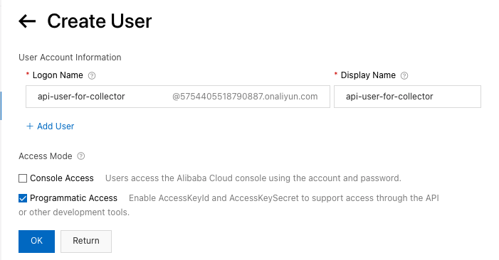
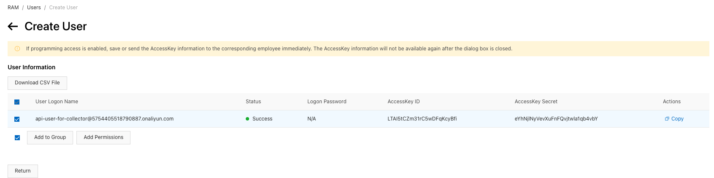

# \(Alibaba Cloud\) Service Account Policy Management

## Service Account Policy

**SpaceONE** highly recommends to set appropriate permissions to **Service Account** for each purpose. 

Please, Set service account, To Create API for each use case:

* [General Collector](alibaba-cloud-service-account-policy-management.md#general-collector)

## General Collector 

Collector requires appropriate authorities to collect cloud resources. We strongly recommend to limit collector's service account its permission to **read only access**. 

Otherwise, you can add more restrictions per resources or actions. One of the useful example is to restrict its rights.

**STEP 1. Log in Alibaba Cloud Console &gt; RAM** 

Go to [RAM Console](https://ram.console.aliyun.com/) &gt; Identities &gt; Users &gt; **`Create User`** 

**STEP 2. Set Service account details**

Enter _**Logon Name**_, and _**Display Name**_. Set access type to _**Programmatic access.**_ ****Click **`OK`** _****_and return to _Create User screen_.

\*\*\*\*

**STEP 3: Add Permissions to the service account.**

Click **`Add Permissions`** which will open _Add Permissions popup window_. 

Then Alibaba Cloud Account would be selected for its Authorized Scope and its logon name would be selected for its Principal. All you need to do is just to select **`ReadOnlyAccess`** policy for its _**System Policy**_. Click **`OK`** and **`Complete`** to close the popup.

**STEP 4: Check Your AccessKey Pair.**

You will return to _Create User screen_, and can check you _**AccessKey ID**_ and _**AccessKey Secret**_. Alibaba Cloud generates AccessKey Pair by default when you create a user. Click **`Copy`** to copy your authentication information. Go to step 5 if you miss this step.

  
**STEP 5: Generate Your AccessKey Pair. \(optional\)**

Go to [RAM Console](https://ram.console.aliyun.com/) &gt; Identities &gt; Users &gt; Choose the user you created for General Collector.

Click **`Create AccessKey`** in the _Authentication_ tap.

You will receive _Create AccessKey popup_, and click **`Copy`** below the blue box to copy your _**AccessKey Pair**_ information. Click **`Close`** to close the popup window.

