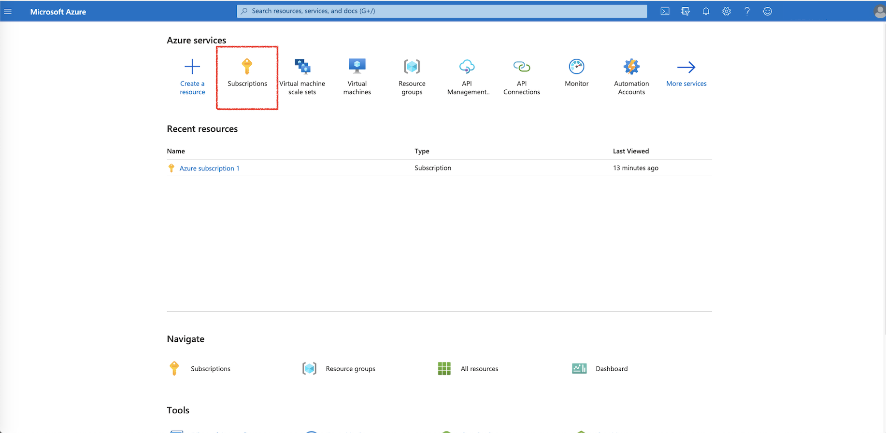
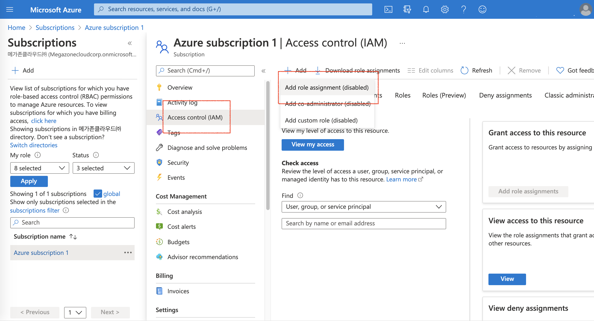

# \(Azure\) Access Control \(IAM\) Policy Management

## **Access Control** Policy

**SpaceONE** highly recommends to set appropriate permissions to Resource groups for each purpose. 

Please, Set service account, To Create API for each use case:

* [General Collector](azure-access-control-iam-policy-management.md#general-collector)

## General Collector 

Collector requires appropriate authorities to collect cloud resources. We strongly recommend to limit collector's service account its permission to **read only access**. 

Otherwise, you can add more restrictions per resource groups or actions. One of the useful example is to restrict its rights within resource groups.

\*\*\*\*

**Prerequisite**

This user guide tutorial assumes that a `subscription id` is already created.

\*\*\*\*

**STEP 1. Log in Azure Portal &gt; Resource groups** 

Select the resource group for which the collector will collect resources.

**STEP 2. Click `Access control (IAM)` Navigation tab, and click `+Add` button.**

**STEP 3: Assign the `Reader role`  to the account. The account should  have an access permission in this resource group.**

## Troubleshooting

### Authorization

If you get any kinds of error messages above, follow the troubleshooting steps below.

#### 1. \(AuthorizationFailed\) Client does not have authorization 


The client `client_id` with object id `object_id` does not have authorization to perform action Microsoft.Resources/subscriptions/resourcegroups/read over scope `subscription_id` or the scope is invalid. If access was recently granted, please refresh your credentials


**STEP 1: Log in Azure Portal and Drive to &gt; Subscriptions** 

  
**STEP 2: Click the subscription name where resources are located.**

**STEP 3: Click `+Add role assignment` button.**

\*\*\*\*

**STEP 4: Add role `Reader` assignment as below. Select the account entered in the service account of the** _**SpaceONE**_ **console.**

