# \(Google Cloud\) Service Account Policy Management

## Service Account Policy

**SpaceONE** highly recommends to set appropriate permissions to **Service Account** for each purpose. 

Please, Set service account,  To Create API for each use case:

* [General Collector](service-account-policy-management.md#how-to-create-readonly-policy-in-aws)
* [Power Scheduler Service](service-account-policy-management.md#powerscheduler)

## General Collector 

Collector requires appropriate authorities to collect cloud resources. We strongly recommend to limit collector's service account its permission to **read only access**. 

Otherwise, you can add more restrictions per resources or actions. One of the useful example is to restrict its rights within region.


**STEP 1. Log in Google Cloud Console &gt; IAM** 

Go to IAM &gt;  Service Account and Click **`+ CREATE SERVICE ACCOUNT`**

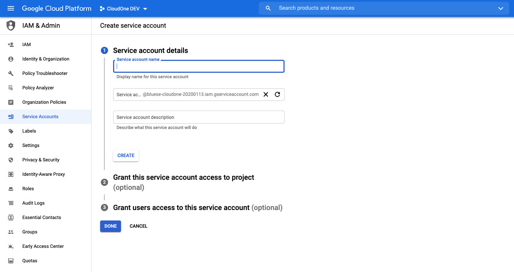

**STEP 2. Set Service account details**

Enter _**Service account name**_, and _**Service account description**_

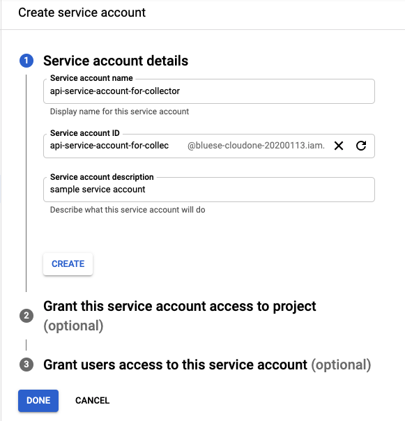

**STEP 3: Grant Service account  to project**

Set Permission to Viewer\(Role\): Read All Access and Click **`CONTINUE`**

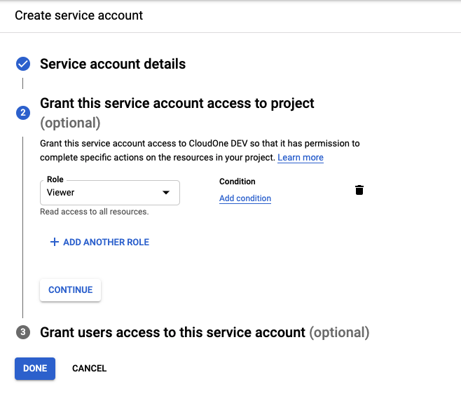

**STEP 4: Grant Users access to this service Account \(optional\)** 

_**You can skip this process**_ and move to next.    
Set Service account users role and Service account admin role.

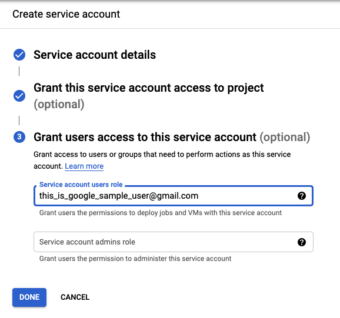

Click **`DONE`** if everything is finished. 

  
**STEP 5: CREATE KEY**

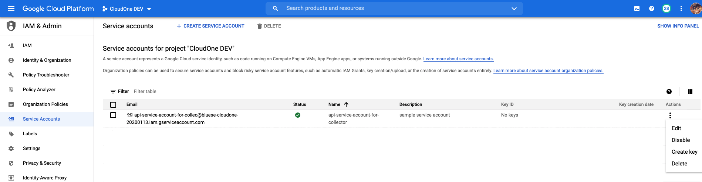

Find a Service account that you created right before in previous step. Click Action button and Select**`Create Key`**  

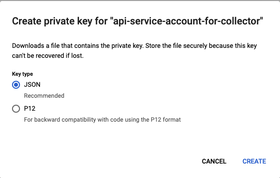

Select Key Type and Click **`CREATE`** button. We suggest JSON Type  as recommended above.

**STEP 6: Review**

You will see Key ID on the list and its service account JSON on your local. 

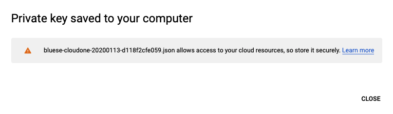

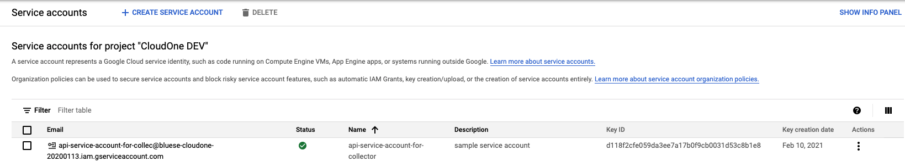

## PowerScheduler

Suggested IAM policy for each cloud provider to use _**SpaceONE Power Scheduler**_ service are below.

**Step 1. Create Role**

Go to IAM &gt; Policies &gt; Create policy

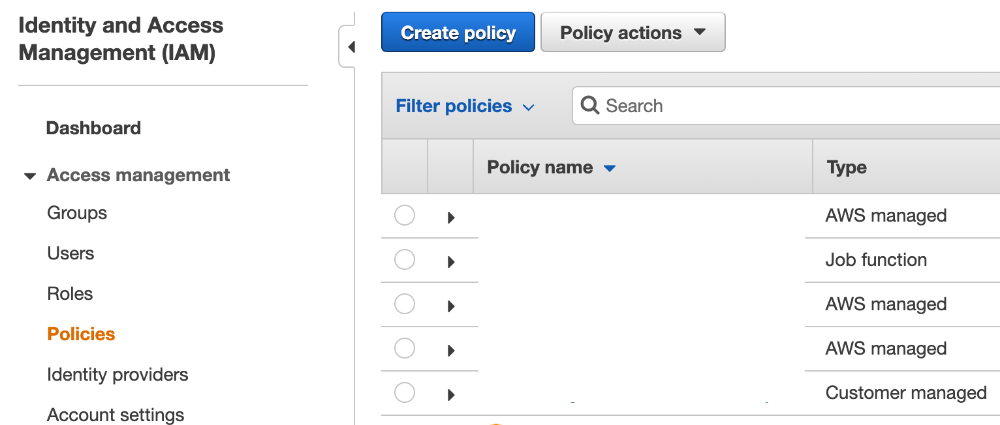

\*\*\*\*

**Step 2. Attach Policy Definitions**

Move to JSON tab, attach policy definition below. Then click _**Review policy**_



```text
{
    "Version": "2012-10-17",
    "Statement": [
        {
            "Sid": "VisualEditor0",
            "Effect": "Allow",
            "Action": [
                "rds:StartDBCluster",
                "rds:StopDBCluster",
                "rds:StartDBInstance",
                "rds:StopDBInstance",
                "rds:RebootDBInstance",
                "ec2:StartInstances",
                "ec2:StopInstances",
                "ec2:RebootInstances",
                "autoscaling:SetDesiredCapacity",
                "autoscaling:UpdateAutoScalingGroup"
            ],
            "Resource": "*"
        }
    ]
}
```




**Step 3. Review Policy** 

Enter policy name and description, Then click _**Create policy**_


**Step 4. Log in AWS Console &gt; IAM** 

Go to IAM &gt; Users &gt; Add user

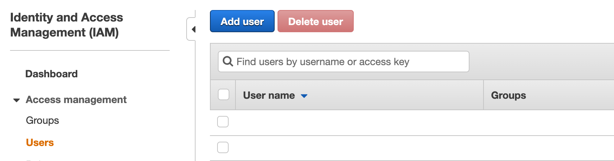


**Step 5. Set User Detail** 

Enter _**User name**_, Set access type to _**Programmatic access**_

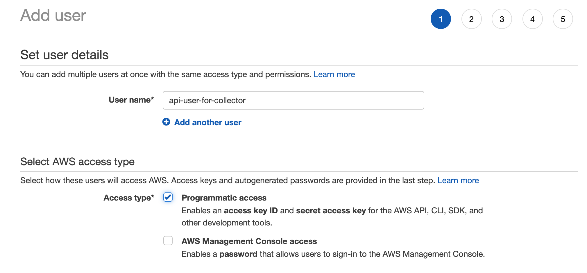

\*\*\*\*

**Step 6. Set API Permission**

 Add all policies below. They should included to guarantee successful action.

* AmazonDynamoDBReadOnlyAccess 
* AmazonEC2ReadOnlyAccess 
* AmazonRDSReadOnlyAccess 
* AutoScalingReadOnlyAccess
* **Policy created in step 3**

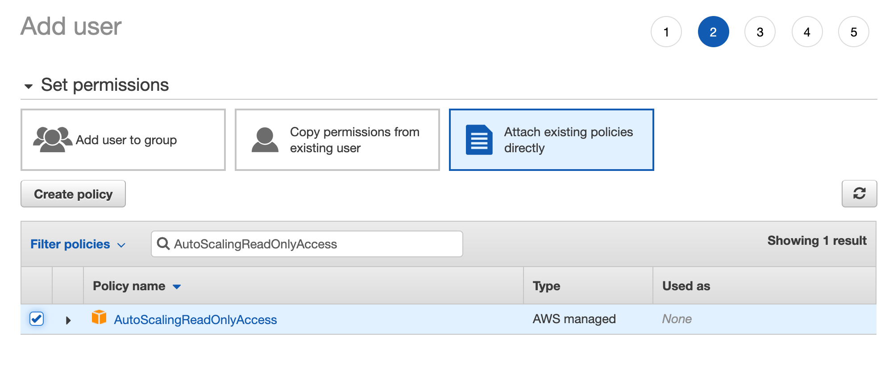


**Step 7. Review**

Make sure all the permission from Step 4. included, Then click _**Create user**_

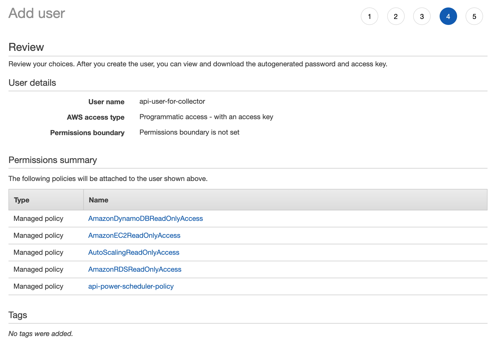


_**Step 8. Copy Key Pair**_

IAM key pair created, _**Be sure to copy the Access key ID/Secret access key and keep it safely**_.

If you skip to copy, there is no chance to have it again\(Do from step 1 again\).

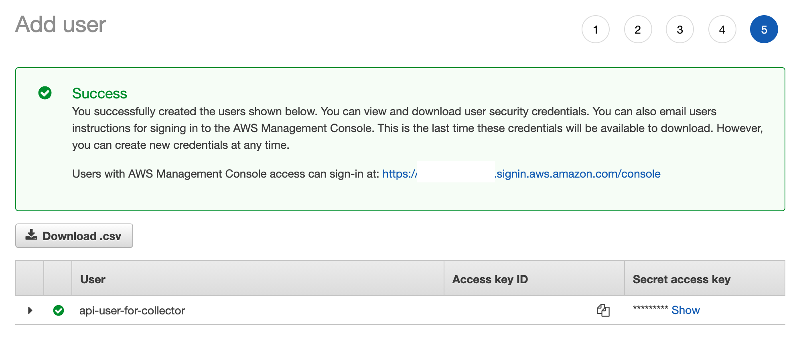

