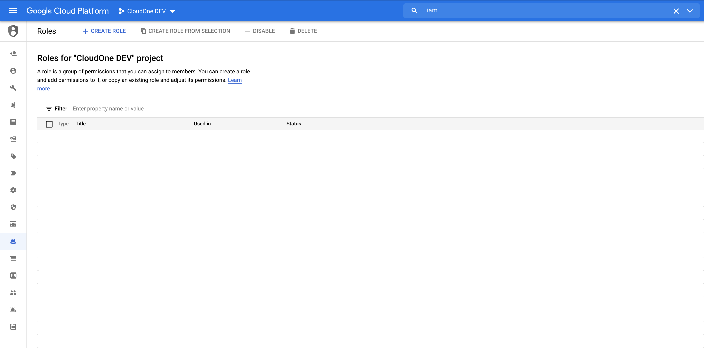
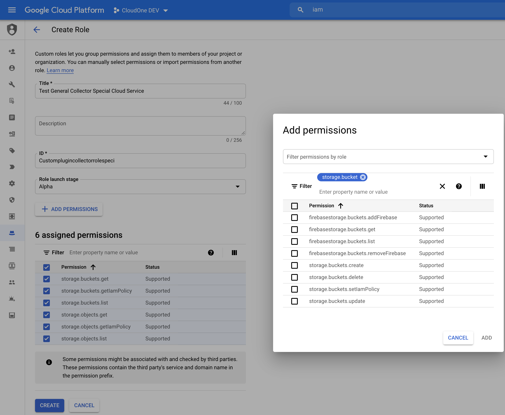
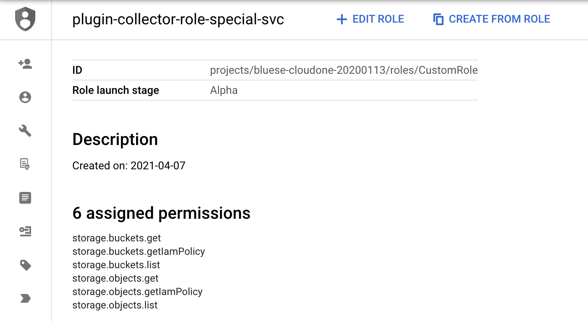
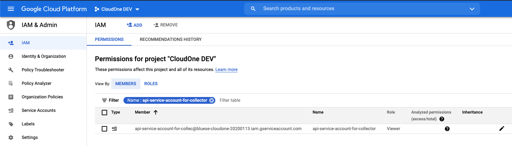
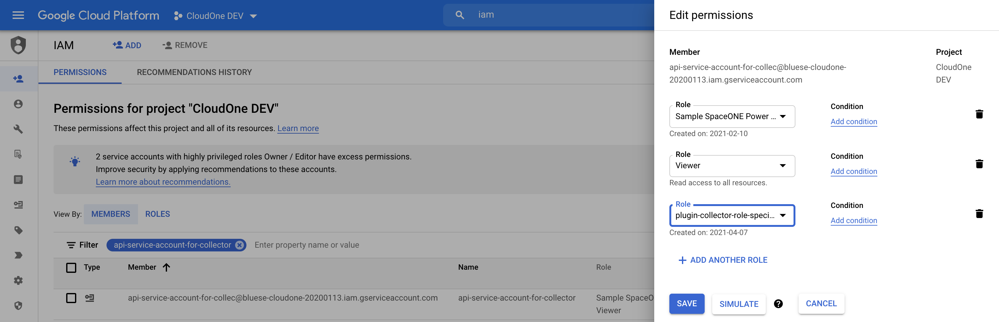
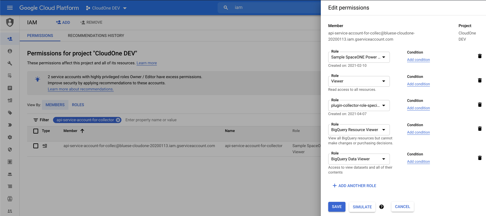
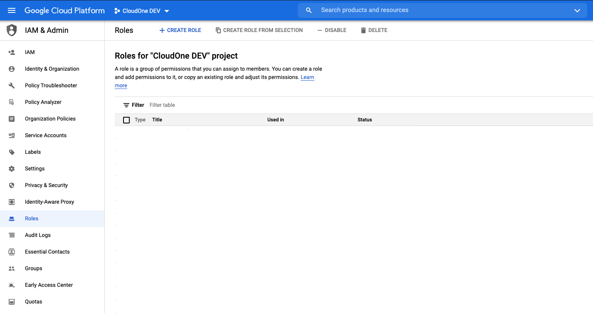
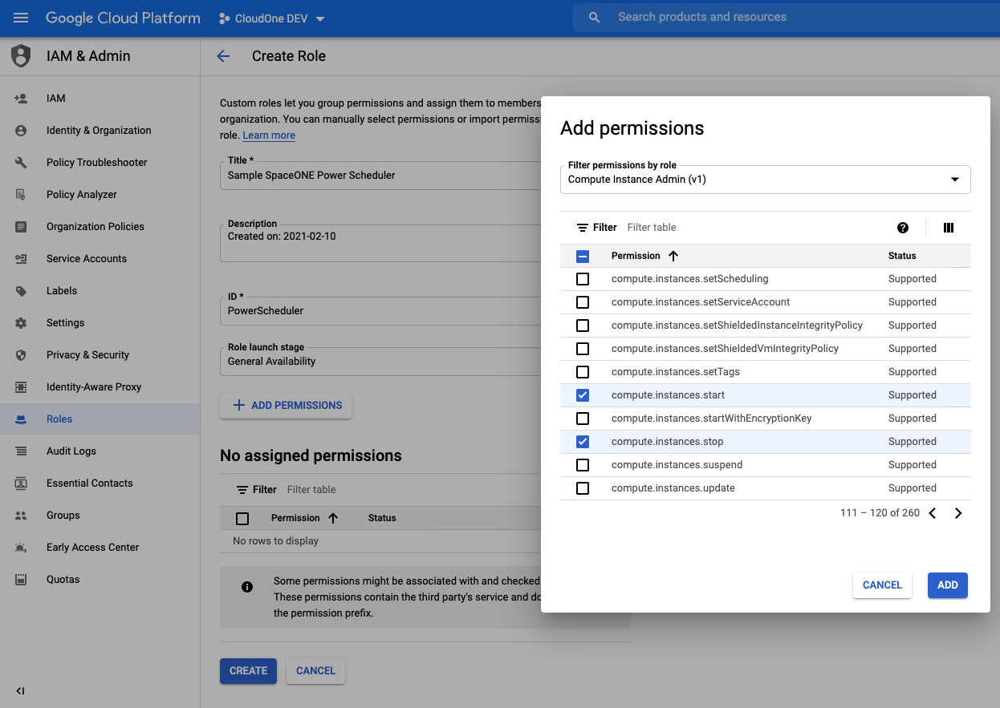
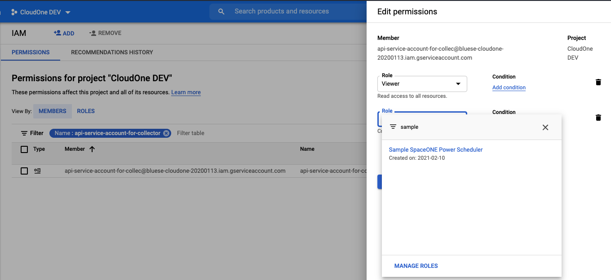
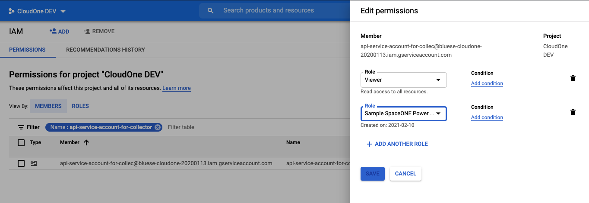

# \(Google Cloud\) Service Account Policy Management

## Service Account Policy

**SpaceONE** highly recommends to set appropriate permissions to **Service Account** for each purpose. 

* **General Collector** \(Retrieve Google Cloud Resources into **SpaceONE** Inventory\)
  * Google Compute VM Collector - **google-cloud compute**
  * Google Cloud Service Collector - **google-cloud-services**
  * Google power state Collector - **google-cloud-power-state**
* **Power-scheduler** \(Post Action to Google Cloud resources to turn on/off for following resources Compute VMs, Instance group, Cloud SQL\)
  * Google Cloud power Controller 

**STEP 1. Please, Set service account**  to Create API for each use case:

* \*\*\*\*[**General Collector**](google-cloud-service-account-policy-management.md#general-collector)\*\*\*\*
  * \*\*\*\*[**Special Roles**](google-cloud-service-account-policy-management.md#special-roles) ****
* \*\*\*\*[**Power Controller**](google-cloud-service-account-policy-management.md#power-controller)\*\*\*\*

**STEP 2. Register Your Service Account into SpaceONE** 

* **Register Service Account into SpaceONE**

## General Collector 

Collector requires appropriate authorities to collect cloud resources. We strongly recommend to limit collector's service account its permission to **read only access**. 

Otherwise, you can add more restrictions per resources or actions. One of the useful example is to restrict its rights within region.

**STEP 1. Log in Google Cloud Console &gt; IAM** 

Go to IAM &gt;  Service Account and Click **`+ CREATE SERVICE ACCOUNT`**

**STEP 2. Set Service account details**

Enter _**Service account name**_, and _**Service account description**_

**STEP 3: Grant Service account  to project**

Set Permission to Viewer\(Role\): Read All Access and Click **`CONTINUE`**

**STEP 4: Grant Users access to this service Account \(optional\)** 

_**You can skip this process**_ and move to next.    
Set Service account users role and Service account admin role.

Click **`DONE`** if everything is finished. 

  
**STEP 5: CREATE KEY**

Find a Service account that you created right before in previous step. Click Action button and Select**`Create Key`**  

Select Key Type and Click **`CREATE`** button. We suggest JSON Type  as recommended above.

**STEP 6: Review**

You will see Key ID on the list and its service account JSON on your local. 

### Special Roles

_**SpaceONE**_'s _**General Collector**_ requires permission to access for following services:


**Google Cloud APIs are categorized as its types, and therefore must set up a Special Role that Collect to other than general cloud services.**   


* Cloud Storage
  * Object
    * list
    * get
    * getIamPolicy
  * Bucket
    * list
    * get
    * getIamPolicy
* Big Query
  * Resource Viewer
  * Data Viewer

**Step 1. Create Role**

Go to IAM &gt; Role &gt; **+ Create Role**

**Step 2. Add Permissions to Role**

**Please, find appropriate permission within cloud services**

* storage.buckets.get
* storage.buckets.getIamPolicy
* storage.buckets.list
* storage.objects.get
* storage.objects.getIamPolicy
* storage.objects.list

Click **`ADD`** button

  
**STEP 3: Review Permission** 

Review permissions in created role.

**STEP 4: Set Created Role into Service Account** 

Drive to Menu IAM &gt; IAM 

Click pencil icon to edit and Add New Role that created in previous step

**STEP 5: Set BigQuery Permission into Service Account** 

Click **`Save`** button.

## Power Controller

_**SpaceONE**_'s _**Power Scheduler**_ requires edit permission to update following Cloud Services: 

* **VM Instance**
* **Instance Group**
* **Cloud SQL**

**Step 1. Create Role**

Go to IAM &gt; Role &gt; **+ Create Role**

\*\*\*\*

**Step 2. Add Permissions to Role**

**Please, find appropriate permission within cloud services**

* VM Instance 
  * Start
  * Stop
  * Reset
* Instance Group \(Manager\)
  * Resize
  * Autoscaler
    * Update
* Cloud SQL
  * Update

Click **`ADD`** button

  
**STEP 3: Review Permission** 

Review permissions in created role.

**STEP 4: Set Created Role into Service Account** 

Drive to Menu IAM &gt; IAM 

Click pencil icon to edit and Add New Role that created in previous step. 

 Click **`Save`** button.

## Register Your Service Account into SpaceONE

