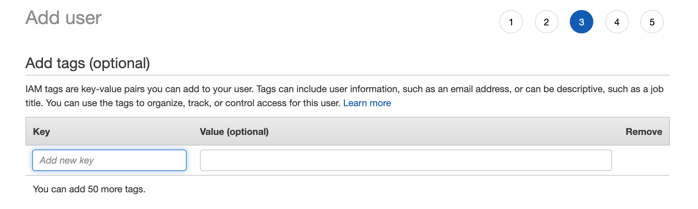

# \(Google Cloud\) Service Account Policy Management

## Service Account Policy

Before create Service Account, User can modify your existing API policy.

This will guarantee isolation your resource from other non power-scheduled items. Also prevent malfunction from mis configuration of power scheduling.

To Create API for each use case. follow directions below.

* [General Collector](service-account-policy-management.md#how-to-create-readonly-policy-in-aws)
* [Power Scheduler Service](service-account-policy-management.md#powerscheduler)

In case of internal regulations, create a policy below then attach when creating API user. 

* [Overall IAM Policy Superset](service-account-policy-management.md#overall-iam-policy-superset)

## General Collector 

Collectors require an authority of read permission and therefore we strongly recommend to limit collector's service account its permission to **read only access**. 

Otherwise, User can add more restrictions like regional and resource base. One of the useful example is to restrict its rights within region.

In order to experience powerful function of SpaceONE collectors. Use the managed _**ReadOnly policy**_ is preferred. 


**Step 1. Log in AWS Console &gt; IAM** 

Go to IAM &gt; Users &gt; Add user


\*\*\*\*

**Step 2. Set User Details**

Enter _**User name**_, Set access type to _**Programmatic access**_


**Step 3. Set API Permission**

Set Permission to ReadOnlyAccess\(Managed Policy\)

Click _**Attach existing policies directly**_ . Enter _**readonly**_ keyword in policy search bar.

Select _**ReadOnlyAccess**_ managed policy as below.


\*\*\*\*

**Step 4. Add tags**

_**You can skip this process**_ and move to next. 

SpaceONE collector does not related to tags in IAM. 




_**Step 5. Review**_

Check the details you added. Then click _**Create users**_ right down of page


_**Step 6. Copy Key Pair**_

IAM key pair created, _**Be sure to copy the Access key ID/Secret access key and keep it safely**_.

If you skip to copy, there is no chance to have it again\(Do from step 1 again\).


## PowerScheduler

Suggested IAM policy for each cloud provider to use _**SpaceONE Power Scheduler**_ service are below.


**Step 1. Create Policy**

Go to IAM &gt; Policies &gt; Create policy


\*\*\*\*

**Step 2. Attach Policy Definitions**

Move to JSON tab, attach policy definition below. Then click _**Review policy**_



```text
{
    "Version": "2012-10-17",
    "Statement": [
        {
            "Sid": "VisualEditor0",
            "Effect": "Allow",
            "Action": [
                "rds:StartDBCluster",
                "rds:StopDBCluster",
                "rds:StartDBInstance",
                "rds:StopDBInstance",
                "rds:RebootDBInstance",
                "ec2:StartInstances",
                "ec2:StopInstances",
                "ec2:RebootInstances",
                "autoscaling:SetDesiredCapacity",
                "autoscaling:UpdateAutoScalingGroup"
            ],
            "Resource": "*"
        }
    ]
}
```




**Step 3. Review Policy** 

Enter policy name and description, Then click _**Create policy**_


**Step 4. Log in AWS Console &gt; IAM** 

Go to IAM &gt; Users &gt; Add user


**Step 5. Set User Detail** 

Enter _**User name**_, Set access type to _**Programmatic access**_


\*\*\*\*

**Step 6. Set API Permission**

 Add all policies below. They should included to guarantee successful action.

* AmazonDynamoDBReadOnlyAccess 
* AmazonEC2ReadOnlyAccess 
* AmazonRDSReadOnlyAccess 
* AutoScalingReadOnlyAccess
* **Policy created in step 3**


**Step 7. Review**

Make sure all the permission from Step 4. included, Then click _**Create user**_


_**Step 8. Copy Key Pair**_

IAM key pair created, _**Be sure to copy the Access key ID/Secret access key and keep it safely**_.

If you skip to copy, there is no chance to have it again\(Do from step 1 again\).


## AWS Personal Health Dashboard/Trusted Advisor

To use aws advanced collector like AWS _**Personal Health Dashboard/Trusted Advisor**_ 

User account support level should be over _**business**_ and additional IAM policy need to be attached.


**Step 1. Create Policy**

Go to IAM &gt; Policies &gt; Create policy


\*\*\*\*

**Step 2. Attach Policy Definitions**

Move to JSON tab, attach policy definition below. Then click _**Review policy**_


```text
{
    "Version": "2012-10-17",
    "Statement": [
        {
            "Effect": "Allow",
            "Action": [
                "support:DescribeAttachment",
                "support:DescribeCaseAttributes",
                "support:DescribeCases",
                "support:DescribeCommunications",
                "support:DescribeIssueTypes",
                "support:DescribeServices",
                "support:DescribeSeverityLevels",
                "support:DescribeSupportLevel",
                "support:DescribeTrustedAdvisorCheckRefreshStatuses",
                "support:DescribeTrustedAdvisorCheckResult",
                "support:DescribeTrustedAdvisorChecks",
                "support:DescribeTrustedAdvisorCheckSummaries",
                "support:SearchForCases"
            ],
            "Resource": "*"
        }
    ]
}
```

**Step 3. Review Policy**

Enter name and description. Then click _**Create policy.**_ 


 

**Step 4. Log in AWS Console &gt; IAM** 

Go to IAM &gt; Users &gt; Add user


**Step 5. Set User Detail** 

Enter _**User name**_, Set access type to _**Programmatic access**_


\*\*\*\*

**Step 6. Set API Permission**

 Add all policies below. They should included to guarantee successful action.


\*\*\*\*

**Step 7. Review**

Make sure all the permission from Step 4. included, Then click _**Create user**_


_**Step 8. Copy Key Pair**_

IAM key pair created, _**Be sure to copy the Access key ID/Secret access key and keep it safely**_.

If you skip to copy, there is no chance to have it again\(Do from step 1 again\).


## Overall IAM Policy Superset

If user can use managed policy, Refer to policy below. 

_**Region Code**_ in Resource parameter need to be changed. _**AWS Region Code**_ or _**\***_  character is available.


