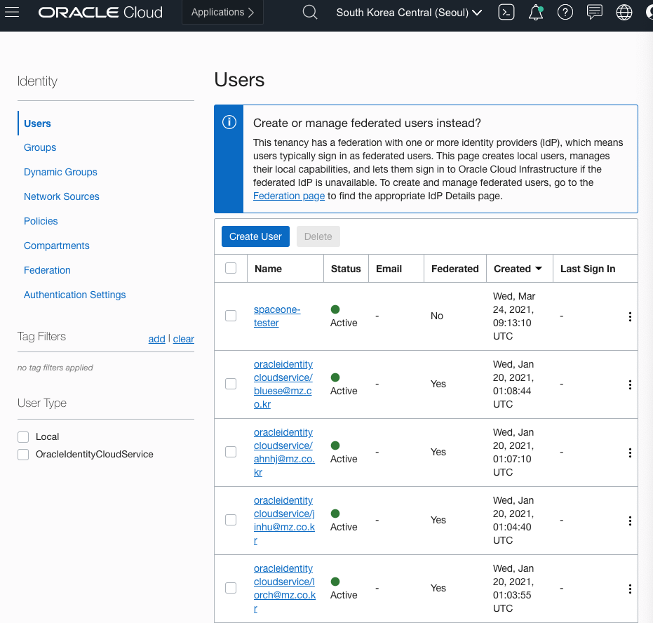
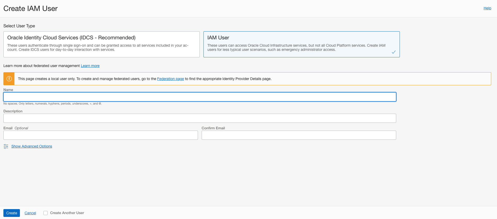
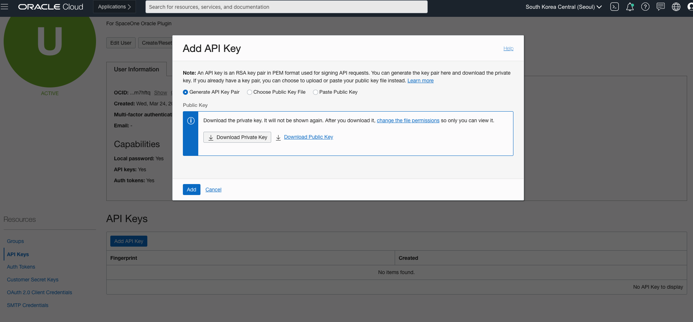
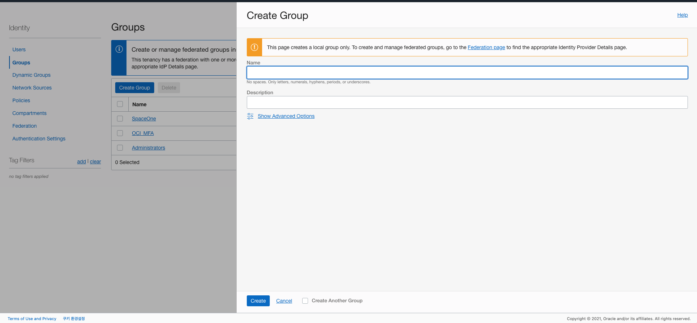
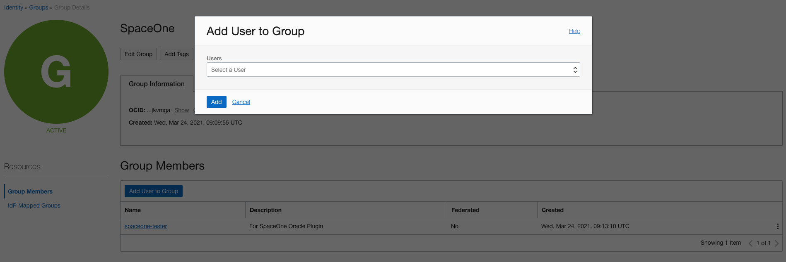
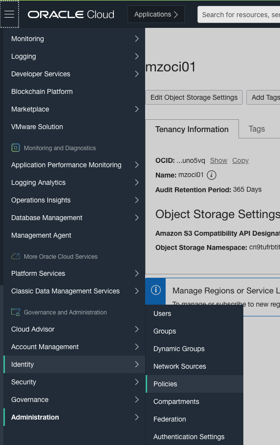
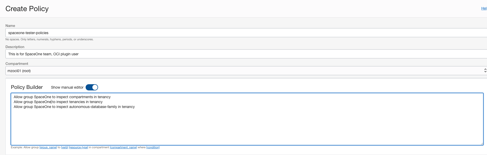

# \(Oracle Cloud Infrastructure\) Service Account Policy Management

## Service Account Policy

**SpaceONE** highly recommends to set appropriate permissions to **Service Account** for each purpose. 

Please, Set service account,  To Create API for each use case

* [General Collector](oracle-cloud-infrastructure-service-account-policy-management.md#general-collector)

## General Collector 

Collector requires appropriate authorities to collect cloud resources. We strongly recommend to limit collector's service account its permission to **read only access**. 

Otherwise, you can add more restrictions per resources or actions. One of the useful example is to restrict its rights within region.

#### STEP 1. Log in Oracle Cloud Infrastructure Console &gt; Identity

Go to Identity &gt; Users and Click   `CREATE USER`

#### STEP 2. Set IAM User details

Click  `IAM User`and Enter  _**User name**_ and _**Description**_ 

#### STEP 3. Set API Keys to IAM User 

Go to Identity &gt; Users &gt; User &gt; Details &gt; API Keys. Click  `Add API Key`  and add or Generate API Key. 

#### STEP 4. Create Group for IAM User 

Go to Identity &gt; Groups and Click   `Create Group` Button. Enter _**Name**_ and _**Description**_.

#### STEP 5. Add IAM User to Group

Go to Group that you made and Click  `Add User to Group`  Button and add IAM User. 

#### STEP 6. Set Policies to Group

Go to Identity &gt; Policies and Click  `Create Policy` Button.

Enter _**Name**_ and _**Description**_ and _**Policies**_ by manually.

