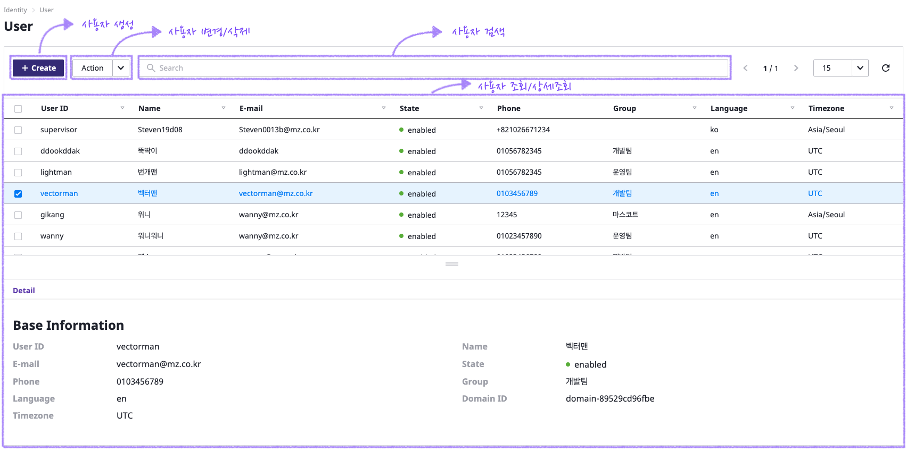
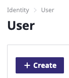
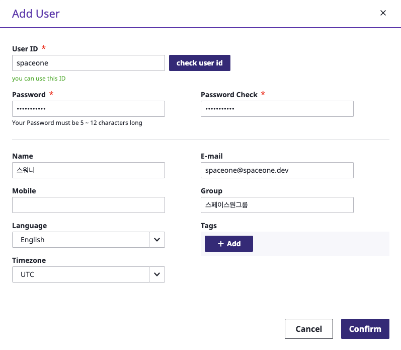
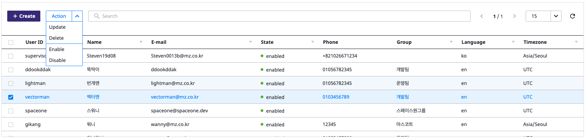
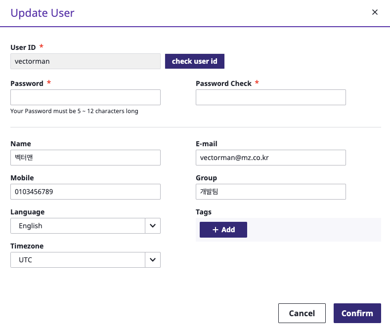
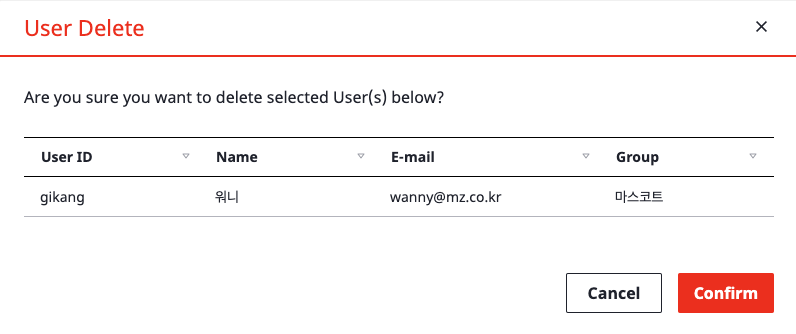
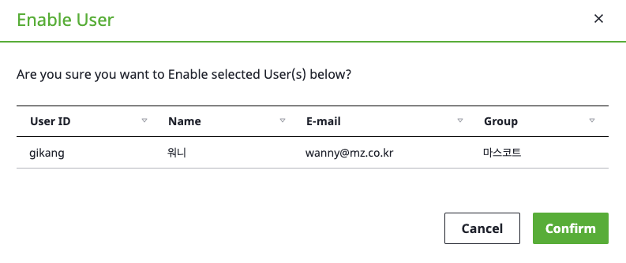
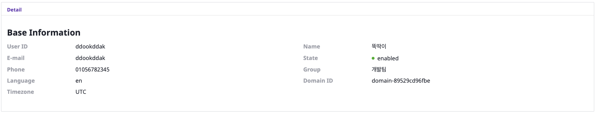
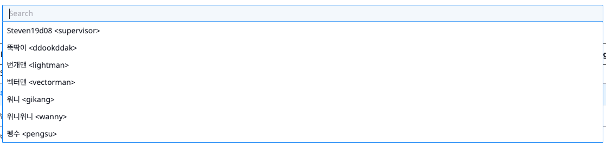

# User

## 概要

下記のユーザー管理ページで、ドメイン内のユーザーの追加/変更/削除ができます。  

 

## ユーザー追加

_**+ Create**_をクリックして、ドメイン内のユーザーが追加できます。

ユーザーの情報を入力した後、右下の**confirm**をクリックします。

\* で表示される項目は必須項目です。

User IDを入力した後、**check user id**をクリックして利用できるかを確認します。

ユーザーを入力した後、リロードをクリックしたら、追加されたユーザーが確認できます。

## ユーザー変更/削除

変更若しくは削除したいユーザーをクリックした後、Actionドロップダウンメニューから変更/削除ができます。

ActionからはUpdate/Delete/Enable/Disableが選択できます。

Updateメニューをクリックした場合、下記のようにユーザーの変更画面が表示されます。情報を変更した後、**Confirm**をクリックします。

Deleteメニューをクリックした場合、下記のようにユーザー削除画面が表示されます。**Confirm**をクリックして削除します。

ユーザーのログインを制御するために、Enable/Disableメニュを利用します。

* Enable : ユーザーはspaceoneコンソールへログイン可能
* Disable : ユーザーはspaceoneコンソールへログイン不可

## User Details

ユーザーをクリックすれば、下記のようなDetailsタグが表示されます。そのタグはクリックしたユーザーの詳細情報を表示します。

DetailsタグではID, Name, Emailなどの基本情報と、Language、stateなどが確認できます。

## ユーザー検索

検索をクリックすれば、下記のようにIDと名前でユーザーの検索ができます。

