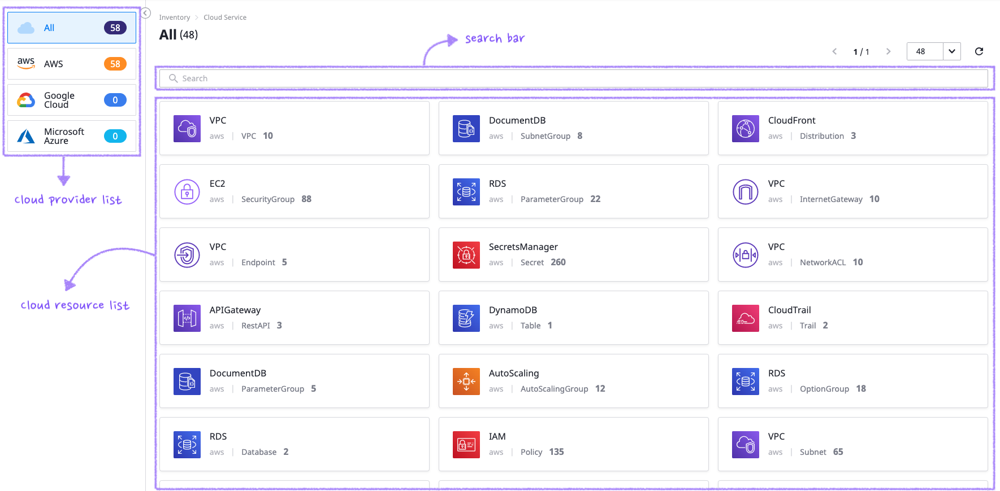
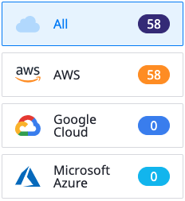
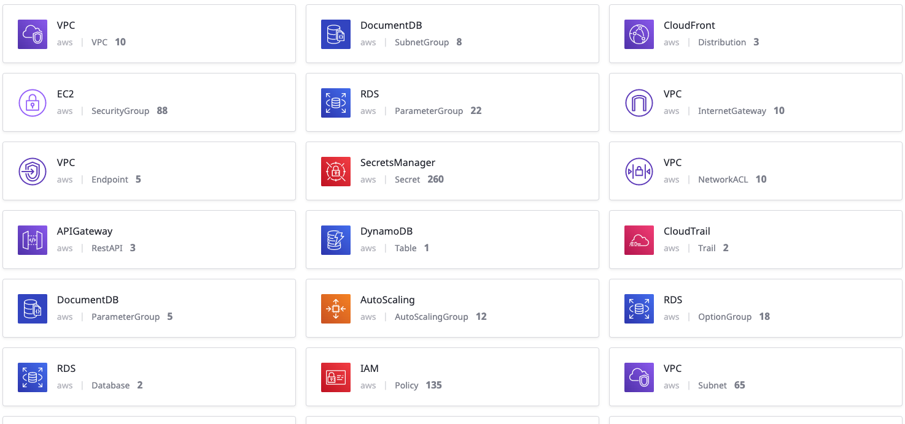
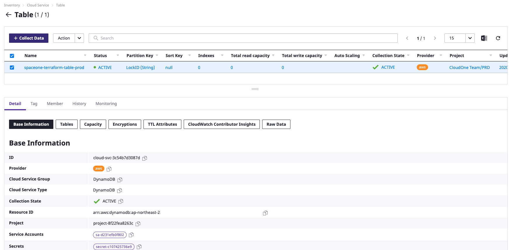
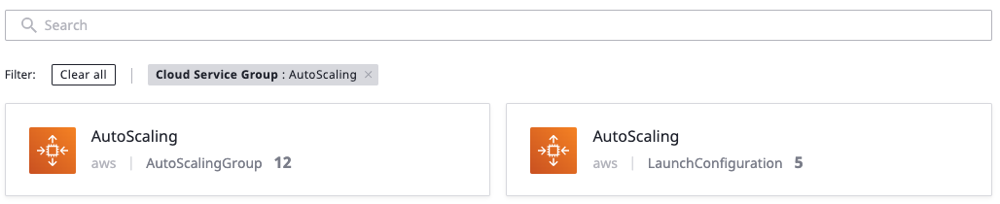
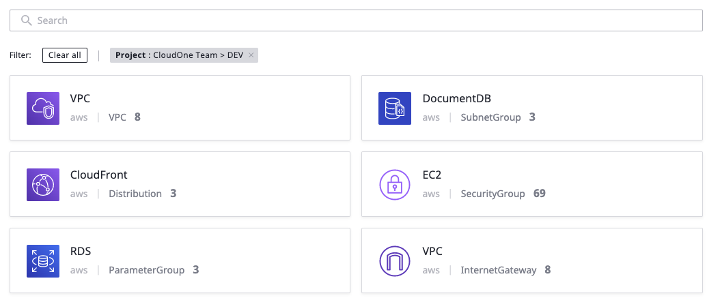

# CloudService

## 둘러보기  

SpaceONE에서 제공되는 다양한 Plugin을 사용하여, 여러 Cloud Resource 들을 편리하게 조회할 수 있습니다. 

## Cloud Provider List

수집된 Cloud Resource를 Cloud Provider 별로 확인할 수 있습니다. 현재는 AWS/GCP/Azure를 지원 합니다.   

## Cloud Resource List

수집된 Cloud Resource의 전체 리스트를 확인할 수 있습니다. 

각각의 Cloud Resource를 클릭한 경우 상세 내역 페이지로 이동 합니다. 

검색바를 활용하여 같은 리소스 그룹끼리 묶어서 관리 하거나, 프로젝트 단위로 관리하는 것이 가능 합니다. 

### 상세 정보

각 Cloud Resource의 상세 상태를 조회할 수 있습니다.  

Cloud Resource 별로 연관성 있는 정보들을 한 화면에서 같이 확인할 수 있습니다. 

## 검색바

각 화면에서 keyword 방식으로 필요한 항목을 검색할 수 있습니다. 

각 keyword를 통해 서비스를 종류별로 구분하여 조회 하거나, 지역별/프로젝트별/Service Account 별로 구분하여 자유롭게 조회 하는 것이 가능 합니다. 

