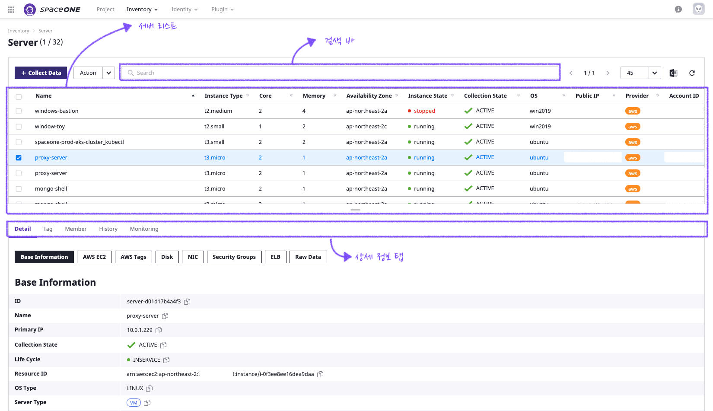
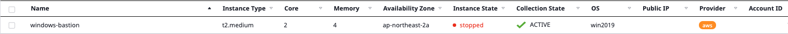
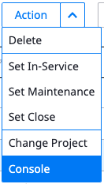
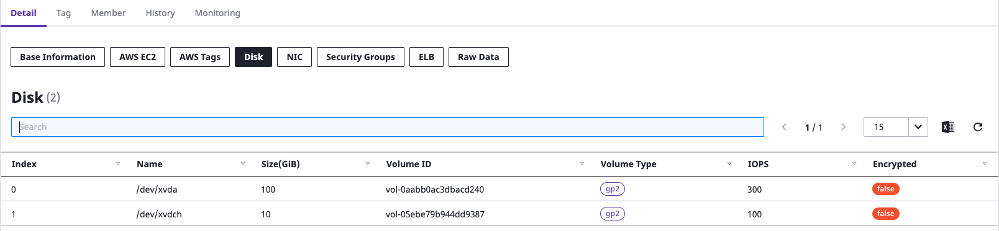
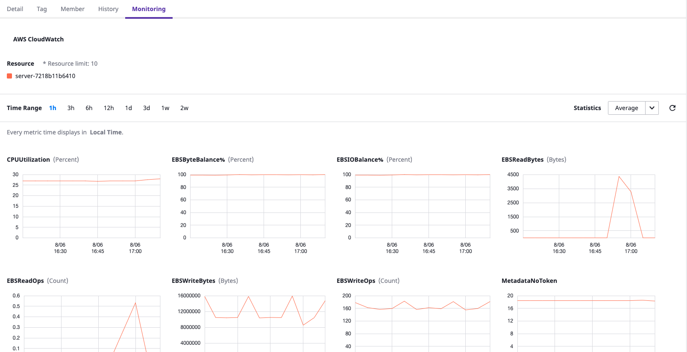
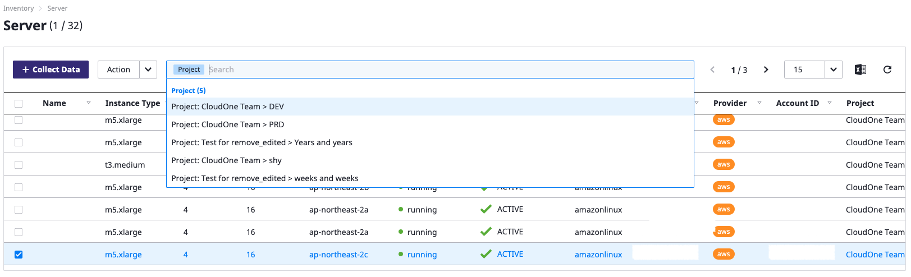
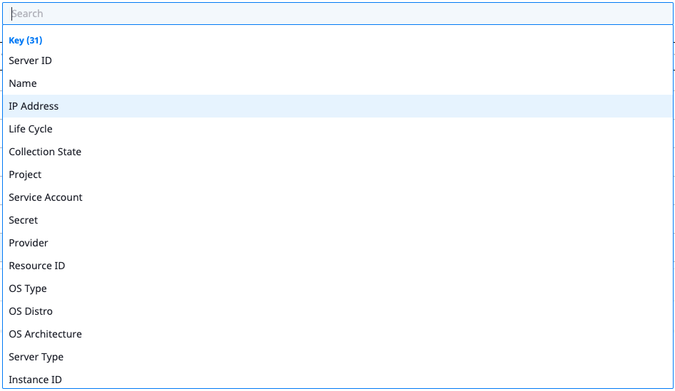

# Server

## 概要

Serverメニューでは、多様なリージョン及びプロジェクト別に散らばっているServerリソースを統合して管理できます。

この機能を通して、毎度アカウント及びRegionを変更しながらCloud Consoleへアクセスしたり、ターミナルを通してアクセスしなくても、サーバの状態を確認することができます。

Serverメニューは大きく下記のように構成されています。

* サーバリスト : サーバの全体リストが確認できます。
* 詳細現況タグ : 各サーバ別の詳細情報が照会できます。
* 検索バー : 多数のサーバの状態が検索できます。

## サーバリスト

Multi Cloud基盤で収集されたサーバ情報が照会できます。

サーバの各項目別情報は次の通りです。

<table>
  <thead>
    <tr>
      <th style="text-align:left">Item</th>
      <th style="text-align:left">Description</th>
    </tr>
  </thead>
  <tbody>
    <tr>
      <td style="text-align:left">Name</td>
      <td style="text-align:left">&#xC11C;&#xBC84;&#xC758; &#xC774;&#xB984;&#xC744; &#xC758;&#xBBF8; &#xD569;&#xB2C8;&#xB2E4;.
        OS &#xB0B4;&#xBD80;&#xC758; hostname&#xC774;&#xC678;&#xC758; &#xAC01; Cloud
        &#xC0AC;&#xC5D0;&#xC11C; &#xC81C;&#xACF5;&#xD558;&#xB294; &#xC774;&#xB984;
        &#xAC12;(Name Tag)&#xC744; &#xCC38;&#xC870; &#xD569;&#xB2C8;&#xB2E4;.</td>
    </tr>
    <tr>
      <td style="text-align:left">Instance Type</td>
      <td style="text-align:left">&#xC11C;&#xBC84;&#xC758; spec. &#xC815;&#xBCF4;&#xB97C; &#xD45C;&#xD604;
        &#xD569;&#xB2C8;&#xB2E4;. spec. &#xAC01; Cloud Provider&#xC758; Compute
        &#xC11C;&#xBE44;&#xC2A4;&#xC5D0;&#xC11C; &#xC81C;&#xACF5;&#xD558;&#xB294;
        &#xBA85;&#xCE6D;&#xC744; &#xB530;&#xB985;&#xB2C8;&#xB2E4;.</td>
    </tr>
    <tr>
      <td style="text-align:left">Core/Memory</td>
      <td style="text-align:left">&#xC11C;&#xBC84;&#xC758; Core/Memory(GB)&#xB97C; &#xB098;&#xD0C0;&#xB0C5;&#xB2C8;&#xB2E4;.</td>
    </tr>
    <tr>
      <td style="text-align:left">Availability Zone</td>
      <td style="text-align:left">&#xC11C;&#xBC84;&#xAC00; &#xC704;&#xCE58;&#xD55C; Zone &#xC815;&#xBCF4;&#xB97C;
        &#xB098;&#xD0C0;&#xB0C5;&#xB2C8;&#xB2E4;</td>
    </tr>
    <tr>
      <td style="text-align:left">Instance State</td>
      <td style="text-align:left">&#xC11C;&#xBC84;&#xC758; &#xC0C1;&#xD0DC;&#xB97C; &#xC758;&#xBBF8; &#xD569;&#xB2C8;&#xB2E4;.
        &#xAC01; cloud provider&#xC5D0;&#xC11C; &#xC81C;&#xACF5;&#xD558;&#xB294;
        running/stopped &#xB4F1; &#xC0C1;&#xD0DC; &#xC815;&#xBCF4;&#xB97C; &#xADF8;&#xB300;&#xB85C;
        &#xB530;&#xB985;&#xB2C8;&#xB2E4;</td>
    </tr>
    <tr>
      <td style="text-align:left">Collection State</td>
      <td style="text-align:left">
        
Collector&#xB97C; &#xD1B5;&#xD55C; &#xC11C;&#xBC84;&#xC758; &#xC218;&#xC9D1;
          &#xC0C1;&#xD0DC;&#xB97C; &#xC758;&#xBBF8; &#xD569;&#xB2C8;&#xB2E4;. ACTIVE/DISCONNECTED
          &#xC0C1;&#xD0DC;&#xAC00; &#xC874;&#xC7AC;&#xD558;&#xBA70;, &#xB300;&#xC0C1;
          &#xC11C;&#xBC84;&#xC815;&#xBCF4;&#xAC00; collector&#xB97C; &#xD1B5;&#xD574;
          &#xC815;&#xC0C1;&#xC801;&#xC73C;&#xB85C; &#xC218;&#xC9D1;&#xB418;&#xACE0;
          &#xC788;&#xB294;&#xC9C0; &#xC5EC;&#xBD80;&#xB97C; &#xB098;&#xD0C0;&#xB0C5;&#xB2C8;&#xB2E4;.

        <ul>
          <li>Disconnected &#xC0C1;&#xD0DC;&#xB294; collector&#xB97C; &#xD1B5;&#xD55C;
            &#xC218;&#xC9D1;&#xC774; &#xB418;&#xACE0; &#xC788;&#xC9C0; &#xC54A;&#xB294;
            &#xC0C1;&#xD669;&#xC73C;&#xB85C;, 48&#xC2DC;&#xAC04; &#xC774;&#xC0C1; &#xC815;&#xC0C1;&#xC801;&#xC73C;&#xB85C;
            &#xC218;&#xC9D1;&#xB418;&#xC9C0; &#xC54A;&#xC744; &#xACBD;&#xC6B0; &#xD574;&#xB2F9;
            &#xC11C;&#xBC84;&#xB97C; &#xB9AC;&#xC2A4;&#xD2B8;&#xC5D0;&#xC11C; &#xC0AD;&#xC81C;&#xD569;&#xB2C8;&#xB2E4;.</li>
        </ul>
      </td>
    </tr>
    <tr>
      <td style="text-align:left">OS</td>
      <td style="text-align:left">ubuntu/amazonlinux/centos/win2019 &#xC744; &#xC11C;&#xBC84;&#xC758; OS
        &#xC815;&#xBCF4;&#xB97C; &#xD45C;&#xC2DC;&#xD569;&#xB2C8;&#xB2E4;.</td>
    </tr>
    <tr>
      <td style="text-align:left">Public IP</td>
      <td style="text-align:left">&#xACF5;&#xC778; IP(ex. AWS EIP &#xB4F1;)&#xAC00; instance&#xC5D0; mount
        &#xB41C; &#xACBD;&#xC6B0; &#xD45C;&#xC2DC;&#xD569;&#xB2C8;&#xB2E4;.</td>
    </tr>
    <tr>
      <td style="text-align:left">Provider</td>
      <td style="text-align:left">Cloud Provider&#xB97C; &#xB098;&#xD0C0;&#xB0C5;&#xB2C8;&#xB2E4;. aws,
        azure, gcp, openstack, vmware &#xB4F1;&#xC758; cloud &#xC81C;&#xACF5;&#xC790;&#xB97C;
        &#xB098;&#xD0C0;&#xB0C5;&#xB2C8;&#xB2E4;.</td>
    </tr>
    <tr>
      <td style="text-align:left">Account ID</td>
      <td style="text-align:left">AWS&#xC5D0;&#xC11C; &#xC0AC;&#xC6A9;&#xB418;&#xB294; 12&#xC790;&#xB9AC;
        account id &#xC22B;&#xC790;&#xB97C; &#xD45C;&#xD604; &#xD569;&#xB2C8;&#xB2E4;.</td>
    </tr>
    <tr>
      <td style="text-align:left">Project</td>
      <td style="text-align:left">&#xB300;&#xC0C1; &#xC11C;&#xBC84;&#xAC00; &#xC18C;&#xC18D;&#xB41C; project&#xB97C;
        &#xD45C;&#xD604;&#xD569;&#xB2C8;&#xB2E4;.</td>
    </tr>
    <tr>
      <td style="text-align:left">Updated at</td>
      <td style="text-align:left">&#xC11C;&#xBC84; &#xC815;&#xBCF4;&#xAC00; &#xC218;&#xC9D1;&#xB41C; &#xAC00;&#xC7A5;
        &#xB9C8;&#xC9C0;&#xB9C9; &#xC2DC;&#xAC04;&#xC744; &#xB098;&#xD0C0;&#xB0C5;&#xB2C8;&#xB2E4;.</td>
    </tr>
  </tbody>
</table>

### Action

各サーバを選択した後上部のActionをクリックすれば、サーバの状態が変更できます。

* Delete : サーバリストから削除します。実際のサーバが削除されることではありません。Collectorを通した収集を再開始する場合、再度追加されます。
* Set In-Service/Maintenance/Close : サーバの状態を変更します。
* Change Project : サーバ属しているProjectを変更します。
* Console : 対象サーバが属しているAWS Consoleリンクへアクセスします。

### Export

収集されたサーバリスト情報がExcelでExportできます。

## 詳細現況タグ

サーバの詳細情報を提供します。下記のようなTabで構成されています。

* Details : サーバリストで確認できる基本情報以外に、サーバ仕様やImage名、Security Groupなどの詳細情報も提供します。

* Tag : サーバをTagで別途グループ化して管理できます。
* Member : サーバの担当者が管理できます。
* History : サーバの状態/仕様などすべての変更ヒストリーが管理できます。
* Monitoring : サーバのモニタリング情報が照会できます。外部のモニタリングソリューションと連動して対象サーバの状態をリアルタイムで照会できます。

## 検索バー

収集されたサーバがKey Wordで検索できます。

SpaceONEでは、Collectorから収集された情報をユーザが便利に検索できるように主要keyword基盤で自動的に分類します。

提供されるkeywordはServerに定義されたほぼすべての項目を含めます。（合計31項目）

