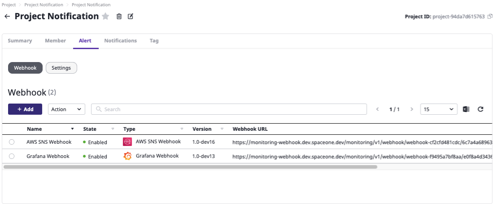

# Webhook Settings

## Overview

**`Webhook`** is based on the **`Project`**  page that allows you the following actions:

* **Set up the Alert Webhook.** 
* **Set up Notification Policy** : View, and Edit 
  * Notification Policy
  * Auto Recovery
  * Event Rule
* **Escalation Policy**

Once you Set Escalation Policy you can dealing with Webhook for following Actions

* \*\*\*\*[**Adding Webhook \(Get Webhook URL\)**](./#adding-webhook-get-webhook-url)\*\*\*\*
* \*\*\*\*[**Webhook list**](./#webhook-list)\*\*\*\*

**You can Set Webhook URL for AWS, Grafana, and more**





## Adding Webhook \(Get Webhook URL\)

To set up a **Webhook** for alert and notification requires appropriate url to retrieve from monitoring systems such as AWS SNS, Grafana, etc. 

**STEP 1. Log in SpaceONE &gt; Project &gt; Alert tab**

Go to Project's Alert Tab and Click **`Activate Alert`**  button and then you will see Activate Alert Success 

**STEP 2. Alert &gt; Webhook &gt; `+ Add`**

**STEP 3. Name Webhook, Select Type of Webhook & Version and Click  `Confirm` Button**


**Please, Select the latest Version of Webhook  
Latest version automatically will be selected if you click version drop-down.**   


**STEP 4. Check registered Webhooks on the list.**

## Webhook List

**All Created Webhook list is Alert Tabs Per Project.**


All **Webhook URLs** that Created through **SpaceONE** is **HTTPS** but **HTTP** works as well**.   
  
Please,** type ****URL ****as **HTTP  like if you need to set url as HTTP `http://monitoring-webhook.dev.spaceone.dev/monitoring/v1/webhook/...`**


