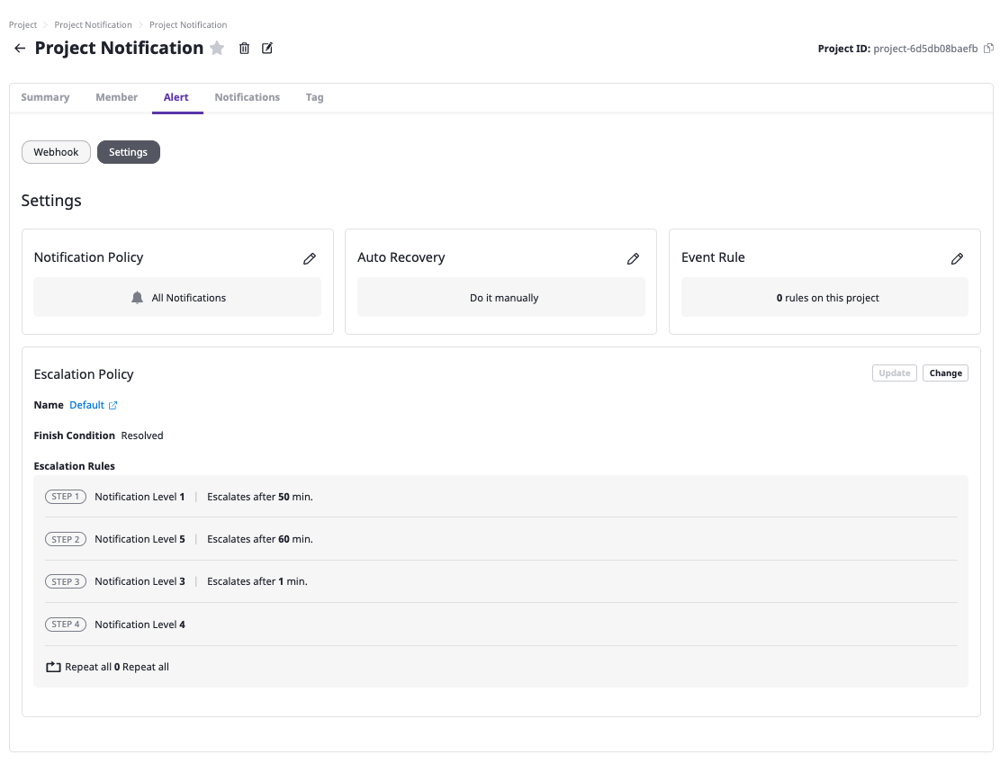
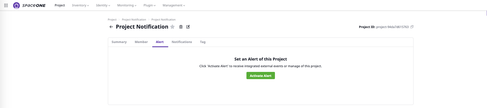
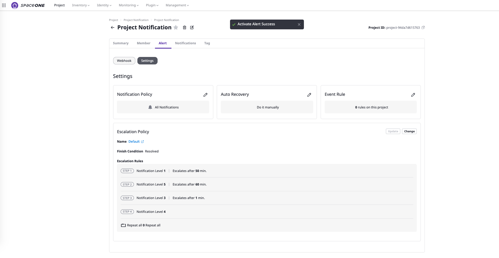
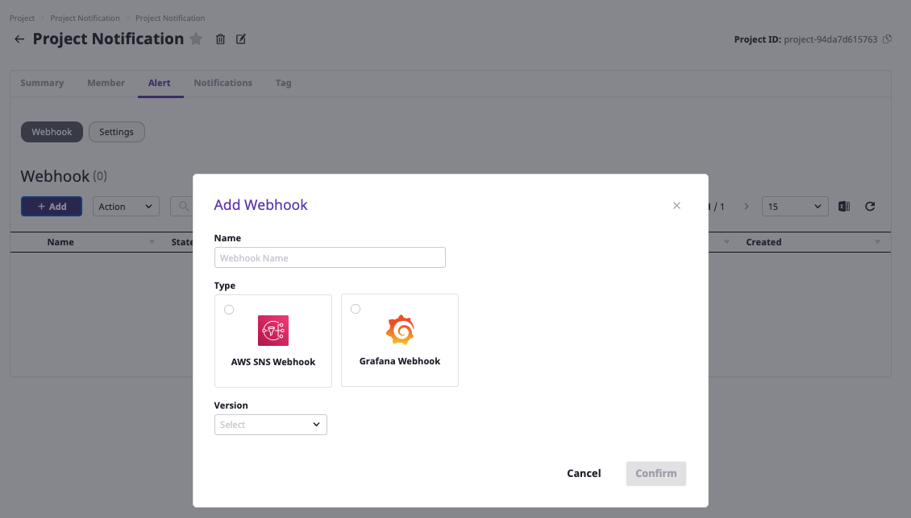
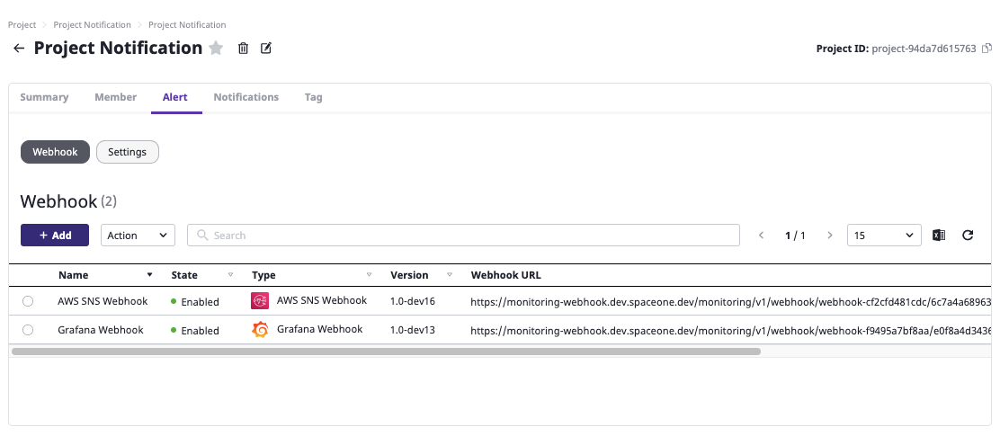

# Webhook Settings

## Overview

**`Webhook`** is based on the **`Project`**  page that allows you the following actions:

* **Set up the Alert Webhook.** 
* **Set up Notification Policy** : View, and Edit 
  * Notification Policy
  * Auto Recovery
  * Event Rule
* **Escalation Policy**

## Adding Webhook \(Get Webhook URL\)

To set up a **Webhook** for alert and notification requires appropriate url to retrieve from monitoring systems such as AWS SNS, Grafana, etc. 

**STEP 1. Log in SpaceONE Portal &gt; Project &gt; Alert tab**

Go to Project's Alert Tab and Click **`Activate Alert`**  button and then you will see Activate Alert Success 

**STEP 2. Alert &gt; Webhook &gt; `+ Add`**

**STEP 3. Name Webhook, Select Type of Webhook&Version and Click  `Confirm` Button**


**Please, Select latest Version of Webhook  
Latest version automatically will be selected if you Click version drop-down.**   


**STEP 4. Check registered Webhooks on the list.**

