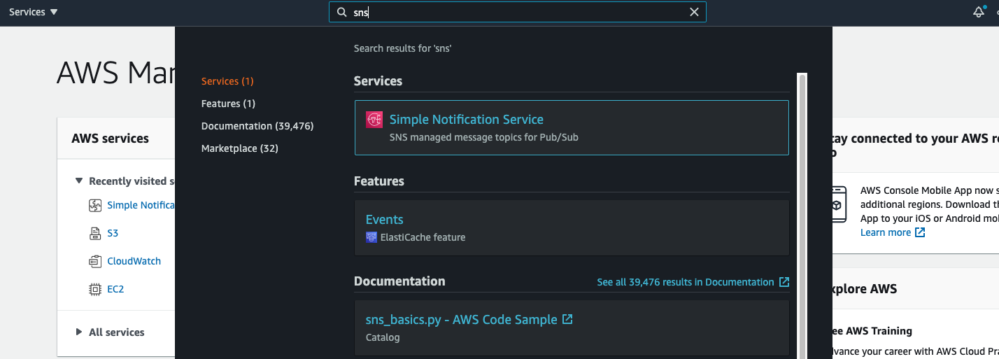
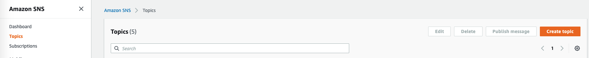
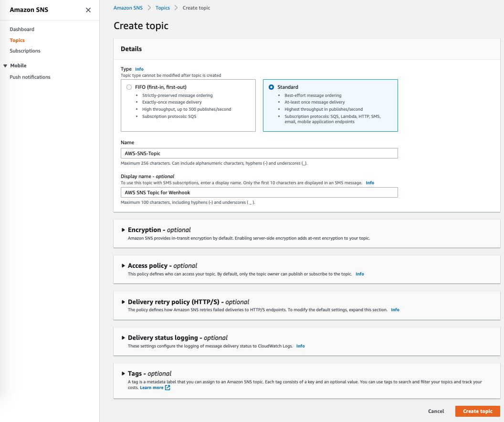
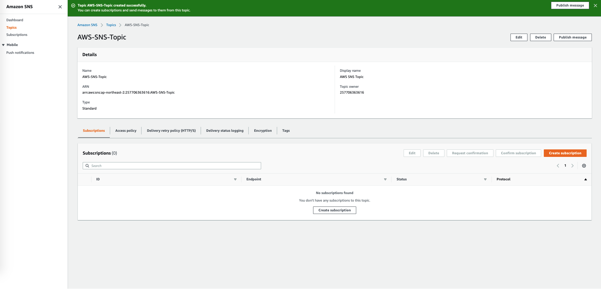

# AWS SNS

## Set up a SNS topic and Subscription

**To** Connect **SpaceONE's Alert Manager,** Set up AWS SNS's Topic and its Subscriptions

Please, Set SNS Topic and its Subscription for following Steps

* Set up a Topic on AWS SNS
* Set up a Subscription on AWS SNS

### Set up a Topic on AWS SNS

**Step 1. Log in AWS Console &gt; SNS &gt; Topics**

**`Project`**  p

**Step 2. Click `Create topic`**  **Button**

**Step 3. Select `Standard`**  **options and Give name for new topic as below**

**Step 4. Check Topic is created successfully.** 

### 

### Set up a Subscription on AWS SNS

