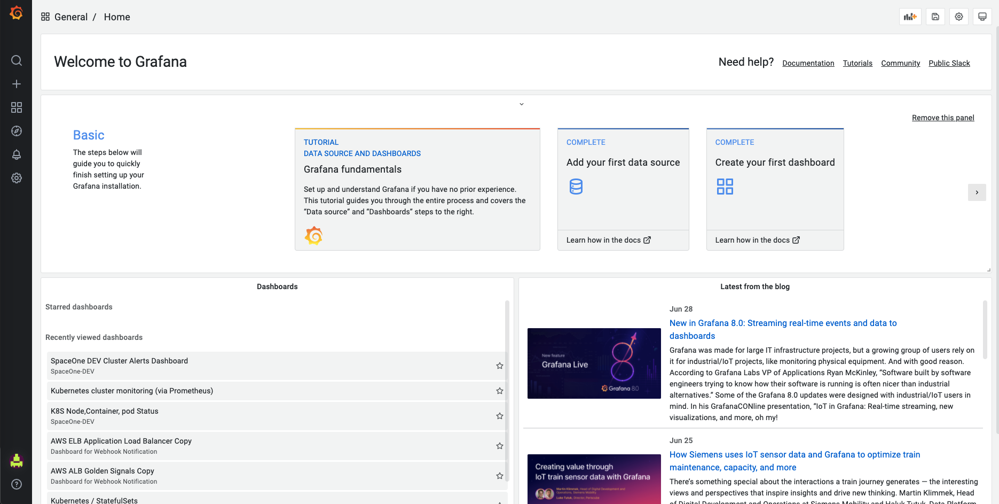
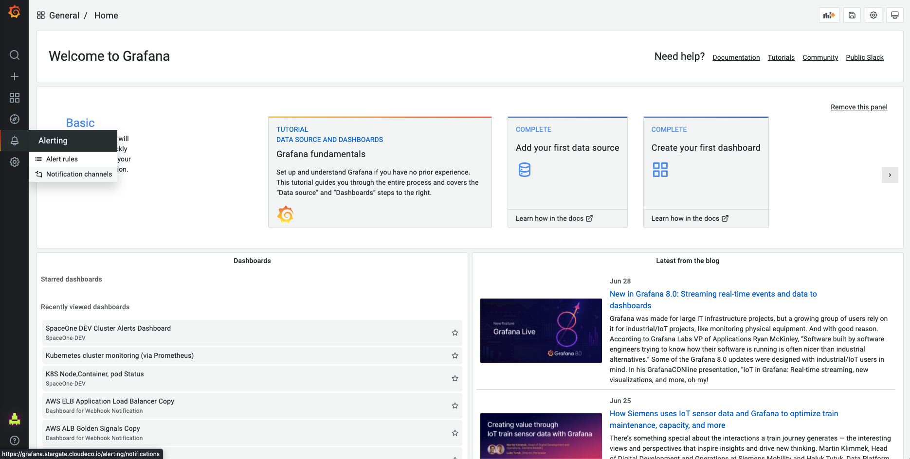
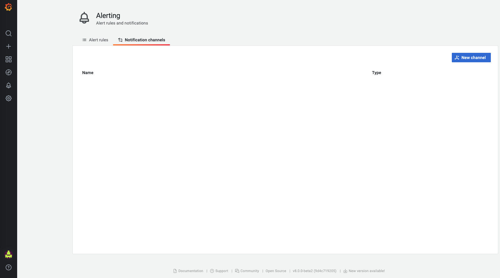

# Grafana

## Set up a Webhook at Grafana

**To** Connect **SpaceONE's** Alert Manager**,** Set up Grafana's Notification Channels.   
**`Project`**  p

Please, Set Alerting Channel for following Steps

* Set up a Notification Channel on Grafana

### Set up a Notification Channels

**Step 1. Drive to Grafana on Browser**

**Step 2. Drive to Notification Channel on Browser**

**Step 3. Click `New Channel`**  **button**

