# Collector

## 概要

SpaceONEはCollector Pluginを通して様々なサービスのCloud Resourceが収集できます。

Pluginは、Official MarketplaceやカスタムPluginが利用できます。

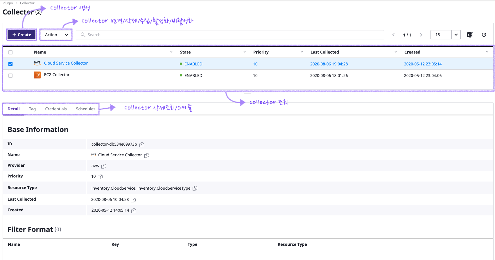

## Collector作成

下記の画面のように、Official Marketplaceで利用できるplugin listが照会できます。

インストールしたいPluginを選択し、_**+ Create**_ をクリックして、Collector作成できます。

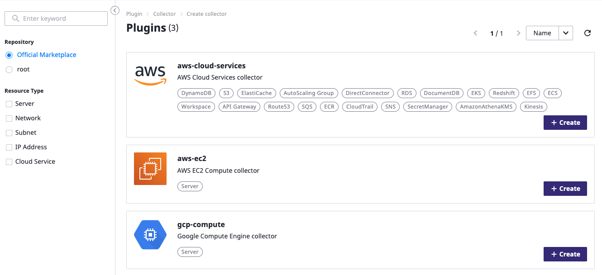

Collector名だけを入力し、他のところはDefaultで、変更しなくてもご利用に問題ありません。Pluginバージョンの選択はできますが、主にlatestにします。

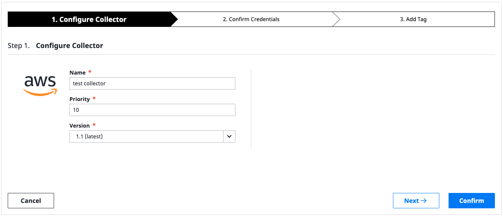

Collectorが利用するCredentials情報を選択します。以前利用していたCredentials情報を除いて自動的にmappingするので、_**Availability**_ 項目が正常的に表示されたばあ、次の画面に移動します。

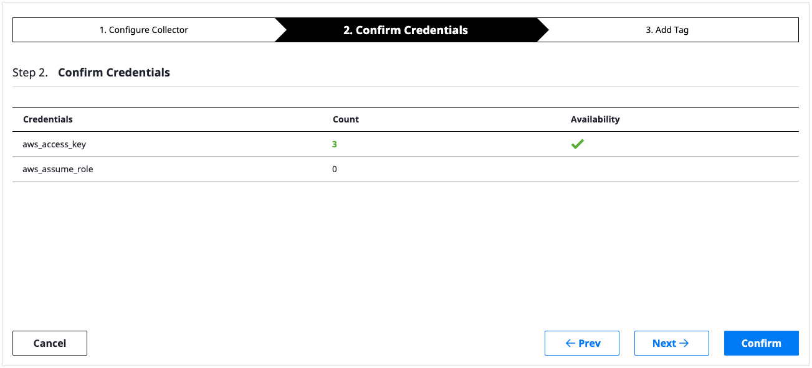

Tagの入力画面です。CollectorにTag入力が必要ン場合追加し、そうでない場合、 _**Confirm**_ を入力して作成を完了します。

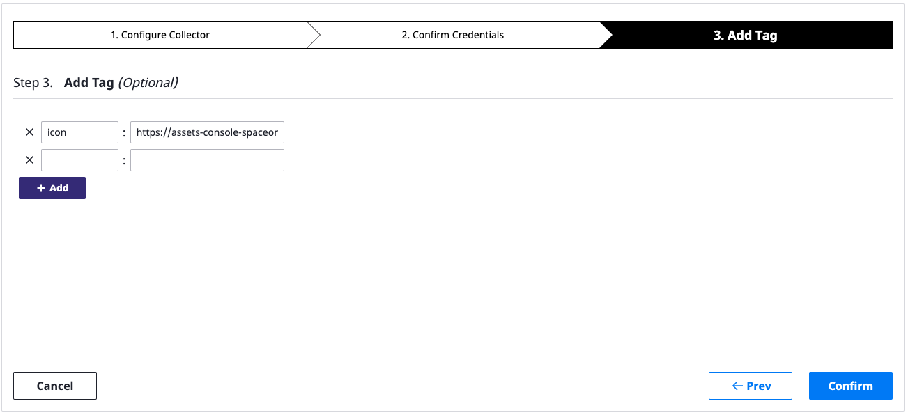

もし、作成が正しく進めない場合、Collector作成の画面に赤く表示されるところがあるか確認します。

## Collector変更/削除/有効化/非活性化

作成を除くcollector 作業はAction リストメニューを通して確認できます。 Collectorを選択し Action をクリックして下記のような作業可能なリストが照会されます。

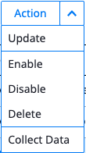

#### 変更

変更事項を修正した後、 _**Confirm**_ をクリックして完了します。

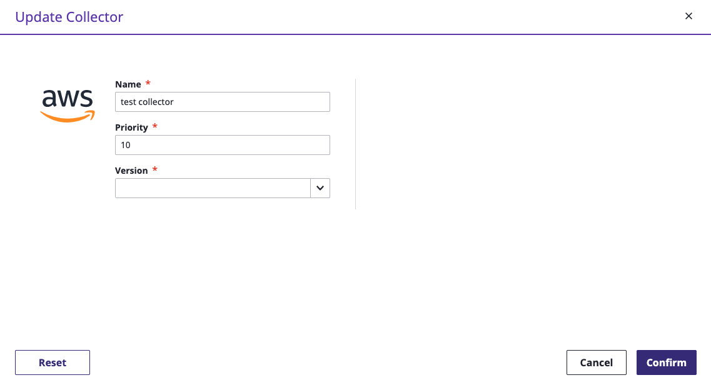

#### 削除

下記のように削除ページが表示されますが、 _**Confirm**_ をクリックします。

#### 有効化

_**DISABLE**_ 状態の Collectorを _**ENABLE**_ に変更します。Cloud Resource 収集作業ができるようになります。

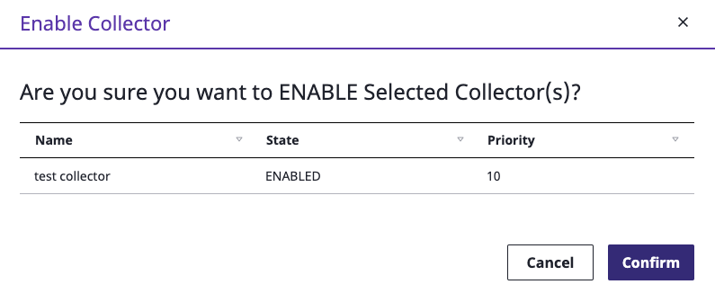

#### 非有効化

Collectorを _**DISABLE**_に変更して Cloud Resource 収集作業が中止できます。

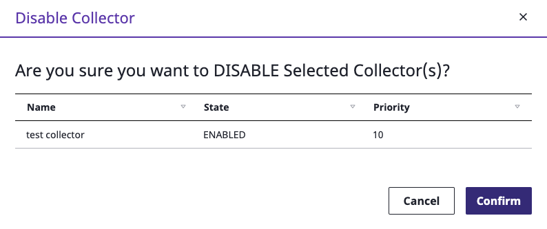

## Collector照会/詳細照会

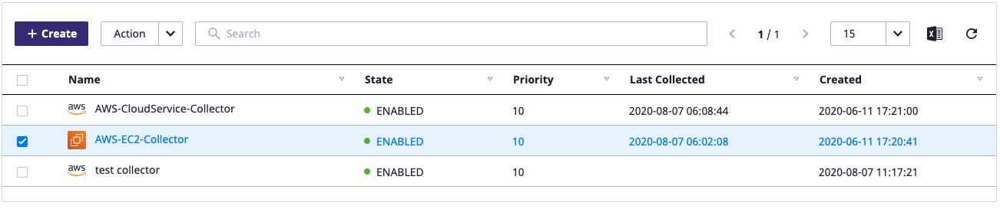

Collectorリストでは下記の情報が確認できます。

* Name : Collector名
* State : Enable/Disableで Collectorの収集が制御できます。
* Priority : 多数のCollectorから収集された情報が重複される場合、優先順位を決定します。Priorityが低いほど優先順位が高いです。
* Last Collected : Collectorが稼働された最後の時間を記録します。
* Created : Collectorが作成された時間を記録します。

Collectorの詳細動作は下記のタグで管理できます。

### Detail

Collectorの詳細設定を表示します。

Collectorが収集するデータのFilterが照会できます。

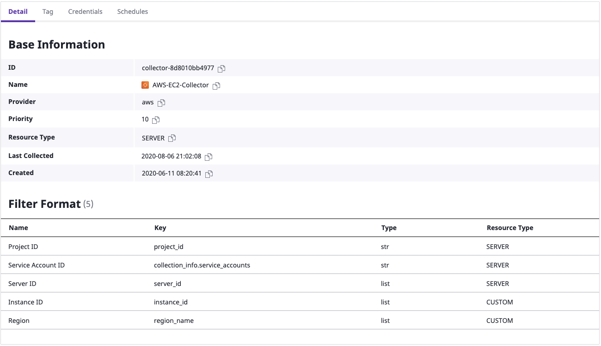

### Tag

CollectorのTagが管理きます。_**Edit**_ をクリックしてTagが編集できます。

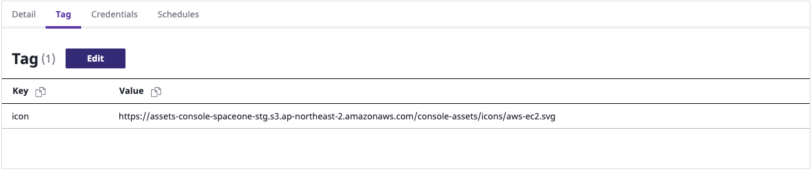

編集画面で _**Add Tag**_ と _**x**_ を利用して追加/削除できます。編集が完了された後、右下の _**Save**_ をクリックします。

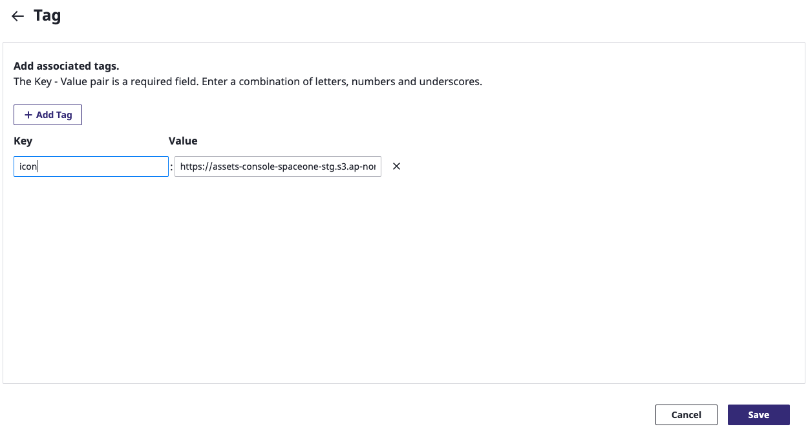

### Credentials

Collectorが利用している認証情報を表示します。その認証情報はSpaceONEのService Accountと連動されます。

_**Collect Data**_ をクリックして該当するCredentialsへ Cloud Resourceが即時に収集できます。

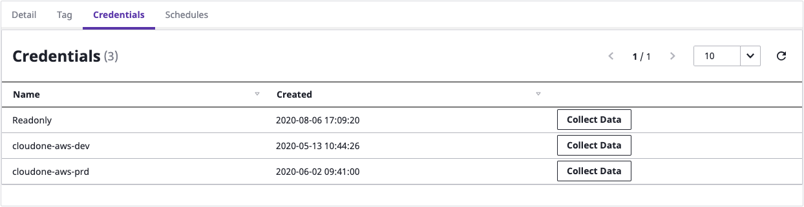

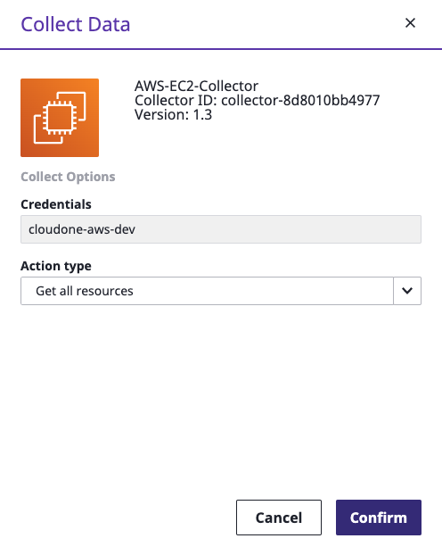

### Schedules

Collectorがデータを収集する周期を競ってします。

Scheduleを指定した場合、毎日指定された時間にCollectorの Cloud Resource 収集が実行されます。

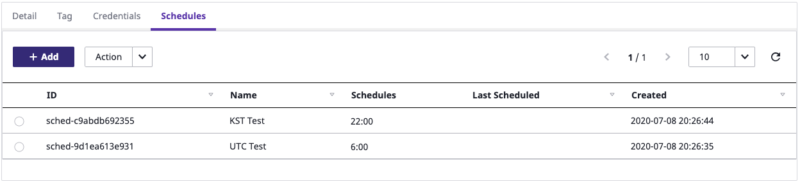

**追加**

* Add をクリックすると、スケージュール追加画面が表示されます。

名前/Timezone/収集時間が選択で起案す。

Collecting Timeは24時間基準で指定し、1時間単位で選択できます。

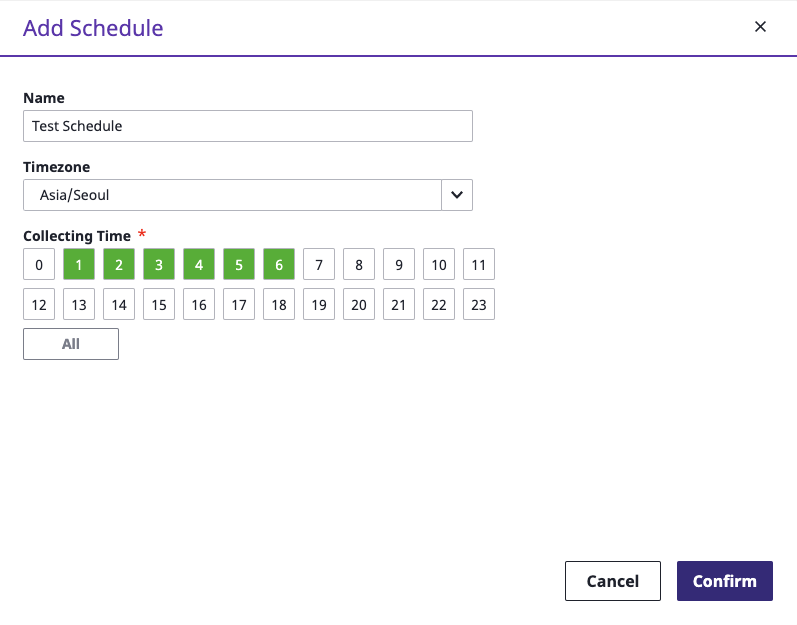

#### スケージュール変更、削除

スケージュールを選択した後、 _**Action**_ **&gt; Update/Delete** を通して既存スケージュールが変更/削除できます。

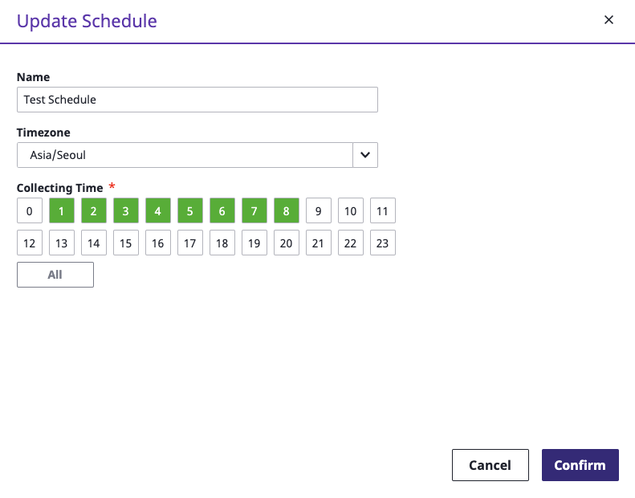

## Cloud Resource収集

Collectorを通してご希望の時点にCloud Resourceが収集できます。ユーザーは様々な方法でProject内の Inventory データが最新化されるようにすることができます。

### 即時収集

Collectorを選択した後、 _**Action &gt; Collect Data**_ メニューをクリックして収集します。

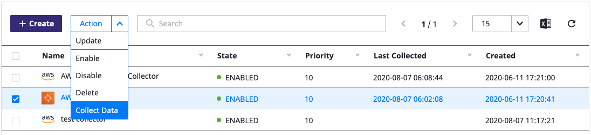

下記のようなCollect Data画面が出力されますが、 _**Confirm**_ をクリックして収集を開始します。

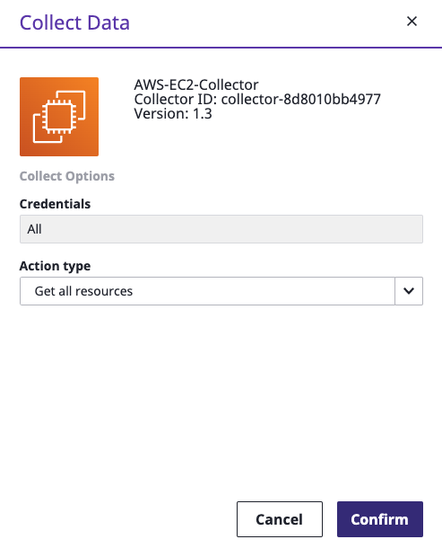

Collectが実行されている状況はMain Dashboardから確認できます。画面が自動的にRefreshされないよう、周期的に_**Reload**_ をクリックします。

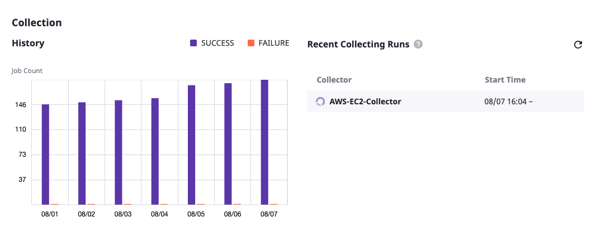

### スケージュール収集

上記の _**Schedules**_ に登録されたスケージュールでSpaceONE が自動的にCloud Resource 収集作業を行います。

最終遂行時間はCollector リストから確認できます。

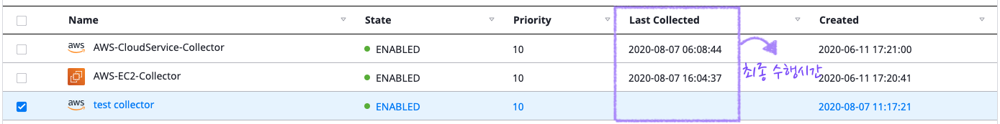

