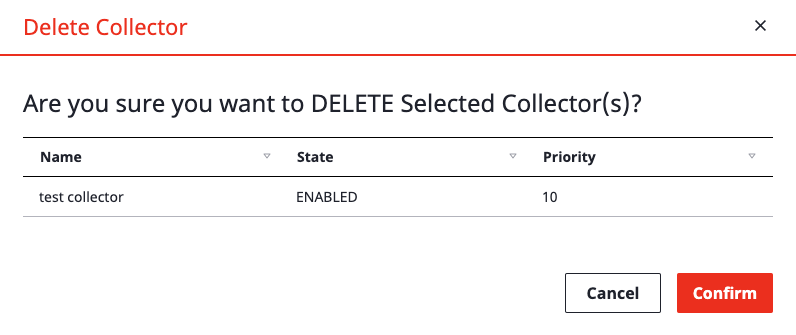

# Collector

## Overview

With _**Collector Plugins**_ in SpaceONE marketplace, Cloud resources from various cloud providers can be collected easily.

Plugins are offered by both SpaceONE Official marketplace and private repository.

## Create Collector

Available plugin list is printed by select _**Official Marketplace.**_

Select plugin to install, Click _**+ Create**_ button will starts collector creation wizard.

Fill out name of collector and choose version of plugin. Higher plugin version is generally suggested.

Selecting credentials information for collector. This step will be done automatically.

User can add tags for collector. Tags can be added by clicking _**+ Add**_ button

You don\`t need to delete existing tags\(For system use\)

If creation is not proceeds, Check red marked steps in _**Collector creation wizards**_

## Collector Update/Delete/Enable/Disable

Controlling _**Collector**_ can be done by _**Action**_ list menu. 

Select _**Collector**_ then click _**Action button**_. Available list of actions will be shown.

#### Update 

Change items to be updated, then click _**Confirm**_ button. 

#### Delete 

Deletion pop up will be printed, Proceeds through _**Confirm**_ button

#### Enable

Changing Collector status from _**DISABLE**_ status to _**ENABLE**_. This allows collecting job with _**collector.**_

#### DISABLE 

Collector를 _**DISABLE**_로 변경 하여 Cloud Resource 수집 작업이 일어나지 않게 설정할 수 있습니다.

## Collector 조회/상세조회

Collector 리스트에서는 아래와 같은 정보 확인이 가능 합니다. 

* Name : Collector의 이름
* State : Enable/Disable 상태로 구분하여, Collector의 사용 여부를 결정 합니다. 
* Priority : 다수의 Collector로 부터 수집된 정보가 중복 되었을 경우, 우선순위를 결정 합니다. Priority가 낮을수록 우선순위가 높습니다.
* Last Collected : Collector가 구동된 마지막 시간을 기록 합니다.
* Created : Collector가 생성된 시간을 기록 합니다. 

Collector의 상세 동작은 하단 탭에서 관리 가능 합니다. 

### Detail

Collector의 상세 설정을 나타냅니다. 

Collector가 수집하는 데이터의 Filter를 조회할 수 있습니다.

### Tag

Collector의 Tag를 관리할 수 있습니다. _**Edit**_ 버튼을 클릭하여 Tag 를 편집할 수 있습니다.

편집 화면에서 _**Add Tag**_ 버튼과 _**x**_ 버튼을 사용하여 추가/삭제 할 수 있습니다.  편집이 완료된 후 우측 하단의 _**Save**_ 버튼을 통해 편집을 완료 합니다. 

### Credentials

Collector가 사용하는 인증 정보를 나타 냅니다. 해당 인증 정보는 SpaceONE의 Service Account와 연결 됩니다. 

_**Collect Data**_ 버튼을 클릭하여 해당 Credentials로 Cloud Resource의 즉시 수집이 가능 합니다. 

### Schedules

Collector가 데이터를 수집하는 주기를 지정 합니다. 

Schedule 지정시 매일 지정된 시간에 Collector를 통한 Cloud Resource 수집이 이루어집니다. 

**추가** 

+ Add 버튼을 클릭할 경우 스케쥴 추가 화면이 나타납니다. 

이름/Timezone/수집 시간을 선택할 수 있습니다. 

Collecting Time은 24시간 기준으로 지정하고 1시간 단위로 선택 가능합니다. 

#### 스케쥴 변경, 삭제

스케쥴을 선택 후 _**Action**_ **&gt; Update/Delete** 버튼을 통해 기존 스케쥴을 변경하거나 삭제가 가능합니다.   

## Cloud Resource 수집

Collector를 통하여 원하는 시점에 Cloud Resource 수집이 가능 합니다. 사용자는 다양한 방식으로 Project 내의 Inventory 데이터가 최신화 될 수 있도록 할 수 있습니다. 

### 즉시수집

Collector를 선택 후 _**Action &gt; Collect Data**_ 메뉴를 클릭하여 수집 합니다. 

아래와 같이 Collect Data 화면이 출력 되는데, _**Confirm**_ 버튼을 클릭하여 수집을 시작 합니다. 

Collect가 진행중인 상황은 Main Dashboard에서 확인 가능합니다. 화면이 자동으로 Refresh 되지 않으므로, 주기적으로 화면내 _**Reload**_ 버튼을 클릭합니다. 

### 스케쥴 수집  

위의 _**Schedules**_ 에  등록된 일정으로 SpaceONE 내부에서 자동으로 Cloud Resource 수집을 진행 합니다. 

최종 수행 시간을 Collector 리스트에서 확인할 수 있습니다. 

 

