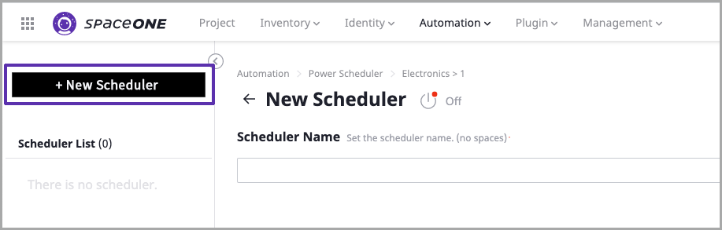
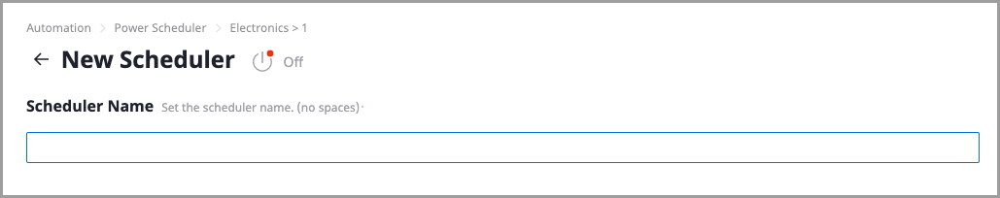
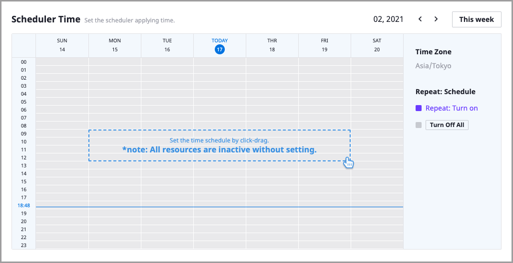
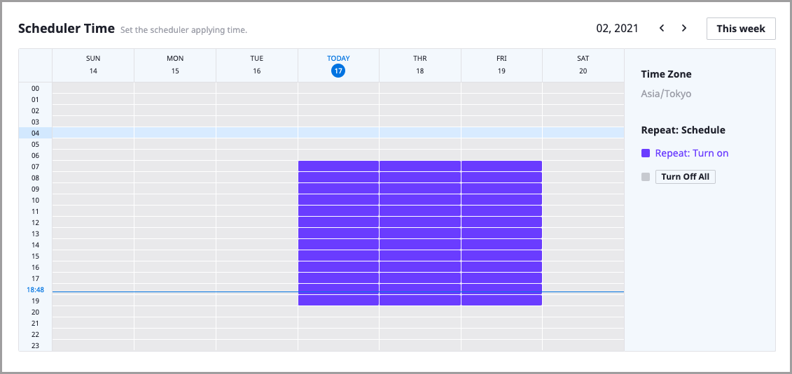
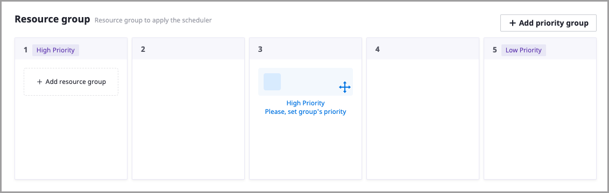
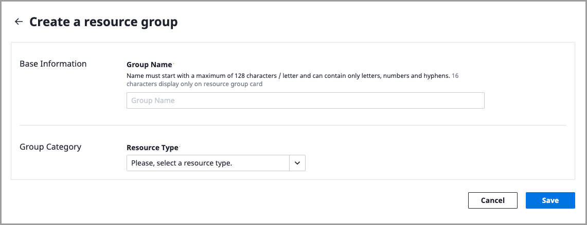
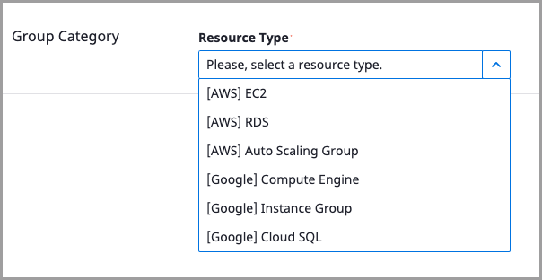

# Power Scheduler Quick Start

## How to Set up

Start your Power Scheduler after completing the following steps: 

* [Prerequisites](power-scheduler-quick-start.md#prerequisites)
* [Set up Basic Scheduler Info](power-scheduler-quick-start.md#set-up-basic-scheduler-info)
* [Configure Scheduler Runtime](power-scheduler-quick-start.md#configure-scheduler-runtime)
* [Define Resource Group](power-scheduler-quick-start.md#define-resource-group)

## Prerequisites

You can set up your IAM policy for power scheduler in SpaceONE with pre-defined credentials per cloud-provider to control resources with safety and prevent others to access resources without permission.

Please, assign corresponding access policies to SpaceONE from each provider's console as mentioned below, prior to create a Power Scheduler.





## Set up Basic Scheduler Info

**STEP 1:** Select `Automation` &gt; `Power Scheduler` on top header menu 

**STEP 2:** Select a project to set up Power Scheduler on the dashboard. 

**STEP 3:**  Click `+ New Scheduler`  button at the top left corner. It is automatically changed to the creation mode if there is no previously created scheduler in the project.

**STEP 4:**  Set the scheduler's name to create a scheduler. You can enter a string including letters and  `-` . Scheduler name is required and blank spaces are not allowed.

## Configure scheduler runtime

Set the time for applying a scheduler.   
  
The calendar grid breaks the week down by day on the horizontal axis and has 24-hour basis segments in portrait orientation.  You can click `This week` button to set the scheduled time for this week.  

You can move between month through  `< >` at the upper right of the graph. 

There are three types of scheduler mode.

|  Mode | State | Description | Color |
| :---: | :---: | :--- | :---: |
| Repeated Schedule |  | Timer repeated by every week. Selected area became On, Otherwise\(Non selected\) became Off. |  |
| One Time Schedule | ON | Created specified time range. Resource became On selected area. |  |
|  | OFF | Created specified time range. Resource became Off selected area. |  |

**STEP 1:** Click&drag to select certain time segments to set time for the scheduler to run.

> **Please, be advised**   
> Without any setting of Scheduler Time, it recognizes scheduler as `Turn Off All` which causes all resource to stop working immediately.

## Define Resource Group

Set the resource group for applying defined schedule  

By clicking **`+ Add Resource Group`**, user can move to **Create a resource group** page. 

The Naming Rules of Resource Group is below.

> * Max 128 character 
> * Start with character
> * Character, Number, & Hyphen`-`  available

Select resource type

Enter all information, then click the save button below. 

Get _**creating success**_ message pops up when all creation process is done successfully. 

## Limitation & Restriction

Some of the restrictions for power scheduler are [listed here](power-scheduler-quick-start.md#limitation-and-restriction).

