# Project Group Management

## 概要

Projectページを通してプロジェクトグループとプロジェクトが管理できます。

Projectページは下記のように**Project Group管理/Project 管理/検索**で構成されています。

この機能を通して、ユーザーをプロジェクトに参加させることができ、プロジェクト単位でリソースを管理したりサービスの運営ができます。

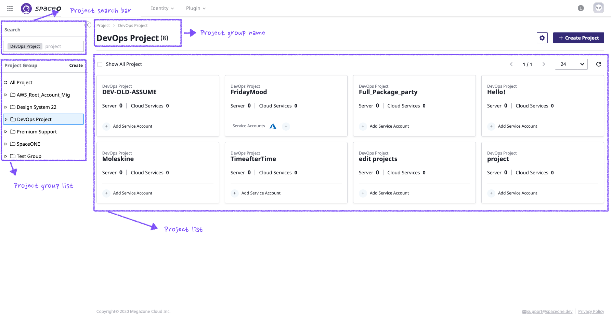

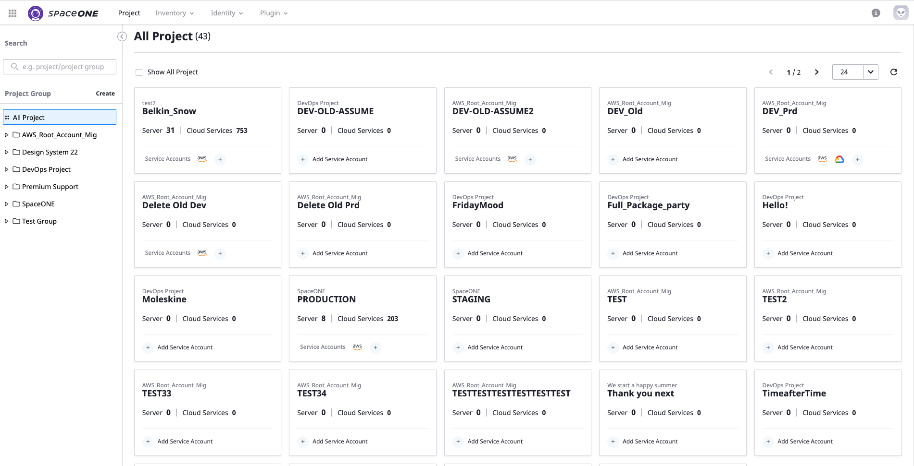

各部分の詳細機能について説明します。

初ページでは全体のプロジェクトリストが確認できます。

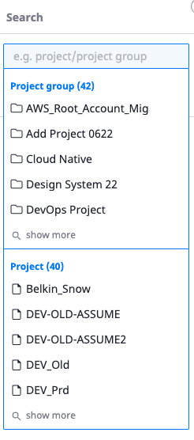

## Project Group管理

右の検索バーを通して、Project GroupとProjectが検索でき、また簡単に移すことができます。

Project Group Treeを照会し、作成、変更、削除します。

### 照会

_**All Project**_を選択する場合、ユーザーが照会できるすべてのプロジェクトリストが照会されます。 プロジェクトを選択して対象Project Dashboardへ移動できます。

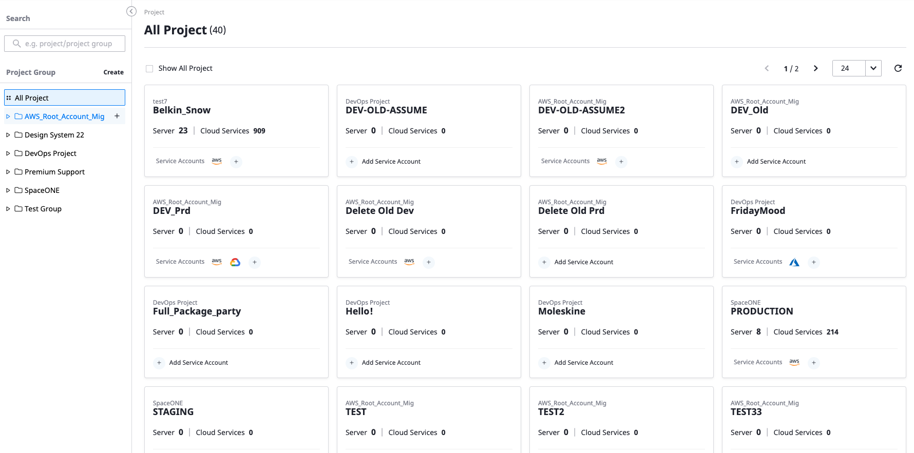

各々のProject Groupを選択した場合、そのProject Groupに属しているProject Listが照会できます。

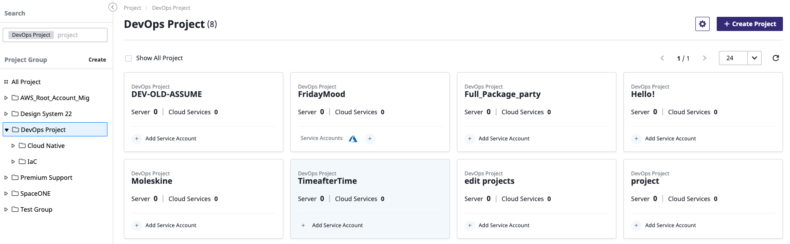

### 作成

Project Group文字の横の_**Create**_ をクリックして、Project Groupが作成できます。

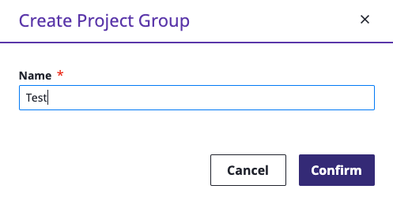

Project GroupはTree構造で、階層管理ができます。上位Project Groupの下にSub Project Groupを作成する場合、下記のように選択します。

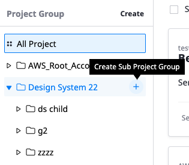

### 変更/削除

Project Groupを変更/削除する機能はProject Group名が表示されている部分でできます。

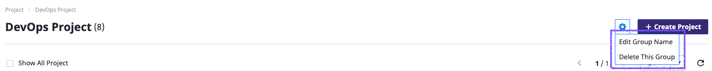

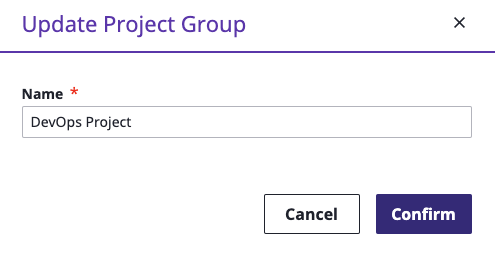

Project Groupを削除するためには事前に対象Group内のProjectをすべて削除しなければいけません。

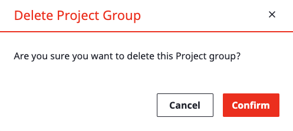

## Project照会

Project Groupを選択すれば、所属されているProjectが確認できます。

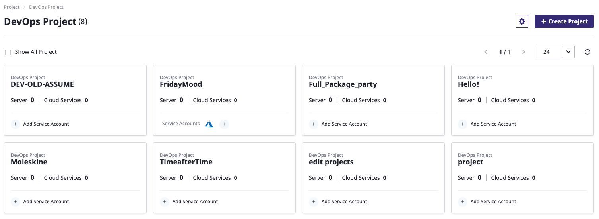

各Projectに属しているServer/Cloud Service数が確認できます。また、所属されているCloud Service Accout Typeも確認できます。

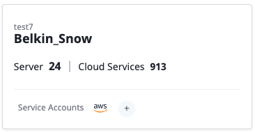

## 検索

Search Barを通してProject Group/Projectに素早く移動できます。

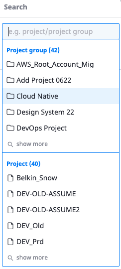

* Search Barにキーワードを入力すれば、Group/Projectを検索して提案します。
* Group/Projectをクリックすれば、そのページへ移動します。
* _**show more**_ をクリックすれば、追加リストが確認できます。

