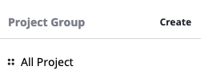

# Project Group Management

## 개요

## 둘러보기

Project 페이지를 통해 프로젝트 그룹과 프로젝트들을 관리할 수 있습니다.  

Project 페이지는 아래와 같이 _**Project Group 관리/Project 관리/검색**_  부분으로 각각 구성되어 있습니다. 

이 기능을 통해 회사의 사용자들을 프로젝트에 참가시킬 수 있으며 프로젝트 단위로 자원을 관리하거나 서비스 운영을 할 수 있습니다.

각 부분의 상세 기능에 대해서는 아래에서 다루도록 합니다.  

처음 페이지에 들어가면 전체 프로젝트 리스트를 확인할 수 있습니다. 

## Project Group 관리

좌측의 검색 바를 통해 Project Group과 Project를 검색하고 손쉽게 이동할 수 있습니다. 

Project Group Tree를 조회하고 생성,변경,삭제합니다. 

### 조회하기 

_**All Project**_ 를 선택할 경우, 사용자가 조회 할 수 있는 모든 프로젝트의 리스트가 한번에 조회 됩니다. 대상 프로젝트를 선택하여 Project Dashboard로 이동할 수 있습니다.   

각각의 Project Group을 선택했을 경우 해당 Project Group에 속한 Project List를 조회할 수 있습니다. 

### 생성하기

Project Group 문구 옆 _**Create**_ 버튼을 통해 Project Group을 생성할 수 있습니다. 

Project Group은 Tree 구조로 계층 관계를 가질 수 있습니다. 상위 Project Group 밑에 Sub Project Group을 생성할 경우에는 아래와 같이 선택 합니다.

### 변경/삭제하기

Project Group을 변경/삭제하는 기능은 Project Group명이 표시되는 부분 에서 가능합니다.

Project Group을 삭제하기 위해서는 사전에 대상 Group내에 Project를 모두 삭제해야 가능합니다. 

## Project 조회

Project Group을 선택하면 소속된 Project를 확인할 수 있습니다. 

각 Project 에 속해있는 Server/Cloud Service의 개수를 간략히 확인할 수 있있습니다. 또한, 소속된 Cloud Service Accout Type도 확인할 수 있습니다. 

## 검색하기 

Search Bar를 통해 Project Group/Project로 빠르게 이동 가능합니다. 

* Search Bar에 키워드 입력시 Group/Project를 검색하여 제안 합니다. 
* Group/Project를 클릭시 해당 페이지로 링크 합니다.
* _**show more**_ 버튼 클릭시 추가 리스트를 확인 가능합니다. 

