# Project Management

## 概要

Project Managementは大きく下記のような機能で構成されています。

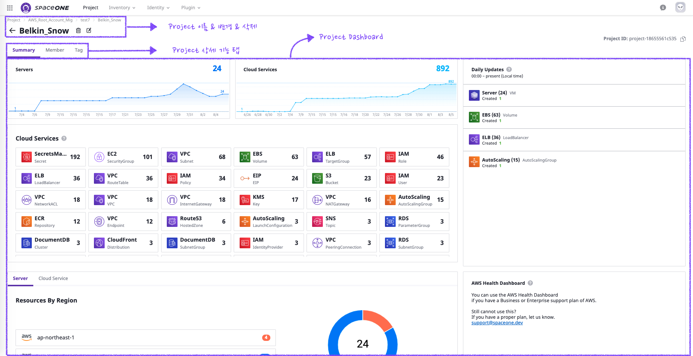

* **Project名照会 & 変更** : Project名を照会し変更します。
* **Project削除** : Projectを削除します。
* **Project詳細機能タグ** : Project管理機能であるSummary, Member, Tag機能の詳細ページへ移動します。
* **Project Dashboard** : Projectの全体使用現況が確認できます。

## Summary

Projectの全体使用現況を確認し、詳細現況ページへ移動します。

### 変更History    

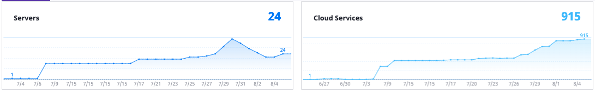

* \(Projectで利用している) ServerとCloud Serviceの全体使用現況が照会できます。\(1カ月間の変化履歴を含む\)
* 画面をクリックしたら詳細ページへ移動します。

### サービス別利用現況

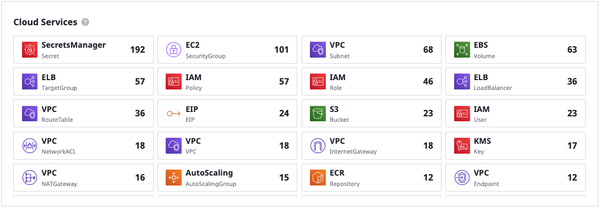

* Computeサービスを除くCloud Resourceのサービス別使用現況が確認できます。各々のアイコンをクリックすれば、詳細内訳ページへ移動します。

### Daily Update

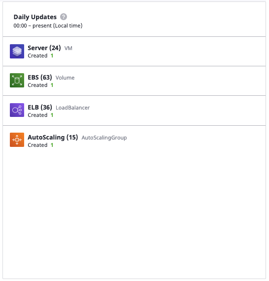

* 現在までのCloud Resourceの変化ヒストリーが確認できます。クリックすれば詳細内訳ページ経移動します。

### Region別使用量

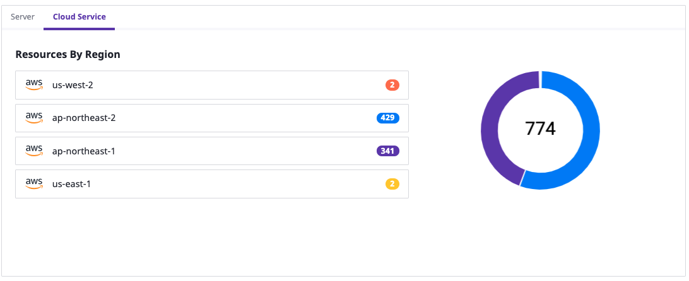

*   リージョン別Cloud Resource現況を確認します。

### Service Accounts

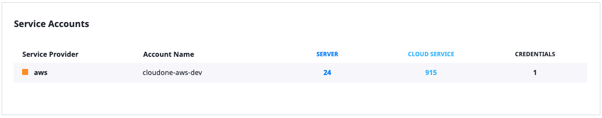

* Projectに属しているService Account及びService Account別リソースの使用量及び入力されたCredential数が確認できます。

## Member

Projectを照会、変更できるユーザーを登録/削除します。

事前にDomain内のユーザーとして登録されていなければいけません。

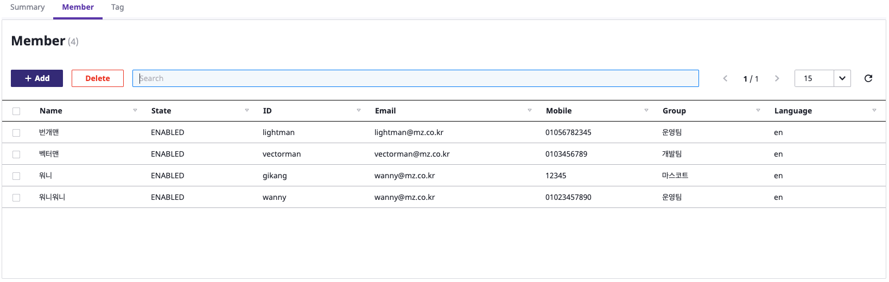

### ユーザー追加

_**+ Add**_をクリックするとユーザー追加画面に移動します。複数のユーザーが一度で登録できます。

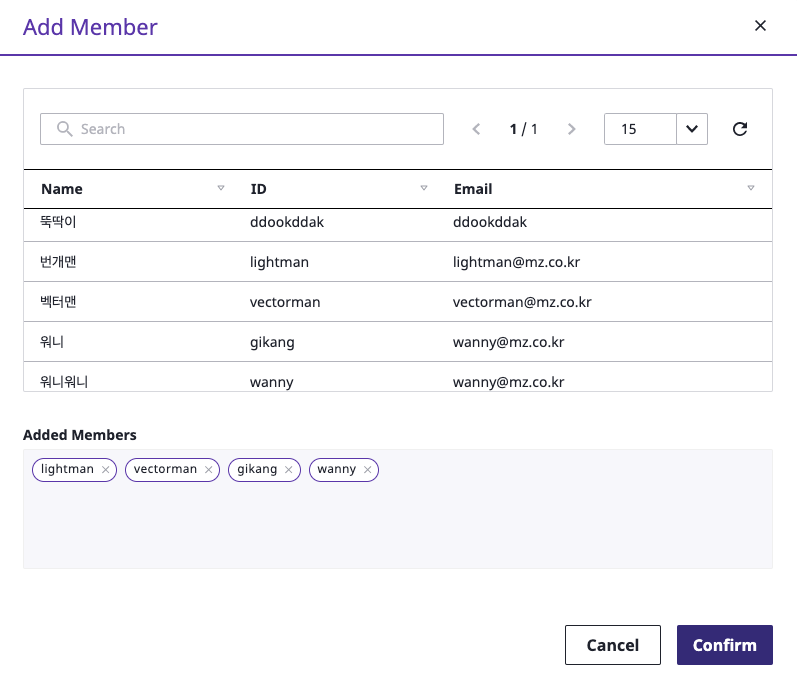

### ユーザー削除

Projectでユーザーの削除は、ユーザーを選択した後_**Delete**_をクリックします。

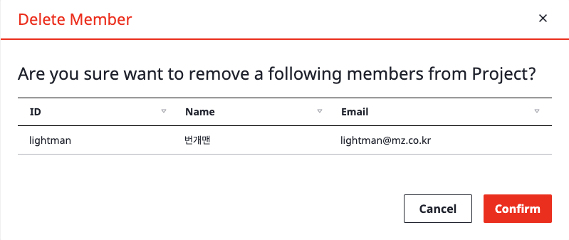

## Tag

ProjectにTagの追加及び削除ができます。

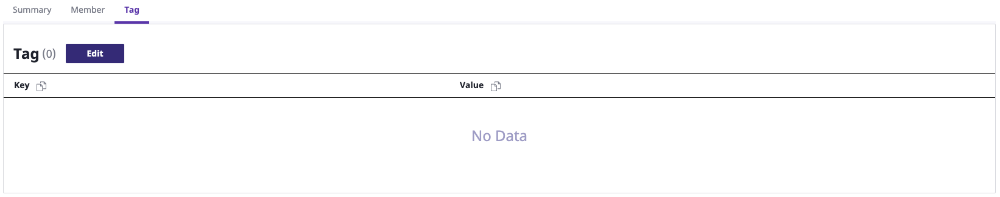

_**Edit**_をクリックしてTagの追加/削除ができます。画面で追加/削除を選択した後、**Save** 保存をクリックします。

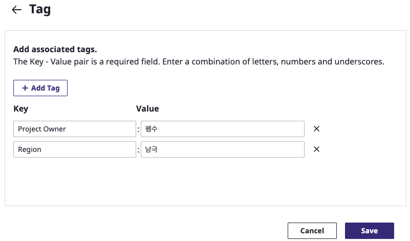

