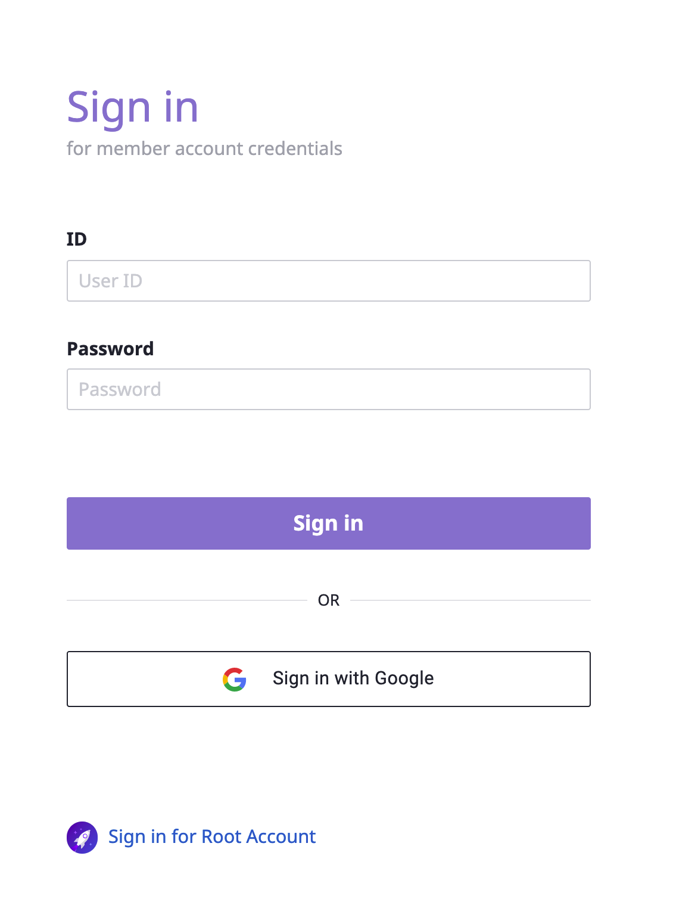
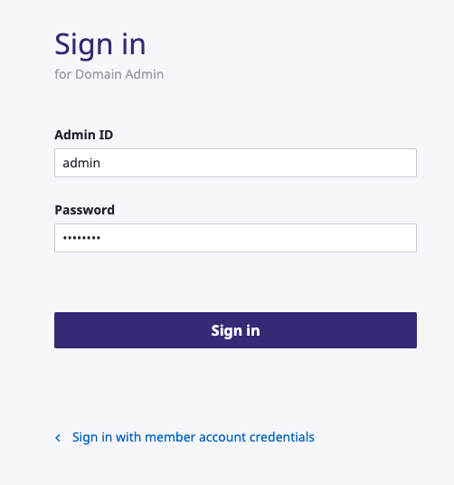
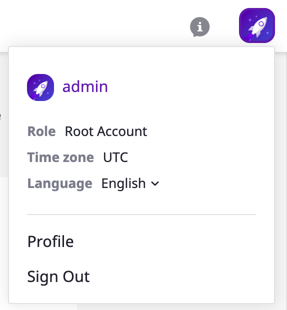
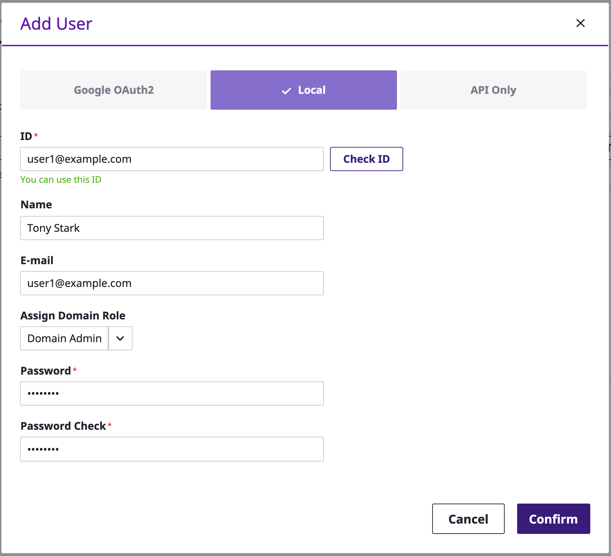
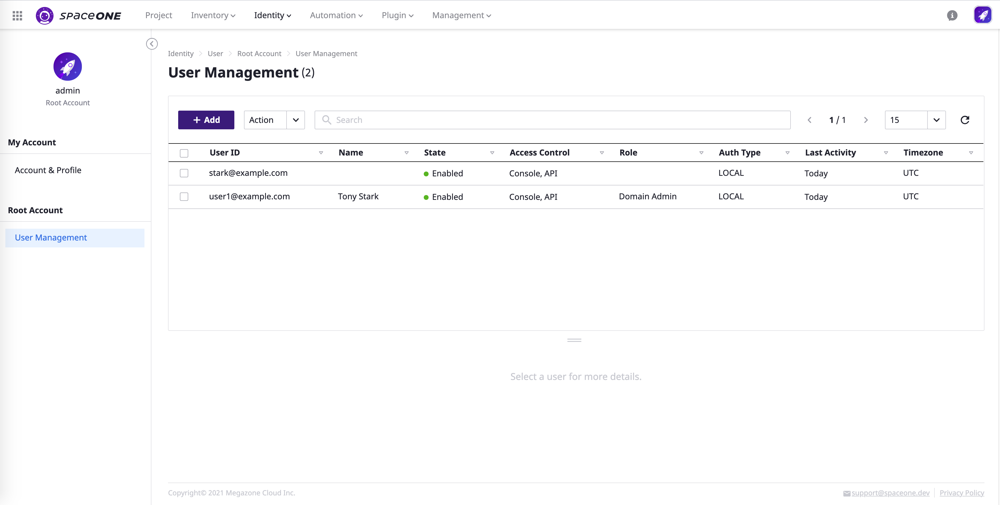

# Root Account

## Log-in

`Root Account`는 시스템 전체에 대한 최상위 관리자로서, `Root Account` 로그인 페이지를 통해 접속 가능합니다.

**STEP 1: Domain Owner로 Log-in 합니다.**

\*\*\*\*

**STEP 2: SpaceONE console 의 우측 상단에서 적용된 admin role을 확인합니다.**

\*\*\*\*

## Create Domain Admin

**Root Account** 의 역할 중 한 가지는  `Domain Admin`  관리자를 생성하고,  `Domain Admin Role` 을 부여해  관리자가 접속할 수 있도록 지원하는 것입니다.  

상단의**`Identity`** - **`User`** 에서  적용된 내용을 확인할 수 있습니다.

