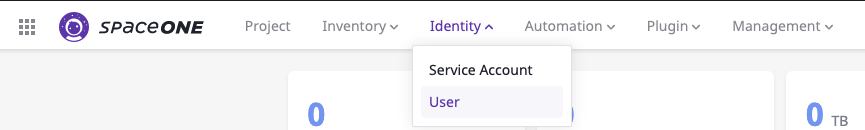
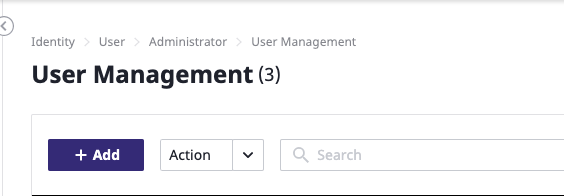

# Root Account

## Sign-in

**STEP 1:** Connect to **SpaceONE** from your browser and Click **`Sign in for Root Account`** to sign in as Domain Owner. 

\*\*\*\*

**STEP 2:** Click **`SpaceShip`** icon on the right corner of the top bar and check your role is a Root Account. 

\*\*\*\*

## Create Domain Admin

Root Account's primary role is to create a **`Domain Admins`** who's the administrator of a certain domain.

**STEP 1:** Drive to menu **`Identity > User`** at the top bar. 

  
**STEP 2:** Click **`+ Add`** button to add a domain Admin user.

**STEP 3:** Fill out all required fields ****and click **`Confirm`** button once finish.

**STEP 4:** Check an added user on the user list on User Management menu.  

